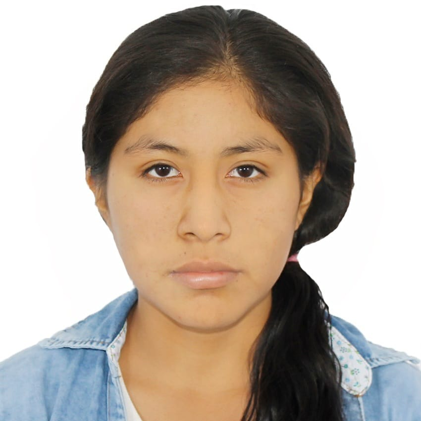
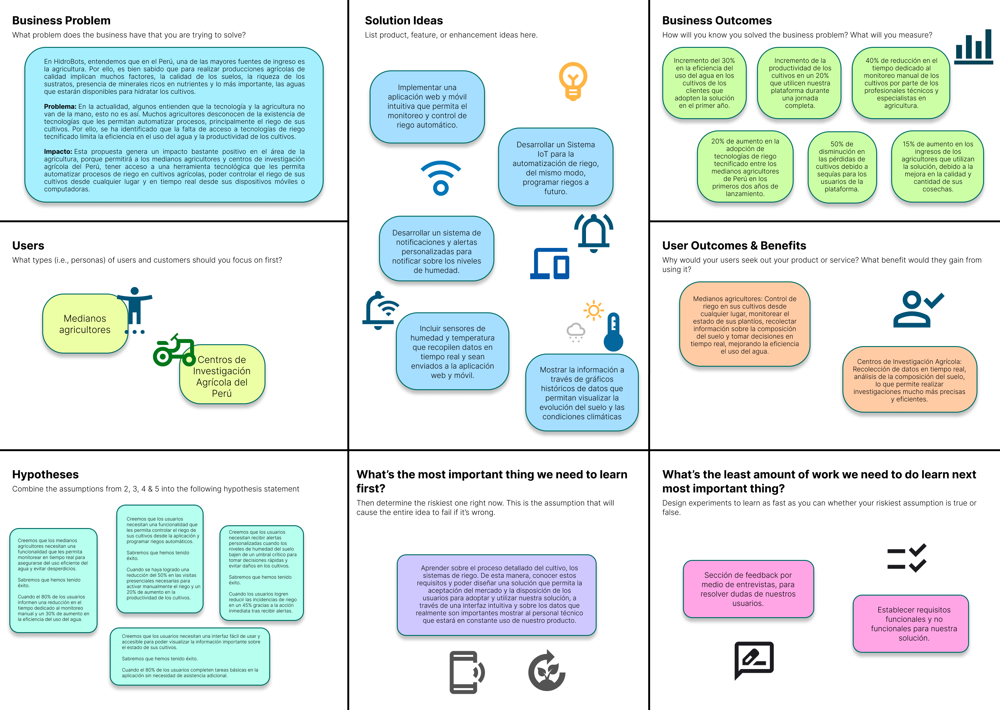

<h3 align="center"> Universidad Peruana de Ciencias Aplicadas </h3>

<h3 align="center"> Ingeniería de Software </h3>
<h3 align="center"> Ciclo 2024 - 2 </h3>

 

  

 

<h1 align="center"> TB1 Report </h1>

<h3 align="center"> Desarrollo de Soluciones IoT - SW53 </h3>

<h3 align="center"> Docente:  </h3>

<h3> Startup: HidroBots </h3>

<h3> Product: </h3>

<h3> Team Members: </h3>

| Member                              |    Code    |
| :---------------------------------- | :--------: |
| Ampudia Flores, José Carlos Isaac   | u202112936 |
| Defilippi Santillán, Diego          | U202120448 |
| Horna Silva, Fabio Ernesto          | u202020229 |
| Lopez Huarcaya, Leonardo Paul       | u202124304 |
| Paucar De La Cruz, Tatiana Medalith | u20211f955 |

<h3 align="center">Septiembre, 2024</h3>

  

## Registro de Versiones del Informe

El objetivo de esta sección es resumir las modificaciones relevantes que se realizan al informe durante el ciclo de vida del proyecto. Esta sección inicia en una página nueva e incluye un cuadro con la siguiente estructura:

<table>
  <thead>
    <tr>
      <th>Versión</th>
      <th>Fecha</th>
      <th>Autor</th>
      <th>Descripción de modificación</th>
    </tr>
  </thead>
  <tbody>
    <tr>
      <td>0.1</td>
      <td>27/08/2024</td>
      <td>Diego Defilippi</td>
      <td>Implementación de diseño de entrevistas, desarrollar las entrevistas, el Impact Mapping, User Stories y Event Storming.</td>
    </tr>
    <tr>
      <td>0.2</td>
      <td>27/08/2024</td>
      <td>Jose Ampudia</td>
      <td>Implementación del Capítulo 1, entrevistas, desarrollo de Event Storming en colaboración con otros integrantes del equipo.</td>
    </tr>
    <tr>
      <td>0.3</td>
      <td>01/09/2024</td>
      <td>Tatiana Paucar</td>
      <td>Desarrollo de entrevistas, implementación del Needfinding, Event Storming, User Stories, documentar la capa de dominio de los bounded contexts.</td>
    </tr>
    <tr>
      <td>0.4</td>
      <td>10/10/2024</td>
      <td>Leonardo Lopez</td>
      <td>Desarrollo de entrevistas, implementación del Needfinding, desarrollo de Software Architecture, esto incluye el desarrollo del modelo C4.</td>
    </tr>
    <tr>
      <td>0.5</td>
      <td>18/10/2024</td>
      <td>Fabio Horna</td>
      <td>Desarrollo de entrevistas, y la investigación sobre los competidores y el análisis competitivo y las estrategias frente a los competidores, del mismo modo, apoyo en el desarrollo de Tactical-Level Domain-Driven Design.</td>
    </tr>
    <tr>
      <td>1.0</td>
      <td>20/10/2024</td>
      <td>Equipo HidroBots</td>
      <td>Documentación de la solución versión 1.0.</td>
    </tr>
  </tbody>
</table>

  

## Project Report Collaboration Insights

  

# Contenido

## Tabla de Contenidos

### [Registro de versiones del informe](#registro-de-versiones-del-informe)

### [Project Report Collaboration Insights](#project-report-collaboration-insights)

### [Contenido](#contenido)

### [Student Outcome](#student-outcome-1)

### [Capítulo I: Introducción](#capítulo-i-introducción-1)

- [1.1. Startup Profile](#11-startup-profile)
  - [1.1.1. Descripción de la Startup](#111-descripción-de-la-startup)
  - [1.1.2. Perfiles de integrantes del equipo](#112-perfiles-de-integrantes-del-equipo)
- [1.2. Solution Profile](#12-solution-profile)
  - [1.2.1 Antecedentes y problemática](#121-antecedentes-y-problemática)
  - [1.2.2 Lean UX Process](#122-lean-ux-process)
    - [1.2.2.1. Lean UX Problem Statements](#1221-lean-ux-problem-statements)
    - [1.2.2.2. Lean UX Assumptions](#1222-lean-ux-assumptions)
    - [1.2.2.3. Lean UX Hypothesis Statements](#1223-lean-ux-hypothesis-statements)
    - [1.2.2.4. Lean UX Canvas](#1224-lean-ux-canvas)
- [1.3. Segmentos objetivo](#13-segmentos-objetivo)

### [Capítulo II: Requirements Elicitation & Analysis](#capítulo-ii-requirements-elicitation--analysis-1)

- [2.1. Competidores](#21-competidores)
  - [2.1.1. Análisis competitivo](#211-análisis-competitivo)
  - [2.1.2. Estrategias y tácticas frente a competidores](#212-estrategias-y-tácticas-frente-a-competidores)
- [2.2. Entrevistas](#22-entrevistas)
  - [2.2.1. Diseño de entrevistas](#221-diseño-de-entrevistas)
  - [2.2.2. Registro de entrevistas](#222-registro-de-entrevistas)
  - [2.2.3. Análisis de entrevistas](#223-análisis-de-entrevistas)
- [2.3. Needfinding](#23-needfinding)
  - [2.3.1. User Personas](#231-user-personas)
  - [2.3.2. User Task Matrix](#232-user-task-matrix)
  - [2.3.3. User Journey Mapping](#233-user-journey-mapping)
  - [2.3.4. Empathy Mapping](#234-empathy-mapping)
  - [2.3.5. As-is Scenario Mapping](#235-as-is-scenario-mapping)
- [2.4. Ubiquitous Language](#24-ubiquitous-language)

### [Capítulo III: Requirements Specification](#capítulo-iii-requirements-specification-1)

- [3.1. To-Be Scenario Mapping](#31-to-be-scenario-mapping)
- [3.2. User Stories](#32-user-stories)
- [3.3. Impact mapping](#33-impact-mapping)
- [3.4. Product Backlog](#34-product-backlog)

### [Capítulo IV: Solutions Software Design](#capítulo-iv-solution-software-design)

- [4.1. Strategic-Level Domain-Driven Design](#41-strategic-level-domain-driven-design)
  - [4.1.1. EventStorming](#411-eventstorming)
    - [4.1.1.1. Candidate Context Discovery](#4111-candidate-context-discovery)
    - [4.1.1.2. Domain Message Flows Modeling](#4112-domain-message-flows-modeling)
    - [4.1.1.3. Bounded COntext Canvases](#4113-bounded-context-canvases)
  - [4.1.2. Context Mapping](#412-context-mapping)
  - [4.1.3. Software Architecture](#413-software-architecture)
    - [4.1.3.1. Software Architecture System Landscape Diagram](#4131-software-architecture-system-landscape-diagram)
    - [4.1.3.2. Software Architecture Context Level Diagrams](#4132-software-architecture-context-level-diagrams)
    - [4.1.3.3. Software Architecture Container Level Diagrams](#4133-software-architecture-container-level-diagrams)
    - [4.1.3.4. Software Architecture Deployment Diagrams](#4134-software-architecture-deployment-diagrams)
- [4.2. Tactical-Level Domain-Driven Design](#42-tactical-level-domain-driven-design)
  - [4.2.X. Bounded Context: <Bounded Context name>](#42x-bounded-context)
    - [4.2.X.1. Domain Layer](#42x1-domain-layer)
    - [4.2.X.2. Interface Layer](#42x2-interface-context)
    - [4.2.X.3. Application Layer](#42x3-application-context)
    - [4.2.X.4. Infrastructure Layer](#42x4-infrastructure-context)
    - [4.2.X.5. Bounded Context Software Architecture Component Level Diagrams](#42x5-bounded-context-software-architecture-component-level-diagrams)
    - [4.2.X.6. Bounded Context Software Architecture Code Level Diagrams](#42x6-bounded-context-software-architecture-code-level-diagrams)
      - [4.2.X.6.1. Bounded Context Domain Layer Class Diagrams](#42x61-bounded-context-domain-layer-class-diagrams)
      - [4.2.X.6.2. Bounded Context Database Design Diagram](#42x62-bounded-context-database-design-diagram)

### [Capítulo V: Solution UI/UX Design](#capítulo-v-solutions-uiux-design)

- [5.1. Style Guidelines](#51-style-guidelines)
  - [5.1.1. General Style Guidelines](#511-general-style-guidelines)
  - [5.1.2. Web Style Guidelines](#512-web-style-guidelines)
- [5.2. Information Architecture](#52-information-architecture)
  - [5.2.1. Organization Systems](#521-organization-systems)
  - [5.2.2. Labeling Systems](#522-labeling-systems)
  - [5.2.3. SEO Tags and Meta Tags](#523-seo-tags-and-meta-tags)
  - [5.2.4. Searching Systems](#524-searching-systems)
  - [5.2.5. Navigation Systems](#525-navigation-systems)
- [5.3. Landing Page UI Design](#53-landing-page-ui-design)
  - [5.3.1. Landing Page Wireframe](#531-landing-page-wireframe)
  - [5.3.2. Landing Page Mock-up](#532-landing-page-mock-up)
- [5.4. Applications UX/UI Design](#54-web-applications-uxui-design)
  - [5.4.1. Applications Wireframes](#541-web-applications-wireframes)
  - [5.4.2. Applications Wireflow Diagrams](#542-web-applications-wireflow-diagrams)
  - [5.4.3. Applications Mock-ups](#543-web-applications-mock-ups)
  - [5.4.4. Applications User Flow Diagrams](#544-web-applications-user-flow-diagrams)
- [5.5. Aplications Prototyping](#55-applications-prototyping)

### [Capítulo VI: Product Implementation, Validation \& Deployment](#capítulo-vi-product-implementation-validation--deployment)

- [6.1. Software Configuration Management](#61-software-configuration-management)
  - [6.1.1. Software Development Environment Configuration](#611-software-development-environment-configuration)
  - [6.1.2. Source Code Management](#612-source-code-management)
  - [6.1.3. Source Code Style Guide \& Conventions](#613-source-code-style-guide--conventions)
  - [6.1.4. Software Deployment Configuration](#614-software-deployment-configuration)
- [6.2. Landing Page, Services \& Applications Implementation](#62-landing-page-services--applications-implementation)
  - [6.2.X. Sprint X](#62x-sprint-n)
    - [6.2.X.1. Sprint Planning 1](#62x1-sprint-planning-n)
    - [6.2.X.2. Sprint Backlog 1](#62x2-sprint-backlog-n)
    - [6.2.X.3. Development Evidence for Sprint Review](#62x3-development-evidence-for-sprint-review)
    - [6.2.X.4. Testing Suite Evidence for Sprint Review](#62x4-testing-suite-evidence-for-sprint-review)
    - [6.2.X.5. Execution Evidence for Sprint Review](#62x5-execution-evidence-for-sprint-review)
    - [6.2.X.6. Services Documentation Evidence for Sprint Review](#62x6-services-documentation-evidence-for-sprint-review)
    - [6.2.X.7. Software Deployment Evidence for Sprint Review](#62x7-software-deployment-evidence-for-sprint-review)
    - [6.2.X.8. Team Collaboration Insights during Sprint](#62x8-team-collaboration-insights-during-sprint)
- [6.3. Validation Interviews](#63-validation-interviews)
  - [6.3.1. Diseño de Entrevistas](#631-diseño-de-entrevistas)
  - [6.3.2. Registro de Entrevistas](#632-registro-de-entrevistas)
  - [6.3.3. Evaluaciones según heurísticas](#633-evaluaciones-según-heurísticas)
- [6.4. Video About-the-Product](#64-video-about-the-product)

### [Conclusiones](#conclusiones-1)

- [Conclusiones y recomendaciones](#conclusiones-y-recomendaciones)
- [Video About-the-Team](#video-about-the-team)

### [Bibliografía](#bibliografía-1)

### [Anexos](#anexos-1)

  

# Student Outcome

<b>ABET – EAC - Student Outcome 5:</b> La capacidad de funcionar efectivamente en un equipo cuyos miembros juntos proporcionan liderazgo, crean un entorno de colaboración e inclusivo, establecen objetivos, planifican tareas y cumplen objetivos. En el siguiente cuadro se describe las acciones realizadas y enunciados de conclusiones por parte del grupo, que permiten sustentar el haber alcanzado el logro del ABET – EAC - Student Outcome 5.

<table>
  <thead>
    <tr>
      <th>Criterio específico</th>
      <th>Acciones realizadas</th>
      <th>Conclusiones</th>
    </tr>
  </thead>
  <tbody>
    <tr>
      <td><strong>Trabaja en equipo para proporcionar liderazgo en forma conjunta</strong></td>
      <td>
        <strong>Diego Defilippi</strong> 
        <strong>TB1:</strong> 
        Lideré la distribución de tareas, me aseguré de que cada miembro del equipo comprendiera sus responsabilidades. Organizamos reuniones periódicas para revisar avances y ajustar el plan según los resultados obtenidos. Mi función principal fue implementar los bounded context canvases y el apoyo continuo para el desarrollo del Event Storming.  
        <strong>Jose Ampudia</strong> 
        <strong>TB1:</strong> 
        Propuse el avance conjunto para el desarrollo de los puntos críticos del desarrollo del informe, tales como el capítulo 4, el desarrollo del Event Storming, las cuales se desarrolló con éxito.  
        <strong>Tatiana Paucar</strong> 
        <strong>TB1:</strong> 
        Fomenté la participación activa lo que ayudó en la toma de decisiones clave para el proyecto. Del mismo modo para el desarrollo óptimo de los bounded contexts, los cuales son fundamentales para dividir las funcionalidades principales de la aplicación por módulos.  
        <strong>Leonardo Lopez</strong> 
        <strong>TB1:</strong> 
        Propuse un sistema de trabajo colaborativo basado en las fortalezas del equipo y medió en la resolución de conflictos. Además, me centré en implementar el modelo C4, lo cual es fundamental para tener una vista de alto nivel sobre el funcionamiento de la aplicación.  
        <strong>Fabio Horna</strong> 
        <strong>TB1:</strong> 
        Coordiné el uso de herramientas colaborativas y promoví la comunicación constante en el equipo. Del mismo modo, me encargué de realizar el Tactical-Level Domain-Driven Design lo que nos permite tener una visión más clara de la estructura de la aplicación y de cómo se relacionan los diferentes módulos. 
      </td>
      <td>
        El liderazgo conjunto permitió la distribución adecuada de tareas, facilitando la consecución de los objetivos del proyecto de manera efectiva. La correcta supervisión, mediación y comunicación aseguraron que todos los miembros estuvieran alineados y motivados.
      </td>
    </tr>
    <tr>
      <td><strong>Crea un entorno colaborativo e inclusivo, establece metas, planifica tareas y cumple objetivos</strong></td>
      <td>
        <strong>Diego Defilippi</strong> 
        <strong>TB1:</strong> 
        Establecí metas claras y coordiné la planificación de tareas, asegurando que cada fase del proyecto tuviera objetivos alcanzables. Es por ello que delegamos responsabilidades para la correcta implementación de la solución.  
        <strong>Jose Ampudia</strong> 
        <strong>TB1:</strong> 
        Supervisé el cumplimiento de los plazos y fomentó un entorno inclusivo al involucrar a todos los miembros en la revisión de avances, lo que nos permitió corregir errores y mejorar características de nuestra solución.  
        <strong>Tatiana Paucar</strong> 
        <strong>TB1:</strong> 
        Facilité el uso de herramientas colaborativas y organicé sesiones para revisar el progreso del equipo, tales como reuniones en Discord, además de diseñar modelos de dominio y de arquitectura que permitieron una mejor comprensión de la solución.  
        <strong>Leonardo Lopez</strong> 
        <strong>TB1:</strong> 
        Me encargué de la gestión de recursos y del seguimiento de los avances de cada miembro del equipo, asegurando que se cumplieran los plazos. Es por ello, que para la implementación de modelo C4, se tuvo que coordinar con los miembros del equipo para establecer una visión clara de la arquitectura.  
        <strong>Fabio Horna</strong> 
        <strong>TB1:</strong> 
        Promoví la cohesión del equipo y facilitó la toma de decisiones consensuada para cumplir con los objetivos establecidos. Del mismo modo, se realizaron entrevistas y se recopiló información para el desarrollo de la solución. 
      </td>
      <td>
        El ambiente inclusivo, la colaboración y la correcta planificación permitieron al equipo cumplir con los objetivos del proyecto de manera efectiva, optimizando los recursos y maximizando la eficiencia del trabajo en equipo. La cohesión y la revisión constante aseguraron que todos los miembros estuvieran alineados con los objetivos finales.
      </td>
    </tr>
  </tbody>
</table>

  

# Capítulo I: Introducción

## 1.1. StartUp Profile

### 1.1.1. Descripción de la StartUp

Hidrobots, fue creada con el principal objetivo de facilitar la vida de los agricultores peruanos, mediante la implementación de tecnologías de IoT para la automatización de procesos de riego en cultivos agrícolas. La solución propuesta por HidroBots, permitirá a los medianos agricultores y centros de investigación agrícola del Perú, tener acceso a una herramienta tecnológica que les permita controlar el riego de sus cultivos desde cualquier lugar y en tiempo real desde sus dispositivos móviles o computadoras. De esta manera, los usuarios podrán monitorear el estado de sus plantíos, recolectar información sobre la composición del suelo y tomar decisiones en tiempo real, mejorando la eficiencia el uso del agua y la productividad de los cultivos.

### 1.1.2. Perfiles de integrantes del equipo

<table>
  <tr align="center">
    <td rowspan="4">
      
    </td>
    <td align="left">
      <b>Nombre y Apellido:</b>
                   
      Diego Defilippi Santillán
    </td>
  </tr>
  <tr>
    <td align="left">
    <b>Código:</b>
     
    U202120448
    </td>
  </tr>
  <tr>
    <td align="left">
    <b>Carrera:</b>
     
    Ingeniería de Software
    </td>
  </tr>
  <tr>
    <td align="left">
    <b>Acerca de:</b>
     
    Soy Diego Defilippi, tengo 21 años y tengo una gran pasión por la programación y el diseño de software. Desde hace tres años, estoy aprendiendo las diversas ramas de esta fascinante ingeniería, como el backend, frontend y data science. Además, siempre ando en búsqueda de soluciones creativas e innovadoras ante problemas cotidianos. Finalmente, me considero una persona autodidacta, organizada y con muchos ánimos de aprender.
    </td>
  </tr>
  </tr>

  <tr align="center">
    <td rowspan="4">
      
    </td>
    <td align="left">
      <b>Nombre y Apellido:</b>
                   
      José Carlos Isaac Ampudia Flores
    </td>
  </tr>
  <tr>
    <td align="left">
    <b>Código:</b>
     
    U202112936
    </td>
  </tr>
  <tr>
    <td align="left">
    <b>Carrera:</b>
     
    Ingeniería de Software
    </td>
  </tr>
  <tr>
    <td align="left">
    <b>Acerca de:</b>
     
    Soy José Ampudia, tengo 20 años, estudiante de la carrera de Ingeniería de Software, tengo habilidades en el desarrollo web, tanto en el frontend como en el backend. Me gusta aprender cosas nuevas y apoyar a mis compañeros en lo que necesiten. Me considero una persona responsable, proactiva y con muchas ganas de aprender.
    </td>
  </tr>
  </tr>
   <tr align="center">
    <td rowspan="4">
      
    </td>
    <td align="left">
      <b>Nombre y Apellido:</b>
                   
      Tatiana Medalith Paucar De La Cruz
    </td>
  </tr>
  <tr>
    <td align="left">
    <b>Código:</b>
     
    U20211F955
    </td>
  </tr>
  <tr>
    <td align="left">
    <b>Carrera:</b>
     
    Ingeniería de Software
    </td>
  </tr>
  <tr>
    <td align="left">
    <b>Acerca de:</b>
     
     Soy Tatiana Medalith Paucar De La Cruz, tengo 20 años y estudio Ingeniería de Software en la UPC. Mi interés se enfoca principalmente en el desarrollo web y móvil, así como en la seguridad informática. Además, me considero una persona organizada y responsable, con un compromiso hacia el aprendizaje y la mejora continua.
    </td>
  </tr>
  </tr>

<tr align="center">
    <td rowspan="4">
      
    </td>
    <td align="left">
      <b>Nombre y Apellido:</b>
                   
      Leonardo Paul López Huarcaya
    </td>
  </tr>
  <tr>
    <td align="left">
    <b>Código:</b>
     
    U202124304
    </td>
  </tr>
  <tr>
    <td align="left">
    <b>Carrera:</b>
     
    Ingeniería de Software
    </td>
  </tr>
  <tr>
    <td align="left">
    <b>Acerca de:</b>
     
    Soy Leonardo López, tengo 20 años y cuento con conocimiento de Angular, Sprint Boot, mysql y Flutter, herramientas necesarias para la creación de este proyecto. Finalmente, me considero una persona proactiva, autodidacta y con un buen trabajo en equipo.
    </td>
  </tr>
  </tr>
  
<tr align="center">
    <td rowspan="4">
      
    </td>
    <td align="left">
      <b>Nombre y Apellido:</b>
                   
      Fabio Horna Silva
    </td>
  </tr>
  <tr>
    <td align="left">
    <b>Código:</b>
     
    U202020229
    </td>
  </tr>
  <tr>
    <td align="left">
    <b>Carrera:</b>
     
    Ingeniería de Software
    </td>
  </tr>
  <tr>
    <td align="left">
    <b>Acerca de:</b>
     
    Soy Fabio, tengo 21 años y soy sumamente apasionado al análisis de datos y a los videojuegos. Actualmente me encuentro trabajando como analista de datos y poseo conocimientos avanzados de redes neuronales, SQL, y otras herramientas como Python, donde manejo pandas y otras herramientas para la minería de datos. Me considero una buena persona para trabajar en equipo y me gusta ayudar a mis compañeros.
    </td>
  </tr>

</table>

## 1.2. Solution Profile
Nuestra propuesta es la creación de una solucion IoT, la cual tiene como objetivo principal la automatización de tareas de riego en cultivos agrícolas, aplicando tecnologías de IoT para la recolección de datos, analizar la composición del suelo, de esta manera hacer óptima la toma de decisiones en tiempo real.

### 1.2.1. Antecedentes y problemática
 
 **What? - ¿Qué?**  
 Según resultados de la Encuesta Nacional Agropecuaria (ENA) 2016, ejecutada por el Instituto Nacional de Estadística e Informática (INEI), se informó que del total de pequeños productores/as (45,3%) que aplicaron riego, el 17,1% utilizaron riego tecnificado incrementándose en 2,2 puntos porcentuales, respecto al año 2015. Por lo tanto, el problema principal que se presenta es la falta de acceso a tecnologías de riego tecnificado, lo cual limita la eficiencia en el uso del agua y la productividad de los cultivos.

  **When? - ¿Cuándo?**  
  El problema surge cuando se refleja la necesidad para automatizar procesos de riego en cultivos agrícolas, por lo que la falta de tecnología para realizar un riego eficiente en los plantíos, limita la eficiencia en el uso del agua y la productividad de los cultivos.

  **Where? - ¿Dónde?**  
  El problema se presenta en zonas rurales de Perú, donde la agricultura es una de las principales actividades económicas, y donde la falta de tecnología para realizar un riego eficiente en los cultivos, limita la eficiencia en el uso del agua y la productividad de los cultivos. Esta solución está direccionada a los Medianos agricultores y Centros de Investigación Agrícola del Perú.

  **Who? - ¿Quién?**  
  Los principales usuarios afectados por este problema son los medianos agricultores y centros de investigación agrícola del Perú, y los beneficiarios directos serán los profesinales técnicos y especialistas en agricultura, quienes podrán tener acceso a una herramienta tecnológica que les permita automatizar procesos de riego en cultivos agrícolas, de esta manera ambos segmentos objetivos mejorarán la productividad de los cultivos.

  **Why? - ¿Por qué?**  
  Las causas principales es la manera en cómo se involucra la tecnología con la agricultura. Muchas veces los agricultores no tienen acceso a soluciones digitales, por lo que esta falta de integración tecnológica limita la productividad de los cultivos y el uso eficiente del agua.

  **How? - ¿Cómo?**  
  Se implementará una solución IoT, la cual permitirá a los usuarios controlar el riego de sus cultivos de manera remota, accediendo desde su dispositivo móvil o computadora, a través de una aplicación web y móvil, el cual podrán recibir notificaciones en tiempo real sobre el estado de sus cultivos.

  **How much? - ¿Cuánto?**  
  _¿Cuánto afecta este problema?:_  
  La sequía, el estrés hídrico y las bajas temperaturas influyeron en la disminución de la población pecuaria durante el año 2016, siendo las alpacas con 889 mil cabezas y ovinos con 836 mil cabezas, las especies que más disminuyeron respecto al año anterior, principalmente en los departamentos de la zona sur del país. Igualmente, se observó una disminución en el número de productores/as que conducen estas especies. (INEI, 2016).

  _¿Cuánto costará resolver este problema?:_  
  El costo de la solución dependerá de la cantidad de sensores y actuadores que se requieran para la implementación de la solución IoT, además de los costos de mantenimiento y soporte técnico.

  _¿Cuántas personas se beneficiarán?:_  
  La solución puede ser utilizada por los profesionales técnicos y especialistas en agricultura, por lo que no hay un límite de personas que usen la solución, pero se estima que al menos el 40% de los medianos agricultores y centros de investigación agrícola del Perú podrían beneficiarse de la solución.

  **Conclusiones de 5w y 2h:**  
  En conclusión, gracias a la implementación de las 5W's y 2H's, se ha podido identificar el problema principal que se presenta en la agricultura peruana, Para conseguir una solución eficiente se presentará el producto a medianos agricultores y centros de investigación agrícola para que de esta manera puedan mejorar la productividad de los cultivos.

### 1.2.2. Lean UX Process

#### 1.2.2.1. Lean UX Problem Statements

**Problem Statement:**  

En HidroBots, entendemos que en el Perú, una de las mayores fuentes de ingreso es la agricultura. Por ello, es bien sabido que para realizar producciones agrícolas de calidad implican muchos factores, la calidad de los suelos, la riqueza de los sustratos, presencia de minerales ricos en nutrientes y lo más importante, las aguas que estarán disponibles para hidratar los cultivos. 

**Problema:** En la actualidad, algunos entienden que la tecnología y la agricultura no van de la mano, esto no es así. Muchos agricultores desconocen de la existencia de tecnologías que les permitan automatizar procesos, principalmente el riego de sus cultivos. Por ello, se ha identificado que la falta de acceso a tecnologías de riego tecnificado limita la eficiencia en el uso del agua y la productividad de los cultivos.  

**Impacto:** Esta propuesta genera un impacto bastante positivo en el área de la agricultura, porque permitirá a los medianos agricultores y centros de investigación agrícola del Perú, tener acceso a una herramienta tecnológica que les permita automatizar procesos de riego en cultivos agrícolas, poder controlar el riego de sus cultivos desde cualquier lugar y en tiempo real desde sus dispositivos móviles o computadoras. 

#### 1.2.2.2. Lean UX Assumptions

###### **Business Outcomes:**

- Incremento del 30% en la eficiencia del uso del agua en los cultivos de los clientes que adopten la solución en el primer año.
- Incremento de la productividad de los cultivos en un 20% que utilicen nuestra plataforma durante una jornada completa.
- 40% de reducción en el tiempo dedicado al monitoreo manual de los cultivos por parte de los profesionales técnicos y especialistas en agricultura.
- 20% de aumento en la adopción de tecnologías de riego tecnificado entre los medianos agricultores de Perú en los primeros dos años de lanzamiento.
- 50% de disminución en las pérdidas de cultivos debido a sequías para los usuarios de la plataforma.
- 15% de aumento en los ingresos de los agricultores que utilizan la solución, debido a la mejora en la calidad y cantidad de sus cosechas.
- 60% de reducción en el número de visitas presenciales necesarias para el mantenimiento de los sistemas de riego.

###### **Users:**

Medianos agricultores y Centros de Investigación Agrícola del Perú, especialmente el personal técnico y especialistas en agricultura, que buscan mejorar la productividad de sus cultivos por medio de la automatización de procesos de riego.

###### **User Outcomes & Benefits:**

- Medianos agricultores: Control de riego en sus cultivos desde cualquier lugar, monitorear el estado de sus plantíos, recolectar información sobre la composición del suelo y tomar decisiones en tiempo real, mejorando la eficiencia el uso del agua.

- Centros de Investigación Agrícola: Recolección de datos en tiempo real, análisis de la composición del suelo, lo que permite realizar investigaciones mucho más precisas y eficientes.

###### **Feature Assumptions:**

- Monitoreo en tiempo real sobre la humedad del suelo, la temperatura, que permitan a los usuarios tomar decisiones.

- Control remoto de riego, función que permitirá controlar el riego de los cultivos desde la aplicación.

- Alertas personalizadas, los usuarios recibirán notificaciones cuando los sensores de humedad del suelo bajen de un umbral determinado.

- Interfaz amigable, la aplicación será fácil de usar y accesible para los usuarios, mostrando información relevante de manera clara y concisa.

###### **Business Assumptions:**

1.  **Creemos que nuestros usuarios necesitan** un proceso de riego automatizado donde puedan controlar el riego de sus cultivos desde cualquier lugar y en tiempo real desde sus dispositivos móviles o computadoras.

2. **Estas necesidades se pueden satisfacer** a través de una solución IoT y la creación de una aplicación web y móvil que permita a los usuarios controlar el riego de sus cultivos de manera remota.

3. **Nuestros clientes serán** medianos agricultores y centros de investigación agrícola del Perú, que buscan mejorar la productividad de sus cultivos.

4. **El valor más importante que un cliente quiere de nuestros servicios es**  la capacidad de poder controlar el sistema de riego para sus cultivos desde cualquier lugar, monitoreando el estado de sus plantíos, recolectando información sobre la composición del suelo y tomando decisiones en tiempo real, de esta manera mejorando la eficiencia el uso del agua.

5. **El cliente también va obtener** otros beneficios adicionales como la toma de decisiones dentro de la aplicación, además de recibir notificaciones en tiempo real sobre el estado de sus cultivos.

6. **Vamos a obtener la mayoría de nuestros clientes mediante** la promoción de la solución IoT en ferias agrícolas, eventos de agricultura y a través de la publicidad en redes sociales.

7. **Vamos a obtener ingresos mediante** la venta de la propuesta IoT y la suscripción a la aplicación web y móvil.

8. **Nuestra competencia principal** son las empresas que ofrecen soluciones de riego tecnificado en el mercado peruano.

9. **Vamos a tener ventaja frente a nuestra competencia debido a** la usabilidad y accesibilidad de nuestra aplicación. Además del sistema de riego automatizado, nuestra aplicación permitirá a los usuarios monitorear el estado de sus cultivos y recibir notificaciones.

10. **El mayor riesgo del servicio es** la falta de adopción de la solución por parte de los usuarios, debido a la falta de conocimiento sobre la tecnología y la falta de confianza en la solución.

11. **Lo resolveremos mediante** el desarrollo de pruebas que serán realizadas por los usuarios y estableciendo una estrategia de marketing, como videos del funcionamiento correcto del servicio, permitiendo a los usuarios adoptar la confianza en la solución.

###### **User Assumptions:**

**¿Quién es el usuario?**  
Los usuarios son medianos agricultores y Centros de Investigación Agrícola del Perú, especialmente el personal técnico y especialistas en agricultura.  

**¿Qué problemas tiene nuestro producto? ¿Resolver?**  
Gran parte del sector agrícola, no están familiarizados con la tecnología, lo que generaría dificultades al adaptarse a nuestra propuesta. Para resolver esto, nuestro producto debe ser altamente intuitivo y fácil de usar, implementar guías de paso a paso y tutoriales para los usuarios.  

**¿Qué características son importantes?**  
Las características que resaltan son el monitoreo en tiempo real sobre la humedad del suelo, el control de riego remoto, notificaciones de alerta, simplicidad en la interfaz, programar riegos automáticos. Del miismo modo se tiene pensado implementar datos históricos y ver estos datos en gráficos.  

**¿Dónde encaja nuestro producto en su trabajo o vida?**  
Nuestro producto encaja en la vida laboral de los agricultores y técnicos de los centros de investigación agrícola, automatizando procesos repetitivos y disminuyendo las visitas presenciales a los cultivos.  

**¿Cuándo y cómo es nuestro producto? ¿Usado?**  
Nuestro producto es usado a lo largo del día, principalmente en las horas de riego, dependiendo de los niveles de humedad, dado que en el amanecer y atardecer, la humedad es propensa a cambiar.  

**¿Cómo debe verse nuestro productoo y cómo debe comportarse?**  
La interfaz visusal debe ser intuitiva y amigable, mostrando información relevante de manera clara, con gráficos fáciles de entender. Debe comportarse de manera ágil, tiempos de respuesta rápidos y fluidos, esto implica que sea multiplataforma, es decir, que pueda ser accedido desde cualquier dispositivo.  

#### 1.2.2.3. Lean UX Hypothesis Statements

A continuación, se presentan las hipótesis que se han planteado para la solución a la problemática dentro de las funcionalidades que ofrece nuestra propuesta de solución IoT. Cada hipótesis será específica, medible, de tal manera que se pueda evaluar el éxito de manera objetiva.

- **Hypothesis Statement 1:**  
    **Creemos que** los medianos agricultores necesitan una funcionalidad que les permita monitorear en tiempo real para asegurarse del uso eficiente del agua y evitar desperdicios.  

    **Sabremos** que hemos tenido éxito.  

    **Cuando** el 80% de los usuarios informen una reducción en el tiempo dedicado al monitoreo manual y un 30% de aumento en la eficiencia del uso del agua.  

- **Hypothesis Statement 2:**  
    **Creemos que** los usuarios necesitan una funcionalidad que les permita controlar el riego de sus cultivos desde la aplicación y programar riegos automáticos.  

    **Sabremos** que hemos tenido éxito.  

    **Cuando** se haya logrado una reducción del 50% en las visitas presenciales necesarias para activar manualmente el riego y un 20% de aumento en la productividad de los cultivos.  

- **Hypothesis Statement 3:**  
    **Creemos que** los usuarios necesitan recibir alertas personalizadas cuando los niveles de humedad del suelo bajen de un umbral crítico para tomar decisiones rápidas y evitar daños en los cultivos.  

    **Sabremos** que hemos tenido éxito.  

    **Cuando** los usuarios logren reducir las incidencias de riego en un 45% gracias a la acción inmediata tras recibir alertas.  

- **Hypothesis Statement 4:**  
    **Creemos que** los usuarios necesitan una interfaz fácil de usar y accesible para poder visualizar la información importante sobre el estado de sus cultivos.  

    **Sabremos** que hemos tenido éxito.  

    **Cuando** el 80% de los usuarios completen tareas básicas en la aplicación sin necesidad de asistencia adicional.  

#### 1.2.2.4. Lean UX Canvas

## 1.3. Segmentos objetivo

Un estudio reciente de la Encuesta Nacional Agropecuaria (ENA) 2016, ejecutada por el Instituto Nacional de Estadística e Informática (INEI), informó que del total de pequeños productores/as (45,3%) que aplicaron riego, el 17,1% utilizaron riego tecnificado incrementándose en 2,2 puntos porcentuales, respecto al año 2015. Por lo tanto, el problema principal que se presenta es la falta de acceso a tecnologías de riego tecnificado, lo cual limita la eficiencia en el uso del agua y la productividad de los cultivos.

Nuestros principales segmentos objetivo son:

- **Medianos agricultores:**  
 Los medianos agricultores son un segmento clave para nuestra solución, ya que son los principales usuarios que se beneficiarán de la automatización de procesos de riego en sus cultivos. Este segmento se caracteriza por tener un tamaño de terreno mediano, con una producción agrícola considerable y una necesidad de mejorar la eficiencia en el uso del agua y la productividad de sus cultivos.  

- **Centros de Investigación Agrícola:**  
Los centros de investigación agrícola son otro segmento objetivo importante, ya que son los encargados de realizar investigaciones y estudios sobre la agricultura en el Perú. Estos centros necesitan herramientas tecnológicas que les permitan recolectar datos en tiempo real, analizar la composición del suelo y realizar investigaciones mucho más precisas y eficientes.

# Capítulo II: Requirements Elicitation & Analysis

## 2.1. Competidores

### 2.1.1. Análisis competitivo

### 2.1.2. Estrategias y tácticas frente a competidores

## 2.2. Entrevistas

### 2.2.1. Diseño de entrevistas

### 2.2.2. Registro de entrevistas

### 2.2.3. Análisis de entrevistas

## 2.3. Needfinding

### 2.3.1. User Personas

### 2.3.2. User Task Matrix

### 2.3.3. User Journey Mapping

### 2.3.4. Empathy Mapping

### 2.3.5. As-Is Scenario Mapping

## 2.4. Ubiquitous Language

# Capítulo III: Requirements Specification

## 3.1. To-Be Scenario Mapping

## 3.2. User Stories

## 3.3. Impact mapping

## 3.4. Product Backlog

# Capítulo IV: Solution Software Design

## 4.1. Strategic-Level Domain-Driven Design

### 4.1.1. EventStorming

#### 4.1.1.1. Candidate Context Discovery

#### 4.1.1.2. Domain Message Flows Modeling

#### 4.1.1.3. Bounded Context Canvases

### 4.1.2 Context mapping

### 4.1.3. Software Architecture

#### 4.1.3.1. Software Architecture System Landscape Diagram

#### 4.1.3.2. Software Architecture Context Level Diagrams

#### 4.1.3.3. Software Architecture Container Level Diagrams

#### 4.1.3.4. Software Architecture Deployment Diagrams

## 4.2. Tactical-Level Domain-Driven Design

### 4.2.X. Bounded Context:

#### 4.2.X.1. Domain Layer

#### 4.2.X.2. Interface Context

#### 4.2.X.3. Application Context

#### 4.2.X.4. Infrastructure Context

#### 4.2.X.5. Bounded Context Software Architecture Component Level Diagrams

#### 4.2.X.6. Bounded Context Software Architecture Code Level Diagrams

#### 4.2.X.6.1. Bounded Context Domain Layer Class Diagrams

#### 4.2.X.6.2. Bounded Context Database Design Diagram

# Capítulo V: Solutions UI/UX Design

## 5.1. Style Guidelines

### 5.1.1. General Style Guidelines

### 5.1.2. Web, Mobile and IoT Style Guidelines

## 5.2. Information Architecture

### 5.2.1. Organization Systems

### 5.2.2. Labeling Systems

### 5.2.3. SEO Tags and Meta Tags

### 5.2.4. Searching Systems

### 5.2.5. Navigation Systems

## 5.3. Landing Page UI Design

### 5.3.1. Landing Page Wireframe

### 5.3.2. Landing Page Mock-up

## 5.4. Application UX/UI Design

### 5.4.1. Applications Wireframes

### 5.4.2. Applications Wireflow Diagrams

### 5.4.3. Applications Mock-ups

### 5.4.4. Applications User Flow Diagrams

## 5.5. Applications Prototyping

# Capítulo VI: Product Implementation, Validation & Deployment

## 6.1. Software Configuration Management

### 6.1.1. Software Development Environment Configuration

### 6.1.2. Source Code Management

### 6.1.3. Source Code Style Guide & Conventions

### 6.1.4. Software Deployment Configuration

## 6.2. Landing Page, Services & Applications Implementation

### 6.2.X. Sprint n

#### 6.2.X.1. Sprint Planning n.

#### 6.2.X.2. Sprint Backlog n.

#### 6.2.X.3. Development Evidence for Sprint Review

#### 6.2.X.4. Testing Suite Evidence for Sprint Review.

#### 6.2.X.5. Execution Evidence for Sprint Review.

#### 6.2.X.6. Services Documentation Evidence for Sprint Review.

#### 6.2.X.7. Software Deployment Evidence for Sprint Review.

#### 6.2.X.8. Team Collaboration Insights during Sprint.

## 6.3. Validation Interviews.

### 6.3.1. Diseño de Entrevistas.

### 6.3.2. Registro de Entrevistas.

### 6.3.3. Evaluaciones según heurísticas.

## 6.4. Video About-the-Product.

# Conclusiones

## Conclusiones y recomendaciones

## Video About-the-Team

# Bibliografía

# Anexos
