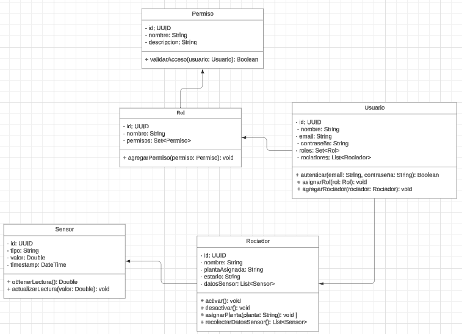
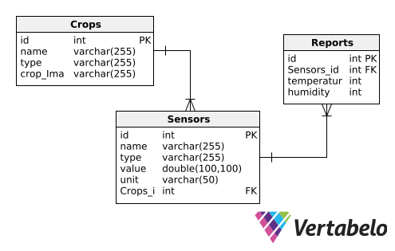

<h3 align="center"> Universidad Peruana de Ciencias Aplicadas </h3>

<h3 align="center"> Ingeniería de Software </h3>
<h3 align="center"> Ciclo 2024 - 2 </h3>

 

  

 

<h1 align="center"> TB1 Report </h1>

<h3 align="center"> Desarrollo de Soluciones IoT - SW53 </h3>

<h3 align="center"> Docente:  </h3>

<h3> Startup: HidroBots </h3>

<h3> Product: </h3>

<h3> Team Members: </h3>

| Member                              |    Code    |
| :---------------------------------- | :--------: |
| Ampudia Flores, José Carlos Isaac   | u202112936 |
| Defilippi Santillán, Diego          | U202120448 |
| Horna Silva, Fabio Ernesto          | u202020229 |
| Lopez Huarcaya, Leonardo Paul       | u202124304 |
| Paucar De La Cruz, Tatiana Medalith | u20211f955 |

<h3 align="center">Septiembre, 2024</h3>

  

## Registro de Versiones del Informe

El objetivo de esta sección es resumir las modificaciones relevantes que se realizan al informe durante el ciclo de vida del proyecto. Esta sección inicia en una página nueva e incluye un cuadro con la siguiente estructura:

<table>
  <thead>
    <tr>
      <th>Versión</th>
      <th>Fecha</th>
      <th>Autor</th>
      <th>Descripción de modificación</th>
    </tr>
  </thead>
  <tbody>
    <tr>
      <td>0.1</td>
      <td>27/08/2024</td>
      <td>Diego Defilippi</td>
      <td>Implementación de diseño de entrevistas, desarrollar las entrevistas, el Impact Mapping, User Stories y Event Storming.</td>
    </tr>
    <tr>
      <td>0.2</td>
      <td>27/08/2024</td>
      <td>Jose Ampudia</td>
      <td>Implementación del Capítulo 1, entrevistas, desarrollo de Event Storming en colaboración con otros integrantes del equipo.</td>
    </tr>
    <tr>
      <td>0.3</td>
      <td>01/09/2024</td>
      <td>Tatiana Paucar</td>
      <td>Desarrollo de entrevistas, implementación del Needfinding, Event Storming, User Stories, documentar la capa de dominio de los bounded contexts.</td>
    </tr>
    <tr>
      <td>0.4</td>
      <td>10/10/2024</td>
      <td>Leonardo Lopez</td>
      <td>Desarrollo de entrevistas, implementación del Needfinding, desarrollo de Software Architecture, esto incluye el desarrollo del modelo C4.</td>
    </tr>
    <tr>
      <td>0.5</td>
      <td>18/10/2024</td>
      <td>Fabio Horna</td>
      <td>Desarrollo de entrevistas, y la investigación sobre los competidores y el análisis competitivo y las estrategias frente a los competidores, del mismo modo, apoyo en el desarrollo de Tactical-Level Domain-Driven Design.</td>
    </tr>
    <tr>
      <td>1.0</td>
      <td>20/10/2024</td>
      <td>Equipo HidroBots</td>
      <td>Documentación de la solución versión 1.0.</td>
    </tr>
  </tbody>
</table>

  

## Project Report Collaboration Insights

Para la elaboracion del proyecto, se ha utilizado la herramienta Github para el control de versiones y colaboración en tiempo real. A continuación se comparte el link del repositorio del proyecto:

| Repositorio del Proyecto | https://github.com/IoT-Solutions-SW71-Grupo-4/HidroBots-Report.git |
| :---: | :---: |

**TB1:**

Para la entrega del TB1 se designó tareas a cada integrente, el cual se podrá visualizar a continuación:

| Miembro del Equipo | Tarea Asignada |
| :---: | :---: |
| Diego Defilippi | Implementación de diseño de entrevistas, desarrollar las entrevistas, el Impact Mapping, User Stories y Event Storming. |
| Jose Ampudia | Implementación del Capítulo 1, entrevistas, desarrollo de Event Storming en colaboración con otros integrantes del equipo. |
| Tatiana Paucar | Desarrollo de entrevistas, implementación del Needfinding, Event Storming, User Stories, documentar la capa de dominio de los bounded contexts. |
| Leonardo Lopez | Desarrollo de entrevistas, implementación del Needfinding, desarrollo de Software Architecture, esto incluye el desarrollo del modelo C4. |
| Fabio Horna | Desarrollo de entrevistas, y la investigación sobre los competidores y el análisis competitivo y las estrategias frente a los competidores, del mismo modo, apoyo en el desarrollo de Tactical-Level Domain-Driven Design. |

Es importante mencionar que durante la elaboración del informe se realizaron commits respectivos a cada tarea asignada, con el fin de mantener un control de versiones y colaboración en tiempo real.

Miembros

- Diego Defilippi (DiegoDefSan)
- Jose Ampudia (IsaacAmp24)
- Tatiana Paucar (TMedalith)
- Leonardo Lopez (leonardox-lh)
- Fabio Horna (FabioHorna)

Gracias a GitHub, se ha podido llevar un control de versiones y colaboración en tiempo real, permitiendo a los miembros del equipo trabajar de manera asincrónica y sincrónica en el proyecto. Además, gracias a Gitflow, se ha creado varias ramas para el desarrollo de las tareas asignadas, permitiendo a los miembros del equipo trabajar de manera independiente y colaborativa en el proyecto.

La rama "develop" se ha utilizado para la integración de las tareas asignadas a cada miembro del equipo, permitiendo la integración de las tareas de manera ordenada y eficiente. La rama "main" sirvió para presentar la versión final del proyecto.

- **TB1**:

  

# Contenido

## Tabla de Contenidos

### [Registro de versiones del informe](#registro-de-versiones-del-informe)

### [Project Report Collaboration Insights](#project-report-collaboration-insights)

### [Contenido](#contenido)

### [Student Outcome](#student-outcome-1)

### [Capítulo I: Introducción](#capítulo-i-introducción-1)

- [1.1. Startup Profile](#11-startup-profile)
  - [1.1.1. Descripción de la Startup](#111-descripción-de-la-startup)
  - [1.1.2. Perfiles de integrantes del equipo](#112-perfiles-de-integrantes-del-equipo)
- [1.2. Solution Profile](#12-solution-profile)
  - [1.2.1 Antecedentes y problemática](#121-antecedentes-y-problemática)
  - [1.2.2 Lean UX Process](#122-lean-ux-process)
    - [1.2.2.1. Lean UX Problem Statements](#1221-lean-ux-problem-statements)
    - [1.2.2.2. Lean UX Assumptions](#1222-lean-ux-assumptions)
    - [1.2.2.3. Lean UX Hypothesis Statements](#1223-lean-ux-hypothesis-statements)
    - [1.2.2.4. Lean UX Canvas](#1224-lean-ux-canvas)
- [1.3. Segmentos objetivo](#13-segmentos-objetivo)

### [Capítulo II: Requirements Elicitation & Analysis](#capítulo-ii-requirements-elicitation--analysis-1)

- [2.1. Competidores](#21-competidores)
  - [2.1.1. Análisis competitivo](#211-análisis-competitivo)
  - [2.1.2. Estrategias y tácticas frente a competidores](#212-estrategias-y-tácticas-frente-a-competidores)
- [2.2. Entrevistas](#22-entrevistas)
  - [2.2.1. Diseño de entrevistas](#221-diseño-de-entrevistas)
  - [2.2.2. Registro de entrevistas](#222-registro-de-entrevistas)
  - [2.2.3. Análisis de entrevistas](#223-análisis-de-entrevistas)
- [2.3. Needfinding](#23-needfinding)
  - [2.3.1. User Personas](#231-user-personas)
  - [2.3.2. User Task Matrix](#232-user-task-matrix)
  - [2.3.3. User Journey Mapping](#233-user-journey-mapping)
  - [2.3.4. Empathy Mapping](#234-empathy-mapping)
  - [2.3.5. As-is Scenario Mapping](#235-as-is-scenario-mapping)
- [2.4. Ubiquitous Language](#24-ubiquitous-language)

### [Capítulo III: Requirements Specification](#capítulo-iii-requirements-specification-1)

- [3.1. To-Be Scenario Mapping](#31-to-be-scenario-mapping)
- [3.2. User Stories](#32-user-stories)
- [3.3. Impact mapping](#33-impact-mapping)
- [3.4. Product Backlog](#34-product-backlog)

### [Capítulo IV: Solutions Software Design](#capítulo-iv-solution-software-design)

- [4.1. Strategic-Level Domain-Driven Design](#41-strategic-level-domain-driven-design)
  - [4.1.1. Event Storming](#411-event-storming)
    - [4.1.1.1. Candidate Context Discovery](#4111-candidate-context-discovery)
    - [4.1.1.2. Domain Message Flows Modeling](#4112-domain-message-flows-modeling)
    - [4.1.1.3. Bounded COntext Canvases](#4113-bounded-context-canvases)
  - [4.1.2. Context Mapping](#412-context-mapping)
  - [4.1.3. Software Architecture](#413-software-architecture)
    - [4.1.3.1. Software Architecture System Landscape Diagram](#4131-software-architecture-system-landscape-diagram)
    - [4.1.3.2. Software Architecture Context Level Diagrams](#4132-software-architecture-context-level-diagrams)
    - [4.1.3.3. Software Architecture Container Level Diagrams](#4133-software-architecture-container-level-diagrams)
    - [4.1.3.4. Software Architecture Deployment Diagrams](#4134-software-architecture-deployment-diagrams)
- [4.2. Tactical-Level Domain-Driven Design](#42-tactical-level-domain-driven-design)
  - [4.2.X. Bounded Context: <Bounded Context name>](#42x-bounded-context)
    - [4.2.X.1. Domain Layer](#42x1-domain-layer)
    - [4.2.X.2. Interface Layer](#42x2-interface-context)
    - [4.2.X.3. Application Layer](#42x3-application-context)
    - [4.2.X.4. Infrastructure Layer](#42x4-infrastructure-context)
    - [4.2.X.5. Bounded Context Software Architecture Component Level Diagrams](#42x5-bounded-context-software-architecture-component-level-diagrams)
    - [4.2.X.6. Bounded Context Software Architecture Code Level Diagrams](#42x6-bounded-context-software-architecture-code-level-diagrams)
      - [4.2.X.6.1. Bounded Context Domain Layer Class Diagrams](#42x61-bounded-context-domain-layer-class-diagrams)
      - [4.2.X.6.2. Bounded Context Database Design Diagram](#42x62-bounded-context-database-design-diagram)

### [Capítulo V: Solution UI/UX Design](#capítulo-v-solutions-uiux-design)

- [5.1. Style Guidelines](#51-style-guidelines)
  - [5.1.1. General Style Guidelines](#511-general-style-guidelines)
  - [5.1.2. Web Style Guidelines](#512-web-style-guidelines)
- [5.2. Information Architecture](#52-information-architecture)
  - [5.2.1. Organization Systems](#521-organization-systems)
  - [5.2.2. Labeling Systems](#522-labeling-systems)
  - [5.2.3. SEO Tags and Meta Tags](#523-seo-tags-and-meta-tags)
  - [5.2.4. Searching Systems](#524-searching-systems)
  - [5.2.5. Navigation Systems](#525-navigation-systems)
- [5.3. Landing Page UI Design](#53-landing-page-ui-design)
  - [5.3.1. Landing Page Wireframe](#531-landing-page-wireframe)
  - [5.3.2. Landing Page Mock-up](#532-landing-page-mock-up)
- [5.4. Applications UX/UI Design](#54-web-applications-uxui-design)
  - [5.4.1. Applications Wireframes](#541-web-applications-wireframes)
  - [5.4.2. Applications Wireflow Diagrams](#542-web-applications-wireflow-diagrams)
  - [5.4.3. Applications Mock-ups](#543-web-applications-mock-ups)
  - [5.4.4. Applications User Flow Diagrams](#544-web-applications-user-flow-diagrams)
- [5.5. Aplications Prototyping](#55-applications-prototyping)

### [Capítulo VI: Product Implementation, Validation \& Deployment](#capítulo-vi-product-implementation-validation--deployment)

- [6.1. Software Configuration Management](#61-software-configuration-management)
  - [6.1.1. Software Development Environment Configuration](#611-software-development-environment-configuration)
  - [6.1.2. Source Code Management](#612-source-code-management)
  - [6.1.3. Source Code Style Guide \& Conventions](#613-source-code-style-guide--conventions)
  - [6.1.4. Software Deployment Configuration](#614-software-deployment-configuration)
- [6.2. Landing Page, Services \& Applications Implementation](#62-landing-page-services--applications-implementation)
  - [6.2.1. Sprint 1](#621-sprint-1)
    - [6.2.1.1. Sprint Planning 1](#6211-sprint-planning-1)
    - [6.2.1.2. Sprint Backlog 1](#6212-sprint-backlog-1)
    - [6.2.1.3. Development Evidence for Sprint Review](#6213-development-evidence-for-sprint-review)
    - [6.2.1.4. Testing Suite Evidence for Sprint Review](#6214-testing-suite-evidence-for-sprint-review)
    - [6.2.1.5. Execution Evidence for Sprint Review](#6215-execution-evidence-for-sprint-review)
    - [6.2.1.6. Services Documentation Evidence for Sprint Review](#6216-services-documentation-evidence-for-sprint-review)
    - [6.2.1.7. Software Deployment Evidence for Sprint Review](#6217-software-deployment-evidence-for-sprint-review)
    - [6.2.1.8. Team Collaboration Insights during Sprint](#6218-team-collaboration-insights-during-sprint)
- [6.3. Validation Interviews](#63-validation-interviews)
  - [6.3.1. Diseño de Entrevistas](#631-diseño-de-entrevistas)
  - [6.3.2. Registro de Entrevistas](#632-registro-de-entrevistas)
  - [6.3.3. Evaluaciones según heurísticas](#633-evaluaciones-según-heurísticas)
- [6.4. Video About-the-Product](#64-video-about-the-product)

### [Conclusiones](#conclusiones-1)

- [Conclusiones y recomendaciones](#conclusiones-y-recomendaciones)
- [Video About-the-Team](#video-about-the-team)

### [Bibliografía](#bibliografía-1)

### [Anexos](#anexos-1)

  

# Student Outcome

<b>ABET – EAC - Student Outcome 5:</b> La capacidad de funcionar efectivamente en un equipo cuyos miembros juntos proporcionan liderazgo, crean un entorno de colaboración e inclusivo, establecen objetivos, planifican tareas y cumplen objetivos. En el siguiente cuadro se describe las acciones realizadas y enunciados de conclusiones por parte del grupo, que permiten sustentar el haber alcanzado el logro del ABET – EAC - Student Outcome 5.

<table>
  <thead>
    <tr>
      <th>Criterio específico</th>
      <th>Acciones realizadas</th>
      <th>Conclusiones</th>
    </tr>
  </thead>
  <tbody>
    <tr>
      <td><strong>Trabaja en equipo para proporcionar liderazgo en forma conjunta</strong></td>
      <td>
        <strong>Diego Defilippi</strong> 
        <strong>TB1:</strong> 
        Lideré la distribución de tareas, me aseguré de que cada miembro del equipo comprendiera sus responsabilidades. Organizamos reuniones periódicas para revisar avances y ajustar el plan según los resultados obtenidos. Mi función principal fue implementar los bounded context canvases y el apoyo continuo para el desarrollo del Event Storming.  
        <strong>Jose Ampudia</strong> 
        <strong>TB1:</strong> 
        Propuse el avance conjunto para el desarrollo de los puntos críticos del desarrollo del informe, tales como el capítulo 4, el desarrollo del Event Storming, las cuales se desarrolló con éxito.  
        <strong>Tatiana Paucar</strong> 
        <strong>TB1:</strong> 
        Fomenté la participación activa lo que ayudó en la toma de decisiones clave para el proyecto. Del mismo modo para el desarrollo óptimo de los bounded contexts, los cuales son fundamentales para dividir las funcionalidades principales de la aplicación por módulos.  
        <strong>Leonardo Lopez</strong> 
        <strong>TB1:</strong> 
        Propuse un sistema de trabajo colaborativo basado en las fortalezas del equipo y medió en la resolución de conflictos. Además, me centré en implementar el modelo C4, lo cual es fundamental para tener una vista de alto nivel sobre el funcionamiento de la aplicación.  
        <strong>Fabio Horna</strong> 
        <strong>TB1:</strong> 
        Coordiné el uso de herramientas colaborativas y promoví la comunicación constante en el equipo. Del mismo modo, me encargué de realizar el Tactical-Level Domain-Driven Design lo que nos permite tener una visión más clara de la estructura de la aplicación y de cómo se relacionan los diferentes módulos. 
      </td>
      <td>
        El liderazgo conjunto permitió la distribución adecuada de tareas, facilitando la consecución de los objetivos del proyecto de manera efectiva. La correcta supervisión, mediación y comunicación aseguraron que todos los miembros estuvieran alineados y motivados.
      </td>
    </tr>
    <tr>
      <td><strong>Crea un entorno colaborativo e inclusivo, establece metas, planifica tareas y cumple objetivos</strong></td>
      <td>
        <strong>Diego Defilippi</strong> 
        <strong>TB1:</strong> 
        Establecí metas claras y coordiné la planificación de tareas, asegurando que cada fase del proyecto tuviera objetivos alcanzables. Es por ello que delegamos responsabilidades para la correcta implementación de la solución.  
        <strong>Jose Ampudia</strong> 
        <strong>TB1:</strong> 
        Supervisé el cumplimiento de los plazos y fomentó un entorno inclusivo al involucrar a todos los miembros en la revisión de avances, lo que nos permitió corregir errores y mejorar características de nuestra solución.  
        <strong>Tatiana Paucar</strong> 
        <strong>TB1:</strong> 
        Facilité el uso de herramientas colaborativas y organicé sesiones para revisar el progreso del equipo, tales como reuniones en Discord, además de diseñar modelos de dominio y de arquitectura que permitieron una mejor comprensión de la solución.  
        <strong>Leonardo Lopez</strong> 
        <strong>TB1:</strong> 
        Me encargué de la gestión de recursos y del seguimiento de los avances de cada miembro del equipo, asegurando que se cumplieran los plazos. Es por ello, que para la implementación de modelo C4, se tuvo que coordinar con los miembros del equipo para establecer una visión clara de la arquitectura.  
        <strong>Fabio Horna</strong> 
        <strong>TB1:</strong> 
        Promoví la cohesión del equipo y facilitó la toma de decisiones consensuada para cumplir con los objetivos establecidos. Del mismo modo, se realizaron entrevistas y se recopiló información para el desarrollo de la solución. 
      </td>
      <td>
        El ambiente inclusivo, la colaboración y la correcta planificación permitieron al equipo cumplir con los objetivos del proyecto de manera efectiva, optimizando los recursos y maximizando la eficiencia del trabajo en equipo. La cohesión y la revisión constante aseguraron que todos los miembros estuvieran alineados con los objetivos finales.
      </td>
    </tr>
  </tbody>
</table>

  

# Capítulo I: Introducción

## 1.1. StartUp Profile

### 1.1.1. Descripción de la StartUp

Hidrobots, fue creada con el principal objetivo de facilitar la vida de los agricultores peruanos, mediante la implementación de tecnologías de IoT para la automatización de procesos de riego en cultivos agrícolas. La solución propuesta por HidroBots, permitirá a los medianos agricultores y centros de investigación agrícola del Perú, tener acceso a una herramienta tecnológica que les permita controlar el riego de sus cultivos desde cualquier lugar y en tiempo real desde sus dispositivos móviles o computadoras. De esta manera, los usuarios podrán monitorear el estado de sus plantíos, recolectar información sobre la composición del suelo y tomar decisiones en tiempo real, mejorando la eficiencia el uso del agua y la productividad de los cultivos.

### 1.1.2. Perfiles de integrantes del equipo

<table>
  <tr align="center">
    <td rowspan="4">
      
    </td>
    <td align="left">
      <b>Nombre y Apellido:</b>
                   
      Diego Defilippi Santillán
    </td>
  </tr>
  <tr>
    <td align="left">
    <b>Código:</b>
     
    U202120448
    </td>
  </tr>
  <tr>
    <td align="left">
    <b>Carrera:</b>
     
    Ingeniería de Software
    </td>
  </tr>
  <tr>
    <td align="left">
    <b>Acerca de:</b>
     
    Soy Diego Defilippi, tengo 21 años y tengo una gran pasión por la programación y el diseño de software. Desde hace tres años, estoy aprendiendo las diversas ramas de esta fascinante ingeniería, como el backend, frontend y data science. Además, siempre ando en búsqueda de soluciones creativas e innovadoras ante problemas cotidianos. Finalmente, me considero una persona autodidacta, organizada y con muchos ánimos de aprender.
    </td>
  </tr>
  </tr>

  <tr align="center">
    <td rowspan="4">
      
    </td>
    <td align="left">
      <b>Nombre y Apellido:</b>
                   
      José Carlos Isaac Ampudia Flores
    </td>
  </tr>
  <tr>
    <td align="left">
    <b>Código:</b>
     
    U202112936
    </td>
  </tr>
  <tr>
    <td align="left">
    <b>Carrera:</b>
     
    Ingeniería de Software
    </td>
  </tr>
  <tr>
    <td align="left">
    <b>Acerca de:</b>
     
    Soy José Ampudia, tengo 20 años, estudiante de la carrera de Ingeniería de Software, tengo habilidades en el desarrollo web, tanto en el frontend como en el backend. Me gusta aprender cosas nuevas y apoyar a mis compañeros en lo que necesiten. Me considero una persona responsable, proactiva y con muchas ganas de aprender.
    </td>
  </tr>
  </tr>
   <tr align="center">
    <td rowspan="4">
      
    </td>
    <td align="left">
      <b>Nombre y Apellido:</b>
                   
      Tatiana Medalith Paucar De La Cruz
    </td>
  </tr>
  <tr>
    <td align="left">
    <b>Código:</b>
     
    U20211F955
    </td>
  </tr>
  <tr>
    <td align="left">
    <b>Carrera:</b>
     
    Ingeniería de Software
    </td>
  </tr>
  <tr>
    <td align="left">
    <b>Acerca de:</b>
     
     Soy Tatiana Medalith Paucar De La Cruz, tengo 20 años y estudio Ingeniería de Software en la UPC. Mi interés se enfoca principalmente en el desarrollo web y móvil, así como en la seguridad informática. Además, me considero una persona organizada y responsable, con un compromiso hacia el aprendizaje y la mejora continua.
    </td>
  </tr>
  </tr>

<tr align="center">
    <td rowspan="4">
      
    </td>
    <td align="left">
      <b>Nombre y Apellido:</b>
                   
      Leonardo Paul López Huarcaya
    </td>
  </tr>
  <tr>
    <td align="left">
    <b>Código:</b>
     
    U202124304
    </td>
  </tr>
  <tr>
    <td align="left">
    <b>Carrera:</b>
     
    Ingeniería de Software
    </td>
  </tr>
  <tr>
    <td align="left">
    <b>Acerca de:</b>
     
    Soy Leonardo López, tengo 20 años y cuento con conocimiento de Angular, Sprint Boot, mysql y Flutter, herramientas necesarias para la creación de este proyecto. Finalmente, me considero una persona proactiva, autodidacta y con un buen trabajo en equipo.
    </td>
  </tr>
  </tr>
  
<tr align="center">
    <td rowspan="4">
      
    </td>
    <td align="left">
      <b>Nombre y Apellido:</b>
                   
      Fabio Horna Silva
    </td>
  </tr>
  <tr>
    <td align="left">
    <b>Código:</b>
     
    U202020229
    </td>
  </tr>
  <tr>
    <td align="left">
    <b>Carrera:</b>
     
    Ingeniería de Software
    </td>
  </tr>
  <tr>
    <td align="left">
    <b>Acerca de:</b>
     
    Soy Fabio, tengo 21 años y soy sumamente apasionado al análisis de datos y a los videojuegos. Actualmente me encuentro trabajando como analista de datos y poseo conocimientos avanzados de redes neuronales, SQL, y otras herramientas como Python, donde manejo pandas y otras herramientas para la minería de datos. Me considero una buena persona para trabajar en equipo y me gusta ayudar a mis compañeros.
    </td>
  </tr>

</table>

## 1.2. Solution Profile
Nuestra propuesta es la creación de una solucion IoT, la cual tiene como objetivo principal la automatización de tareas de riego en cultivos agrícolas, aplicando tecnologías de IoT para la recolección de datos, analizar la composición del suelo, de esta manera hacer óptima la toma de decisiones en tiempo real.

### 1.2.1. Antecedentes y problemática
 
 **What? - ¿Qué?**  
 Según resultados de la Encuesta Nacional Agropecuaria (ENA) 2016, ejecutada por el Instituto Nacional de Estadística e Informática (INEI), se informó que del total de pequeños productores/as (45,3%) que aplicaron riego, el 17,1% utilizaron riego tecnificado incrementándose en 2,2 puntos porcentuales, respecto al año 2015. Por lo tanto, el problema principal que se presenta es la falta de acceso a tecnologías de riego tecnificado, lo cual limita la eficiencia en el uso del agua y la productividad de los cultivos.

  **When? - ¿Cuándo?**  
  El problema surge cuando se refleja la necesidad para automatizar procesos de riego en cultivos agrícolas, por lo que la falta de tecnología para realizar un riego eficiente en los plantíos, limita la eficiencia en el uso del agua y la productividad de los cultivos.

  **Where? - ¿Dónde?**  
  El problema se presenta en zonas rurales de Perú, donde la agricultura es una de las principales actividades económicas, y donde la falta de tecnología para realizar un riego eficiente en los cultivos, limita la eficiencia en el uso del agua y la productividad de los cultivos. Esta solución está direccionada a los Medianos agricultores y Centros de Investigación Agrícola del Perú.

  **Who? - ¿Quién?**  
  Los principales usuarios afectados por este problema son los medianos agricultores y centros de investigación agrícola del Perú, y los beneficiarios directos serán los profesinales técnicos y especialistas en agricultura, quienes podrán tener acceso a una herramienta tecnológica que les permita automatizar procesos de riego en cultivos agrícolas, de esta manera ambos segmentos objetivos mejorarán la productividad de los cultivos.

  **Why? - ¿Por qué?**  
  Las causas principales es la manera en cómo se involucra la tecnología con la agricultura. Muchas veces los agricultores no tienen acceso a soluciones digitales, por lo que esta falta de integración tecnológica limita la productividad de los cultivos y el uso eficiente del agua.

  **How? - ¿Cómo?**  
  Se implementará una solución IoT, la cual permitirá a los usuarios controlar el riego de sus cultivos de manera remota, accediendo desde su dispositivo móvil o computadora, a través de una aplicación web y móvil, el cual podrán recibir notificaciones en tiempo real sobre el estado de sus cultivos.

  **How much? - ¿Cuánto?**  
  _¿Cuánto afecta este problema?:_  
  La sequía, el estrés hídrico y las bajas temperaturas influyeron en la disminución de la población pecuaria durante el año 2016, siendo las alpacas con 889 mil cabezas y ovinos con 836 mil cabezas, las especies que más disminuyeron respecto al año anterior, principalmente en los departamentos de la zona sur del país. Igualmente, se observó una disminución en el número de productores/as que conducen estas especies. (INEI, 2016).

  _¿Cuánto costará resolver este problema?:_  
  El costo de la solución dependerá de la cantidad de sensores y actuadores que se requieran para la implementación de la solución IoT, además de los costos de mantenimiento y soporte técnico.

  _¿Cuántas personas se beneficiarán?:_  
  La solución puede ser utilizada por los profesionales técnicos y especialistas en agricultura, por lo que no hay un límite de personas que usen la solución, pero se estima que al menos el 40% de los medianos agricultores y centros de investigación agrícola del Perú podrían beneficiarse de la solución.

  **Conclusiones de 5w y 2h:**  
  En conclusión, gracias a la implementación de las 5W's y 2H's, se ha podido identificar el problema principal que se presenta en la agricultura peruana, Para conseguir una solución eficiente se presentará el producto a medianos agricultores y centros de investigación agrícola para que de esta manera puedan mejorar la productividad de los cultivos.

### 1.2.2. Lean UX Process

#### 1.2.2.1. Lean UX Problem Statements

**Problem Statement:**  

En HidroBots, entendemos que en el Perú, una de las mayores fuentes de ingreso es la agricultura. Por ello, es bien sabido que para realizar producciones agrícolas de calidad implican muchos factores, la calidad de los suelos, la riqueza de los sustratos, presencia de minerales ricos en nutrientes y lo más importante, las aguas que estarán disponibles para hidratar los cultivos. 

**Problema:** En la actualidad, algunos entienden que la tecnología y la agricultura no van de la mano, esto no es así. Muchos agricultores desconocen de la existencia de tecnologías que les permitan automatizar procesos, principalmente el riego de sus cultivos. Por ello, se ha identificado que la falta de acceso a tecnologías de riego tecnificado limita la eficiencia en el uso del agua y la productividad de los cultivos.  

**Impacto:** Esta propuesta genera un impacto bastante positivo en el área de la agricultura, porque permitirá a los medianos agricultores y centros de investigación agrícola del Perú, tener acceso a una herramienta tecnológica que les permita automatizar procesos de riego en cultivos agrícolas, poder controlar el riego de sus cultivos desde cualquier lugar y en tiempo real desde sus dispositivos móviles o computadoras. 

#### 1.2.2.2. Lean UX Assumptions

###### **Business Outcomes:**

- Incremento del 30% en la eficiencia del uso del agua en los cultivos de los clientes que adopten la solución en el primer año.
- Incremento de la productividad de los cultivos en un 20% que utilicen nuestra plataforma durante una jornada completa.
- 40% de reducción en el tiempo dedicado al monitoreo manual de los cultivos por parte de los profesionales técnicos y especialistas en agricultura.
- 20% de aumento en la adopción de tecnologías de riego tecnificado entre los medianos agricultores de Perú en los primeros dos años de lanzamiento.
- 50% de disminución en las pérdidas de cultivos debido a sequías para los usuarios de la plataforma.
- 15% de aumento en los ingresos de los agricultores que utilizan la solución, debido a la mejora en la calidad y cantidad de sus cosechas.
- 60% de reducción en el número de visitas presenciales necesarias para el mantenimiento de los sistemas de riego.

###### **Users:**

Medianos agricultores y Centros de Investigación Agrícola del Perú, especialmente el personal técnico y especialistas en agricultura, que buscan mejorar la productividad de sus cultivos por medio de la automatización de procesos de riego.

###### **User Outcomes & Benefits:**

- Medianos agricultores: Control de riego en sus cultivos desde cualquier lugar, monitorear el estado de sus plantíos, recolectar información sobre la composición del suelo y tomar decisiones en tiempo real, mejorando la eficiencia el uso del agua.

- Centros de Investigación Agrícola: Recolección de datos en tiempo real, análisis de la composición del suelo, lo que permite realizar investigaciones mucho más precisas y eficientes.

###### **Feature Assumptions:**

- Monitoreo en tiempo real sobre la humedad del suelo, la temperatura, que permitan a los usuarios tomar decisiones.

- Control remoto de riego, función que permitirá controlar el riego de los cultivos desde la aplicación.

- Alertas personalizadas, los usuarios recibirán notificaciones cuando los sensores de humedad del suelo bajen de un umbral determinado.

- Interfaz amigable, la aplicación será fácil de usar y accesible para los usuarios, mostrando información relevante de manera clara y concisa.

###### **Business Assumptions:**

1.  **Creemos que nuestros usuarios necesitan** un proceso de riego automatizado donde puedan controlar el riego de sus cultivos desde cualquier lugar y en tiempo real desde sus dispositivos móviles o computadoras.

2. **Estas necesidades se pueden satisfacer** a través de una solución IoT y la creación de una aplicación web y móvil que permita a los usuarios controlar el riego de sus cultivos de manera remota.

3. **Nuestros clientes serán** medianos agricultores y centros de investigación agrícola del Perú, que buscan mejorar la productividad de sus cultivos.

4. **El valor más importante que un cliente quiere de nuestros servicios es**  la capacidad de poder controlar el sistema de riego para sus cultivos desde cualquier lugar, monitoreando el estado de sus plantíos, recolectando información sobre la composición del suelo y tomando decisiones en tiempo real, de esta manera mejorando la eficiencia el uso del agua.

5. **El cliente también va obtener** otros beneficios adicionales como la toma de decisiones dentro de la aplicación, además de recibir notificaciones en tiempo real sobre el estado de sus cultivos.

6. **Vamos a obtener la mayoría de nuestros clientes mediante** la promoción de la solución IoT en ferias agrícolas, eventos de agricultura y a través de la publicidad en redes sociales.

7. **Vamos a obtener ingresos mediante** la venta de la propuesta IoT y la suscripción a la aplicación web y móvil.

8. **Nuestra competencia principal** son las empresas que ofrecen soluciones de riego tecnificado en el mercado peruano.

9. **Vamos a tener ventaja frente a nuestra competencia debido a** la usabilidad y accesibilidad de nuestra aplicación. Además del sistema de riego automatizado, nuestra aplicación permitirá a los usuarios monitorear el estado de sus cultivos y recibir notificaciones.

10. **El mayor riesgo del servicio es** la falta de adopción de la solución por parte de los usuarios, debido a la falta de conocimiento sobre la tecnología y la falta de confianza en la solución.

11. **Lo resolveremos mediante** el desarrollo de pruebas que serán realizadas por los usuarios y estableciendo una estrategia de marketing, como videos del funcionamiento correcto del servicio, permitiendo a los usuarios adoptar la confianza en la solución.

###### **User Assumptions:**

**¿Quién es el usuario?**  
Los usuarios son medianos agricultores y Centros de Investigación Agrícola del Perú, especialmente el personal técnico y especialistas en agricultura.  

**¿Qué problemas tiene nuestro producto? ¿Resolver?**  
Gran parte del sector agrícola, no están familiarizados con la tecnología, lo que generaría dificultades al adaptarse a nuestra propuesta. Para resolver esto, nuestro producto debe ser altamente intuitivo y fácil de usar, implementar guías de paso a paso y tutoriales para los usuarios.  

**¿Qué características son importantes?**  
Las características que resaltan son el monitoreo en tiempo real sobre la humedad del suelo, el control de riego remoto, notificaciones de alerta, simplicidad en la interfaz, programar riegos automáticos. Del miismo modo se tiene pensado implementar datos históricos y ver estos datos en gráficos.  

**¿Dónde encaja nuestro producto en su trabajo o vida?**  
Nuestro producto encaja en la vida laboral de los agricultores y técnicos de los centros de investigación agrícola, automatizando procesos repetitivos y disminuyendo las visitas presenciales a los cultivos.  

**¿Cuándo y cómo es nuestro producto? ¿Usado?**  
Nuestro producto es usado a lo largo del día, principalmente en las horas de riego, dependiendo de los niveles de humedad, dado que en el amanecer y atardecer, la humedad es propensa a cambiar.  

**¿Cómo debe verse nuestro productoo y cómo debe comportarse?**  
La interfaz visusal debe ser intuitiva y amigable, mostrando información relevante de manera clara, con gráficos fáciles de entender. Debe comportarse de manera ágil, tiempos de respuesta rápidos y fluidos, esto implica que sea multiplataforma, es decir, que pueda ser accedido desde cualquier dispositivo.  

#### 1.2.2.3. Lean UX Hypothesis Statements

A continuación, se presentan las hipótesis que se han planteado para la solución a la problemática dentro de las funcionalidades que ofrece nuestra propuesta de solución IoT. Cada hipótesis será específica, medible, de tal manera que se pueda evaluar el éxito de manera objetiva.

- **Hypothesis Statement 1:**  
    **Creemos que** los medianos agricultores necesitan una funcionalidad que les permita monitorear en tiempo real para asegurarse del uso eficiente del agua y evitar desperdicios.  

    **Sabremos** que hemos tenido éxito.  

    **Cuando** el 80% de los usuarios informen una reducción en el tiempo dedicado al monitoreo manual y un 30% de aumento en la eficiencia del uso del agua.  

- **Hypothesis Statement 2:**  
    **Creemos que** los usuarios necesitan una funcionalidad que les permita controlar el riego de sus cultivos desde la aplicación y programar riegos automáticos.  

    **Sabremos** que hemos tenido éxito.  

    **Cuando** se haya logrado una reducción del 50% en las visitas presenciales necesarias para activar manualmente el riego y un 20% de aumento en la productividad de los cultivos.  

- **Hypothesis Statement 3:**  
    **Creemos que** los usuarios necesitan recibir alertas personalizadas cuando los niveles de humedad del suelo bajen de un umbral crítico para tomar decisiones rápidas y evitar daños en los cultivos.  

    **Sabremos** que hemos tenido éxito.  

    **Cuando** los usuarios logren reducir las incidencias de riego en un 45% gracias a la acción inmediata tras recibir alertas.  

- **Hypothesis Statement 4:**  
    **Creemos que** los usuarios necesitan una interfaz fácil de usar y accesible para poder visualizar la información importante sobre el estado de sus cultivos.  

    **Sabremos** que hemos tenido éxito.  

    **Cuando** el 80% de los usuarios completen tareas básicas en la aplicación sin necesidad de asistencia adicional.  

#### 1.2.2.4. Lean UX Canvas

## 1.3. Segmentos objetivo

Un estudio reciente de la Encuesta Nacional Agropecuaria (ENA) 2016, ejecutada por el Instituto Nacional de Estadística e Informática (INEI), informó que del total de pequeños productores/as (45,3%) que aplicaron riego, el 17,1% utilizaron riego tecnificado incrementándose en 2,2 puntos porcentuales, respecto al año 2015. Por lo tanto, el problema principal que se presenta es la falta de acceso a tecnologías de riego tecnificado, lo cual limita la eficiencia en el uso del agua y la productividad de los cultivos.

Nuestros principales segmentos objetivo son:

- **Medianos agricultores:**  
 Los medianos agricultores son un segmento clave para nuestra solución, ya que son los principales usuarios que se beneficiarán de la automatización de procesos de riego en sus cultivos. Este segmento se caracteriza por tener un tamaño de terreno mediano, con una producción agrícola considerable y una necesidad de mejorar la eficiencia en el uso del agua y la productividad de sus cultivos.  

- **Centros de Investigación Agrícola:**  
Los centros de investigación agrícola son otro segmento objetivo importante, ya que son los encargados de realizar investigaciones y estudios sobre la agricultura en el Perú. Estos centros necesitan herramientas tecnológicas que les permitan recolectar datos en tiempo real, analizar la composición del suelo y realizar investigaciones mucho más precisas y eficientes.

# Capítulo II: Requirements Elicitation & Analysis

## 2.1. Competidores

### 2.1.1. Análisis competitivo

| **Aspecto**                                 | **HidroBots**                                                                                                                                                                                    | **Netafim Perú**                                                                                                                                                                            | **Irritec Perú**                                                                                                                                                                                          | **Camposol**                                                                                                                                                                       |
| ------------------------------------------- | ------------------------------------------------------------------------------------------------------------------------------------------------------------------------------------------------ | ------------------------------------------------------------------------------------------------------------------------------------------------------------------------------------------- | --------------------------------------------------------------------------------------------------------------------------------------------------------------------------------------------------------- | ---------------------------------------------------------------------------------------------------------------------------------------------------------------------------------- |
| **Overview**                                | Solución IoT que automatiza el riego en cultivos agrícolas, permitiendo la toma de decisiones en tiempo real. Está dirigida a medianos agricultores y centros de investigación agrícola en Perú. | Netafim es un líder global en riego tecnificado, especializado en sistemas de goteo y microaspersión. Tiene una sólida presencia en Perú, ofreciendo tecnología avanzada y soporte técnico. | Irritec, una empresa internacional, se enfoca en soluciones de riego por goteo y microaspersión. Tiene una buena penetración en el mercado peruano, especialmente entre medianos y pequeños agricultores. | Camposol es una de las principales agroindustrias del Perú, que utiliza tecnologías avanzadas, incluidas soluciones IoT, para gestionar eficientemente sus cultivos a gran escala. |
| **Ventaja**                                 | Ofrece automatización completa del riego con control remoto, monitoreo en tiempo real, y una interfaz amigable diseñada para facilitar su uso por medianos agricultores.                         | Netafim se destaca por su tecnología avanzada y una red de distribución sólida, lo que le permite ofrecer soluciones de riego de alta precisión a gran escala.                              | Fuerte presencia en el mercado peruano con soluciones de riego accesibles, enfocadas en la eficiencia del agua y soporte técnico local.                                                                   | Camposol cuenta con una infraestructura masiva y recursos suficientes para integrar tecnologías IoT avanzadas en todas sus operaciones agrícolas.                                  |
| **Mercado Objetivo**                        | Medianos agricultores y centros de investigación agrícola en Perú.                                                                                                                               | Grandes y medianos agricultores que buscan soluciones de riego tecnificado de alta precisión.                                                                                               | Medianos y pequeños agricultores que requieren sistemas de riego eficientes y de bajo costo.                                                                                                              | Grandes agroindustrias y empresas agrícolas que operan tanto en Perú como en mercados internacionales.                                                                             |
| **Estrategias de Marketing**                | Promoción en ferias agrícolas, eventos de la industria y campañas en redes sociales. Se enfoca en educar a los agricultores sobre el valor de las tecnologías IoT en la agricultura.             | Netafim utiliza marketing directo, demostraciones en campo y participa en ferias internacionales para mostrar su tecnología de vanguardia.                                                  | Irritec participa en ferias locales, colabora con cooperativas y utiliza marketing educativo para destacar los beneficios de sus sistemas de riego.                                                       | Camposol invierte en publicidad a gran escala, tiene una presencia sólida en ferias internacionales y mantiene alianzas estratégicas con instituciones gubernamentales.            |
| **Producto & Servicios**                    | Solución IoT para riego automatizado, con monitoreo en tiempo real de la humedad del suelo, control remoto, y alertas personalizadas.                                                            | Ofrece sistemas de riego por goteo, microaspersión, y control avanzado, personalizados para diversos tipos de cultivos y condiciones agrícolas.                                             | Proporciona sistemas de riego por goteo y microaspersión, con un enfoque en la eficiencia hídrica y la facilidad de uso para los agricultores.                                                            | Gestiona cultivos a gran escala con integración de tecnologías IoT para monitoreo, control y análisis de datos en toda la cadena de valor agrícola.                                |
| **Precios & Costos**                        | Precios basados en suscripción y venta de hardware, con opciones personalizables según las necesidades de cada agricultor.                                                                       | Precios elevados, orientados a grandes y medianos agricultores que buscan soluciones premium de riego tecnificado.                                                                          | Precios más accesibles, con opciones de financiamiento y soporte técnico, especialmente para pequeños y medianos agricultores.                                                                            | Precios elevados debido a la integración de múltiples tecnologías avanzadas, dirigidos a grandes empresas agroindustriales.                                                        |
| **Canales de Distribución (Web y/o Móvil)** | Solución accesible tanto en plataformas web como móviles, permitiendo el control y monitoreo desde cualquier dispositivo.                                                                        | Distribución principalmente a través de distribuidores autorizados y venta directa, con soporte técnico en campo.                                                                           | Venta a través de distribuidores locales y soporte técnico directo, con presencia en el mercado peruano.                                                                                                  | Camposol utiliza sistemas propios de distribución y ofrece acceso a sus plataformas de monitoreo para sus clientes principales.                                                    |
| **Fortalezas**                              | Innovación tecnológica, enfoque en automatización y adaptabilidad para medianos agricultores, con una interfaz fácil de usar.                                                                    | Liderazgo en el mercado global, tecnología avanzada y una red de distribución sólida y bien establecida.                                                                                    | Presencia local fuerte, precios competitivos y enfoque en la eficiencia del agua con un soporte técnico accesible.                                                                                        | Capacidad para integrar múltiples tecnologías avanzadas, con una infraestructura robusta y presencia internacional.                                                                |
| **Debilidades**                             | Es una startup nueva con menor presencia en el mercado y enfrenta la posible resistencia de los agricultores tradicionales a adoptar nuevas tecnologías.                                         | Sus soluciones tienen costos elevados, lo que puede limitar su acceso a pequeños agricultores con menos capacidad de inversión.                                                             | No ofrece soluciones IoT avanzadas y se enfoca principalmente en sistemas de riego sin automatización completa.                                                                                           | Dependencia de mercados internacionales y un alto costo de implementación, lo que puede limitar su flexibilidad para atender a pequeños agricultores.                              |
| **Oportunidades**                           | Crecimiento en la adopción de tecnologías IoT en la agricultura peruana y expansión hacia otros mercados regionales con necesidades similares.                                                   | Expansión en mercados emergentes y mayor integración de tecnologías innovadoras para ofrecer soluciones más completas y adaptadas.                                                          | Desarrollo de soluciones más avanzadas que integren riego tecnificado con tecnologías IoT para una mayor automatización.                                                                                  | Expansión a otros mercados de América Latina y desarrollo de nuevas tecnologías que mejoren la eficiencia y sostenibilidad operativa.                                              |
| **Amenazas**                                | Competencia con empresas consolidadas y posibles barreras en la adopción tecnológica por parte de los usuarios tradicionales.                                                                    | Competencia creciente de startups que ofrecen soluciones más accesibles y personalizadas para pequeños y medianos agricultores.                                                             | Competencia de empresas con soluciones más integradas o avanzadas y presión en los precios debido a su enfoque en mercados más pequeños.                                                                  | Cambios regulatorios internacionales, fluctuaciones en el mercado global y competencia con otras grandes agroindustrias.                                                           |

### 2.1.2. Estrategias y tácticas frente a competidores

### 1. **Diferenciación basada en la Innovación y la Usabilidad**

- **Estrategia:** Destacar la innovación tecnológica de HidroBots y su facilidad de uso frente a la competencia.
- **Tácticas:**
  - **Desarrollo de una Interfaz Intuitiva:** Asegurar que la interfaz de la aplicación sea amigable y fácil de usar, con tutoriales interactivos y soporte en tiempo real para ayudar a los agricultores a adaptarse rápidamente a la tecnología.
  - **Personalización:** Ofrecer opciones de personalización en la app para que los agricultores puedan adaptar las soluciones a sus necesidades específicas, un área donde competidores como Netafim y Camposol, que tienen soluciones más genéricas, podrían no ser tan flexibles.
  - **Innovación Continua:** Implementar un ciclo rápido de mejoras y actualizaciones basadas en el feedback de los usuarios, introduciendo nuevas funciones antes que la competencia para mantener a HidroBots a la vanguardia.

### 2. **Enfoque en la Educación y el Soporte al Cliente**

- **Estrategia:** Abordar la barrera de adopción tecnológica educando a los usuarios y proporcionando un soporte robusto.
- **Tácticas:**
  - **Campañas Educativas:** Realizar talleres y webinars en colaboración con universidades agrícolas y centros de investigación para educar a los agricultores sobre los beneficios del IoT en la agricultura.
  - **Soporte Técnico Dedicado:** Establecer un equipo de soporte técnico disponible 24/7 para resolver dudas y problemas de los usuarios, superando a la competencia en términos de servicio al cliente.
  - **Pruebas Piloto:** Ofrecer pruebas piloto gratuitas a potenciales clientes para demostrar la efectividad de HidroBots en comparación con sistemas tradicionales o soluciones de la competencia.

### 3. **Segmentación y Marketing Dirigido**

- **Estrategia:** Dirigir esfuerzos de marketing específicamente hacia medianos agricultores y centros de investigación, aprovechando las debilidades de la competencia en este segmento.
- **Tácticas:**
  - **Marketing de Contenidos:** Crear contenido dirigido específicamente a medianos agricultores y centros de investigación, como estudios de caso, informes técnicos y videos tutoriales que muestren cómo HidroBots puede resolver sus problemas específicos.
  - **Alianzas Estratégicas:** Establecer alianzas con cooperativas agrícolas y asociaciones de agricultores para acceder directamente a los segmentos de mercado que pueden no estar bien atendidos por competidores más grandes como Netafim y Camposol.
  - **Publicidad Geolocalizada:** Utilizar la publicidad geolocalizada para dirigirse a zonas agrícolas específicas en Perú, maximizando la relevancia de los mensajes publicitarios.

### 4. **Competitividad en Precio y Valor**

- **Estrategia:** Ofrecer una estructura de precios competitiva que justifique la inversión en HidroBots frente a soluciones más costosas como las de Netafim y Camposol.
- **Tácticas:**
  - **Modelos de Suscripción Flexibles:** Implementar modelos de suscripción que permitan a los agricultores pagar solo por las funciones que utilizan, reduciendo las barreras de entrada.
  - **Ofertas de Lanzamiento:** Ofrecer descuentos y promociones en los primeros meses para incentivar la adopción temprana de la tecnología.
  - **Cálculo de ROI:** Desarrollar herramientas dentro de la app que permitan a los usuarios calcular su retorno sobre la inversión (ROI), demostrando el valor a largo plazo de la adopción de HidroBots frente a soluciones más tradicionales y costosas.

### 5. **Aprovechar las Oportunidades del Mercado**

- **Estrategia:** Expandir rápidamente en mercados emergentes dentro del Perú y Latinoamérica antes de que los competidores consoliden su presencia.
- **Tácticas:**
  - **Expansión Regional:** Identificar y expandirse en regiones agrícolas emergentes en Perú donde la penetración de tecnologías de riego tecnificado aún es baja.
  - **Internacionalización:** Explorar mercados en otros países de Latinoamérica con necesidades similares, posicionando a HidroBots como una solución regional líder en tecnología agrícola.
  - **Desarrollo de Comunidad:** Crear una comunidad de usuarios en línea para fomentar el intercambio de conocimientos y experiencias, fortaleciendo la lealtad de los clientes y aumentando la visibilidad de HidroBots en nuevos mercados.

### 6. **Mitigar Amenazas Externas**

- **Estrategia:** Reducir la dependencia de factores externos y preparar respuestas a las acciones de la competencia.
- **Tácticas:**
  - **Diversificación de Proveedores:** Establecer relaciones con múltiples proveedores de hardware y servicios para evitar interrupciones en la cadena de suministro.
  - **Monitoreo Competitivo:** Implementar un sistema de monitoreo competitivo para estar al tanto de las acciones de los competidores y ajustar las estrategias de manera proactiva.
  - **Plan de Contingencia:** Desarrollar un plan de contingencia para mitigar el impacto de posibles cambios regulatorios o fluctuaciones en el mercado agrícola.

Estas estrategias y tácticas están diseñadas para posicionar a HidroBots como una solución innovadora, accesible y centrada en el cliente en el mercado peruano de tecnologías agrícolas, enfrentando eficazmente a competidores establecidos y capturando nuevas oportunidades en el sector.

## 2.2. Entrevistas

### 2.2.1. Diseño de entrevistas

Se han establecido algunas preguntas dirigidas a nuestro grupo objetivo con el fin de recolectar información cualitativa, como opiniones o descripciones. Esta información será muy útil en la creación de nuestra solución.

<b>Preguntas generales:</b>

- ¿Cuál es su nombre?
- ¿Cuántos años tiene?
- ¿En qué ciudad y distrito reside?
- ¿A qué se dedica actualmente?

<b>Segmento 1: Medianos agricultores</b>

<b>Preguntas sobre su experiencia:</b>

- En términos de cantidad, ¿considera que su producción es al por mayor o al por menor?
- ¿Qué tipo de cultivos normalmente maneja?
- ¿Cómo gestiona normalmente sus cosechas?
- ¿Qué datos considera importantes tener en cuenta para un seguimiento adecuado?
- ¿Cómo realiza generalmente el monitoreo de las condiciones del suelo?
- ¿Cómo realiza el riego de sus cultivos? ¿Utilizas algún sistema automatizado o es manual?

<b>Preguntas sobre los desafíos y problemas:</b>

- ¿Ha enfrentado problemas relacionados con el riego, como escasez de agua o falta de uniformidad en la distribución?- ¿Cómo ha solucionado dichos problemas?
- ¿Ha enfrentado problemas relacionados con el cambio brusco en el clima últimamente? ¿Cómo ha mitigado estos cambios?
- ¿Qué dificultades encuentra al verificar la calidad del suelo? ¿Cómo afecta una mala verificación a la calidad de los productos?
- ¿Qué tan complejo es, para usted, identificar y corregir los posibles imprevistos?
- ¿Cómo afectan estos problemas a su productividad y rentabilidad?
- ¿Qué obstáculos ha encontrado al intentar implementar nuevas tecnologías en sus cultivos?

<b>Deseos del usuario:</b>

- ¿Qué información le gustaría recibir para tomar mejores decisiones sobre sus cultivos?
- ¿Busca mejorar la eficiencia del uso de recursos como el agua y los fertilizantes? Si es así, ¿qué métodos emplea?

<b>Segmento 2: Centros de investigación agrícola</b>

**Preguntas sobre su experiencia:**

- ¿Cuál es tu rol dentro del centro de investigación y en qué proyectos estás actualmente involucrado?
- ¿Cómo gestionan y controlan el riego en los cultivos? ¿Qué herramientas utilizan para hacer estas mediciones?
- ¿Cómo verifican la calidad del suelo de los cultivos al momento de realizar sus experimentos?
- ¿Qué características valoras más en una herramienta para la recolección de datos?
- ¿Cómo se procesan los datos recolectados en los diferentes experimentos?
- ¿De qué manera usted visualiza los datos recolectados en los diferentes experimentos?

<b>Desafíos y problemas:</b>

- ¿Qué desafíos enfrenta usualmente al momento de hacer mediciones de datos (Ejemplo, humedad, temperatura, etc)?
- ¿Ha tenido problemas para obtener datos precisos y en tiempo real? ¿Cómo han afectado estos problemas sus resultados de investigación?

**Deseos:**

- ¿Qué datos le gustaría recolectar para mejorar su comprensión de los procesos agrícolas y desarrollar nuevas tecnologías?
- ¿Usted desearía que ciertos procesos fueran automatizados? Si es así, ¿cuáles procesos?

**A continuación, se presenta al entrevistado la idea del proyecto junto a las principales funcionalidades que esta posee.**

- ¿Qué te parece la propuesta de proyecto?
- ¿Alguna vez ha usado una aplicación y dispositivo como el presentado? ¿Cuál fue su experiencia?
- ¿Cuál es el aspecto que más le llama la atención?
- ¿Qué otras características le gustaría que tuviera la aplicación?

### 2.2.2. Registro de entrevistas

**Entrevistas realizadas a Medianos agricultores (Segmento 1)**

| **Entrevista 1** | **Juan Armando Castilla Saldaña** |
| --- | --- |
| **Edad** | 38 |
| **Ocupación** | Tecnico Agropecuario |
| **Distrito** | Ica  |
| **Fecha** | 23-08-2024 |
|  | La entrevista fue realizada a Juan Castilla, un técnico agropecuario de 38 años dedicado al cultivo de cítricos en la región de Ica. Él trabaja en un fundo que dirige su producción hacia el mercado mayorista, tanto nacional como internacional, por lo que es crucial asegurar la alta calidad del producto. Para lograr esto, ajusta los costos y proyecta inversiones basándose en datos críticos como los porcentajes de maduración de los cultivos. Además, realiza análisis psicoquímicos del suelo y utiliza un sistema de riego por goteo con proyección a automatización. Juan menciona que ha enfrentado desafíos climáticos, como el fenómeno de El Niño, que han requerido un aumento en el riego y la aplicación de bioestimulantes para mantener la productividad. En cuanto a la calidad del suelo, toma muestras, las envía a laboratorio y aplica un programa nutricional basado en los resultados. Aunque ha trabajado con tecnología de sensores para el riego automatizado, ha enfrentado problemas con la señal en áreas remotas. Castilla considera interesante la propuesta de automatizar el riego y el monitoreo nutricional mediante una aplicación, pero subraya la importancia de evaluar los costos y beneficios antes de su implementación. |
| **URL de la grabación**  | [Ver grabación](https://upcedupe-my.sharepoint.com/:v:/g/personal/u20211f955_upc_edu_pe/EbZ-p2A3UfpAk6W2dH6TyucBY4rYO6pU2PuDxYEmnD3E6w?e=03HNww&nav=eyJyZWZlcnJhbEluZm8iOnsicmVmZXJyYWxBcHAiOiJTdHJlYW1XZWJBcHAiLCJyZWZlcnJhbFZpZXciOiJTaGFyZURpYWxvZy1MaW5rIiwicmVmZXJyYWxBcHBQbGF0Zm9ybSI6IldlYiIsInJlZmVycmFsTW9kZSI6InZpZXcifSwicGxheWJhY2tPcHRpb25zIjp7InN0YXJ0VGltZUluU2Vjb25kcyI6NS4zN319)  |
| **Timming** | 0:05 - 21:06 |

 

| **Entrevista 2** | **Martin Cifuentes** |
| --- | --- |
| **Edad** | 20 |
| **Ocupación** | Practicante de ingenieria agricola |
| **Distrito** | Ica |
| **Fecha** | 25-08-2024 |
|  | La entrevista fue realizada a Martin, un asistente de un empresario agricola años dedicado al cultivo de tuberculos la región de Ica. Él trabaja en una empresa que siembra y comercializa tuberculos dirigiendo su produccion hacia grandes comerciantes del mercado nacional. Para lograr esto, se hace uso de una siembra manual y gracias a la experiencia en la prediccion del clima manejan su negocio basándose en guias de mantenimiento y la experiencia pura de sus empleados. Se esta viendo el como implementar un sistema de riego en sus tierras para mejorar la calidad y rentabildiad de sus productos. Aunque no ha trabajado con tecnología de sensores para el riego automatizado, ha sabido manejar de una manera optima el bienestar de sus cultivos. |
| **URL de la grabación** |[Ver grabación](https://upcedupe-my.sharepoint.com/:v:/g/personal/u20211f955_upc_edu_pe/EbZ-p2A3UfpAk6W2dH6TyucBY4rYO6pU2PuDxYEmnD3E6w?e=8UxzHV&nav=eyJyZWZlcnJhbEluZm8iOnsicmVmZXJyYWxBcHAiOiJTdHJlYW1XZWJBcHAiLCJyZWZlcnJhbFZpZXciOiJTaGFyZURpYWxvZy1MaW5rIiwicmVmZXJyYWxBcHBQbGF0Zm9ybSI6IldlYiIsInJlZmVycmFsTW9kZSI6InZpZXcifSwicGxheWJhY2tPcHRpb25zIjp7InN0YXJ0VGltZUluU2Vjb25kcyI6MTI2OC40N319)  |
| **Timming** | 21:07 - 25:21 |

 

| **Entrevista 3** | **Deyvid Guevara** |
| --- | --- |
| **Edad** | 22 |
| **Ocupación** | Ayudante en el sector agrónomo |
| **Distrito** | San Miguel, Lima |
| **Fecha** | 28-08-2024 |
|  | El entrevistado nos indica que en vacasiones se encarga de ayudar a un pariente con sus cultivos, que en mayoría son el maíz, la papa y legumbres. En su experiencia, los datos más importantes a evaluar son las variables meteorológicas (temperatura y humedad), la calidad de la tierra (color, textura y humedad) y el riego. También, indican que no usan herramientas automatizadas para el riego, todo es de manera manual y con mucho cuidado de no regar de más.   Uno de los desafíos que también afronta es el cambio climático. Comenta que, debido a esta problemática, las condiciones meteorológicas, la calidad del suelo y la cantidad de agua disponible cambiaron y se ha perdido una gran cantidad de la cosecha y también hubo pérdida económica.   Cuando se le comentó sobre el proyecto, le gustó bastante la idea y las funcionalidades, en especial la de automatizar procesos como el riego. También, recomienda agregar sensores que detecten si existe alguna plaga y efectuar infecticidas en un punto local y no sobre todo el cultivo, lo que sería perjudicial. |
| **URL de la grabación** | [Ver grabación](https://upcedupe-my.sharepoint.com/:v:/g/personal/u20211f955_upc_edu_pe/EbZ-p2A3UfpAk6W2dH6TyucBY4rYO6pU2PuDxYEmnD3E6w?e=0Fg2tr&nav=eyJyZWZlcnJhbEluZm8iOnsicmVmZXJyYWxBcHAiOiJTdHJlYW1XZWJBcHAiLCJyZWZlcnJhbFZpZXciOiJTaGFyZURpYWxvZy1MaW5rIiwicmVmZXJyYWxBcHBQbGF0Zm9ybSI6IldlYiIsInJlZmVycmFsTW9kZSI6InZpZXcifSwicGxheWJhY2tPcHRpb25zIjp7InN0YXJ0VGltZUluU2Vjb25kcyI6MTUyMi45MX19)  |
| **Timming** | 25:22 - 40:56 |

 

**Entrevistas realizadas a Centros de investigación agrícola (Segmento 2)**

| **Entrevista 4** | **Piero Segundo Silvano Guerra** |
| --- | --- |
| **Edad** | 21 |
| **Ocupación** | Practicante de Agronomía en INIA |
| **Distrito** | Iquitos |
| **Fecha** | 23-08-2024 |
|  | Nuestro invitado Piero Silvano, nos comenta que está en un proyecto referente al cultivo del cacao, y que es encargado de gestionar el riego y asegurarse que las plantas estén en condiciones óptimas para su crecimiento. Nos comenta que cuentan con sistemas de riegos manuales que se conectan a una llave de las cuales personalmente tiene que dirigirse a encender dicha llave para que el sistema de riego sea activado, valora mucho que las herramientas para recolectar datos sean fáciles de usar, porque el cacao requiere un control riguroso, menciona que los datos recolectados se registran manualmente por medio de fotos y en hojas de cálculo donde se procesa la información. También nos menciona que el desafío principal es obtener mediciones exactas de humedad y temperatura constante, dado que el clima de Iquitos es bastante raro, porque en un solo dia puede estar soleado y llover. Nos comenta que sus deseos son recolectar datos precisos sobre los nutrientes del suelo y la humedad y sobre todo automatizar el sistema de riego y las mediciones del clima y suelo. Respecto a la idea del proyecto, nos menciona que le entusiasma mucho ver cómo nuestra solución podría adaptarse a cultivos específicos como el cacao, que requiere un manejo preciso de las condiciones ambientales. |
| **URL de la grabación** | [Ver grabación](https://upcedupe-my.sharepoint.com/:v:/g/personal/u20211f955_upc_edu_pe/EbZ-p2A3UfpAk6W2dH6TyucBY4rYO6pU2PuDxYEmnD3E6w?e=z0WFYk&nav=eyJyZWZlcnJhbEluZm8iOnsicmVmZXJyYWxBcHAiOiJTdHJlYW1XZWJBcHAiLCJyZWZlcnJhbFZpZXciOiJTaGFyZURpYWxvZy1MaW5rIiwicmVmZXJyYWxBcHBQbGF0Zm9ybSI6IldlYiIsInJlZmVycmFsTW9kZSI6InZpZXcifSwicGxheWJhY2tPcHRpb25zIjp7InN0YXJ0VGltZUluU2Vjb25kcyI6MjQ1Ny41MX19)   |
| **Timming** | 40:57 - 54:38  |

 

| **Entrevista 5** | **Diego Miguel Ramirez Ortega** |
| --- | --- |
| **Edad** | 25 |
| **Ocupación** | Practicante de Agronomía |
| **Distrito** | Ica |
| **Fecha** | 26-08-2024 |
|  | El practicante Diego Ramirez nos cuenta su experiencia desde que trabajo en la producción de uva en una empresa de exportación de esta misma. Nos cuenta los métodos que usa y cuales fueron sus principales problematicas que le impulsaron para implementarlas en el trabajo. Igualmente los beneficios que les trajo esta y la importancia que tiene la tecnologia en este sector. En su experiencia afirma que el regado por goteo y el sensor de tierra que utilizan, para identificar la fertilidad de sus tierras antes de realizar una siembra, tubo un resultado positivo en sus ganancias y cantidad de producción en los mese que estos se realizaban. |
| **URL de la grabación** | [Ver grabación](https://upcedupe-my.sharepoint.com/:v:/g/personal/u20211f955_upc_edu_pe/EbZ-p2A3UfpAk6W2dH6TyucBY4rYO6pU2PuDxYEmnD3E6w?e=VIBAcA&nav=eyJyZWZlcnJhbEluZm8iOnsicmVmZXJyYWxBcHAiOiJTdHJlYW1XZWJBcHAiLCJyZWZlcnJhbFZpZXciOiJTaGFyZURpYWxvZy1MaW5rIiwicmVmZXJyYWxBcHBQbGF0Zm9ybSI6IldlYiIsInJlZmVycmFsTW9kZSI6InZpZXcifSwicGxheWJhY2tPcHRpb25zIjp7InN0YXJ0VGltZUluU2Vjb25kcyI6MzI3OS40OH19)   |
| **Timming** | 54:39 - 1:02:42 |

 

| **Entrevista 6** | **Itala Francesca Muñoz Leguía** |
| --- | --- |
| **Edad** | 22 |
| **Ocupación** | Estudiante de Agronomía en la UNALM |
| **Distrito** | Chorrillos, Lima |
| **Fecha** | 28-08-2024  |
|  | Franchesca es estudiante de agronomía y actualmente está realizando su trabajo de tesis acerca de una investigación sobre la eficiencia de fertilizantes. Nos cuenta que, en el trancurso de su investigación, realiza varias mediciones de sustratos, componentes químicos (nitrógeno, fósforo o potasio), características de la planta (altura, color de hojas, clorofila, etc) y del suelo (pH y conductividad eléctrica) para verificar la eficiencia del fertilizante. Asimismo, la cantidad de agua que necesita debe estar en función del tipo, temperatura y humedad   Uno de los problemas que ha tenido es la recolección de datos. Siempre lo hace de manera manual, lo que ocasiona errores en la transcripción y una gran pérdida de tiempo.   Al preguntarle sobre sus deseos, nos comenta que el riego es bastante importante, para prevenir pérdida de fertilizante. Además, le gustaría que ciertos procesos fuesen automatizados, para prevenir la pérdida de datos.   Al describirle el proyecto en el que estamos trabajando, nos indica que le parece una fascinante idea. Además de ello, le gustaría que fuese accesible y "amistoso" a todo el público. Finalmente, propone que se añada el análisis de datos de la raíz de la planta. |
| **URL de la grabación** | [Ver grabación](https://upcedupe-my.sharepoint.com/:v:/g/personal/u20211f955_upc_edu_pe/EbZ-p2A3UfpAk6W2dH6TyucBY4rYO6pU2PuDxYEmnD3E6w?e=z6htXM&nav=eyJyZWZlcnJhbEluZm8iOnsicmVmZXJyYWxBcHAiOiJTdHJlYW1XZWJBcHAiLCJyZWZlcnJhbFZpZXciOiJTaGFyZURpYWxvZy1MaW5rIiwicmVmZXJyYWxBcHBQbGF0Zm9ybSI6IldlYiIsInJlZmVycmFsTW9kZSI6InZpZXcifSwicGxheWJhY2tPcHRpb25zIjp7InN0YXJ0VGltZUluU2Vjb25kcyI6Mzc2My40NH19)  |
| **Timming** | 1:02:43 - 1:16:25 |

### 2.2.3. Análisis de entrevistas

En base a las entrevistas realizadas, se ha realizado un profundo análisis por cada segmento objetivo.

**Segmento 1: Medianos agricultores**

Este segmento está compuesto por personas que gestionan cultivos de tamaño considerable y están involucradas activamente en la toma de decisiones diarias, especialmente en lo que respecta a la producción y calidad de sus productos. El interés en la tecnología de riego y el monitoreo del suelo varía según el nivel de experiencia y conocimiento técnico.

- El 67% de los entrevistados se dedica al cultivo de tubérculos y cítricos (ej. papas, maíz, cítricos), mientras que el 33% apoya a familiares en cultivos variados (maíz, papa, legumbres).

- El 33% de los entrevistados ya ha trabajado con tecnología de sensores para el riego automatizado, aunque ha enfrentado problemas con la señal en áreas remotas. El 67% restante realiza el riego de forma manual o está considerando la automatización.

- El 67% de los agricultores realiza análisis del suelo, como pruebas psicoquímicas o análisis de calidad del suelo, antes de aplicar fertilizantes o comenzar la siembra.

- El 67% mencionó problemas relacionados con fenómenos climáticos como El Niño o el cambio climático, que afectaron la calidad del suelo, disponibilidad de agua y productividad general.

- El 100% de los entrevistados mostró interés en automatizar procesos como el riego, especialmente para mitigar el impacto de los cambios climáticos y mejorar la eficiencia del trabajo diario. Además, el 33% destacó la importancia de evaluar el costo-beneficio de implementar nuevas tecnologías, considerando tanto los beneficios de productividad como los posibles costos iniciales.

**Segmento 2: Centros de Investigación Agrícola**

Este segmento está compuesto por investigadores, estudiantes y profesionales del sector agrónomo que buscan optimizar y mejorar procesos agrícolas mediante la experimentación y el uso de tecnologías innovadoras. Están altamente enfocados en la precisión y la recolección de datos.

- El 100% de los entrevistados utiliza métodos manuales para el riego y la recolección de datos, lo que incluye hojas de cálculo y fotos para el monitoreo de parámetros agrícolas. Además, el 67% mencionó que este método les ha causado errores y pérdida de tiempo.

- El 100% manifestó la necesidad de obtener mediciones precisas sobre las condiciones del suelo (pH, nutrientes, etc.) y la humedad, así como la automatización de estos procesos.

- El 67% mencionó la importancia de que las herramientas sean "amigables" y accesibles, especialmente para estudiantes o investigadores con conocimientos limitados en tecnología.

- En cuanto a las recomendaciones, el 33% destacó la necesidad de adaptar las soluciones tecnológicas a cultivos específicos, como el cacao, así como el 33% sugirió funcionalidades adicionales como análisis de datos de la raíz de la planta para mejorar aún más la gestión de nutrientes.

**Conclusión del análisis**

Se concluye que ambos segmentos muestran interés en la automatización y optimización del riego y el control de las condiciones del suelo, aunque por diferentes razones: los agricultores buscan mejorar la productividad y reducir costos, mientras que los investigadores priorizan la precisión y la facilidad de uso en sus estudios. Los arquetipos deben reflejar estas diferencias clave en objetivos, habilidades tecnológicas y necesidades específicas para desarrollar soluciones efectivas y orientadas al usuario.

## 2.3. Needfinding

### 2.3.1. User Personas

Se presentan los perfiles de los medianos agricultores y centros de investigación agrícola que utilizarán nuestra solución. Estos perfiles son cruciales para entender sus necesidades específicas y diseñar una herramienta que mejore su gestión de riego. 

**Segmento 1: Medianos agricultores**

**Segmento 2: Centros de Investigación Agrícola**

### 2.3.2. User Task Matrix

Se detallan las tareas principales de los medianos agricultores y los centros de investigación agrícola, así como su frecuencia e importancia. 

<table>
  <thead>
    <tr>
      <th rowspan="2">Tareas</th>
      <td colspan="2">Medianos Agricultores</td>
      <td colspan="2">Centros de Investigación Agrícola</td>
    </tr>
    <tr>
      <th>Frequency</th>
      <th>Importance</th>
      <th>Frequency</th>
      <th>Importance</th>
    </tr>
  </thead>
  <tbody>
    <tr>
      <td>Supervisar el riego</td>
      <td>Daily</td>
      <td>High</td>
      <td>Weekly</td>
      <td>High</td>
    </tr>
    <tr>
      <td>Monitorear la calidad del suelo</td>
      <td>Weekly</td>
      <td>High</td>
      <td>Daily</td>
      <td>High</td>
    </tr>
    <tr>
      <td>Consultar datos históricos</td>
      <td>Monthly</td>
      <td>Medium</td>
      <td>Quarterly</td>
      <td>Medium</td>
    </tr>
    <tr>
      <td>Optimizar el uso del agua</td>
      <td>Weekly</td>
      <td>High</td>
      <td>Monthly</td>
      <td>High</td>
    </tr>
    <tr>
      <td>Planificar cultivos futuros</td>
      <td>Biweekly</td>
      <td>High</td>
      <td>Monthly</td>
      <td>High</td>
    </tr>
    <tr>
      <td>Gestionar recursos genéticos</td>
      <td>Monthly</td>
      <td>Medium</td>
      <td>Quarterly</td>
      <td>High</td>
    </tr>
    <tr>
      <td>Adoptar nuevas tecnologías</td>
      <td>Monthly</td>
      <td>High</td>
      <td>Monthly</td>
      <td>High</td>
    </tr>
    <tr>
      <td>Reportar problemas de plagas</td>
      <td>Biweekly</td>
      <td>Medium</td>
      <td>Biweekly</td>
      <td>Medium</td>
    </tr>
    <tr>
      <td>Mejorar la gestión del suelo</td>
      <td>Weekly</td>
      <td>High</td>
      <td>Monthly</td>
      <td>High</td>
    </tr>
    <tr>
      <td>Realizar análisis de suelo</td>
      <td>Quarterly</td>
      <td>High</td>
      <td>Quarterly</td>
      <td>High</td>
    </tr>
  </tbody>
</table>

 
La frecuencia de las tareas agrícolas en Perú varía según el cultivo. Los medianos agricultores deben supervisar el riego y optimizar el uso del agua semanalmente para cultivos con alta demanda hídrica, mientras que monitorean la calidad del suelo regularmente. Los centros de investigación agrícola, en cambio, se concentran en la monitorización diaria del suelo para cultivos que requieren ajustes precisos, y realizan planificación y adopción de nuevas tecnologías con menos frecuencia para mejorar continuamente la producción. 

### 2.3.3. User Journey Mapping

 
Este gráfico muestra cómo los usuarios interactúan con nuestra solución a lo largo del tiempo, destacando sus experiencias clave y áreas de mejora. Este enfoque garantiza que la solución se alinee con sus flujos de trabajo y satisfaga sus necesidades de manera efectiva. 

**Segmento 1: Medianos agricultores**

**Segmento 2: Centros de Investigación Agrícola**

### 2.3.4. Empathy Mapping

 
Mediante este gráfico se refleja las percepciones y sentimientos de los usuarios al interactuar con nuestro aplicativo. Este análisis nos permite entender mejor sus experiencias y desafíos, lo que nos ayuda a diseñar una solución más adecuada y centrada en sus necesidades. 

**Segmento 1: Medianos agricultores**

**Segmento 2: Centros de Investigación Agrícola**

### 2.3.5. As-Is Scenario Mapping

 
Se describen los procesos actuales de los usuarios antes de la implementación de nuestra solución. Esto nos permite identificar ineficiencias y oportunidades para mejorar la gestión del riego y la productividad agrícola con nuestra tecnología. 

**Segmento 1: Medianos agricultores**

**Segmento 2: Centros de Investigación Agrícola**

## 2.4. Ubiquitous Language

En esta sección, se definen términos clave para el dominio del negocio, basándose en el enfoque de Ubiquitous Language propuesto por Eric Evans en Domain-Driven Design. Estas definiciones buscan asegurar una comunicación clara y efectiva entre los miembros del equipo, alineando el vocabulario técnico con las necesidades del proyecto.

- **Soil Analysis (Análisis del Suelo):** El análisis del suelo implica la recolección y evaluación de muestras de suelo para determinar su composición química y física. Este proceso incluye la medición de niveles de pH, nutrientes esenciales (como nitrógeno, fósforo y potasio), contenido de materia orgánica y estructura del suelo. Los resultados del análisis permiten a los agricultores ajustar la fertilización y las prácticas de cultivo, mejorando así la salud y el rendimiento de los cultivos.
   

- **Fertilizer Application (Aplicación de Fertilizantes):** La aplicación de fertilizantes es el proceso de añadir nutrientes al suelo para mejorar su fertilidad y proporcionar a las plantas los elementos esenciales necesarios para su crecimiento y desarrollo. Esto puede hacerse mediante la aplicación directa al suelo, fertirrigación (mezclando fertilizantes con el agua de riego) o mediante aplicaciones foliares (aplicando fertilizantes directamente sobre las hojas). La aplicación de fertilizantes debe ser gestionada cuidadosamente para evitar el exceso y para asegurar que las plantas reciban los nutrientes en las proporciones correctas.
   

- **Irrigation System (Sistema de Riego):** Un sistema de riego es una infraestructura diseñada para suministrar agua a los cultivos de manera eficiente. Puede incluir una variedad de componentes como tuberías, bombas, aspersores, goteo y sistemas de mangueras. Los sistemas de riego pueden ser de diferentes tipos, como riego por goteo, riego por aspersión, riego por gravedad, entre otros. La elección del sistema depende de factores como el tipo de cultivo, las condiciones del suelo, la disponibilidad de agua y el clima. La gestión adecuada del sistema de riego es crucial para asegurar un suministro adecuado de agua, minimizando el desperdicio y optimizando el uso de recursos.
   

- **Climate Monitoring (Monitoreo Climático):** El monitoreo climático implica la observación y registro continuo de variables climáticas relevantes, como temperatura, humedad, precipitaciones, velocidad del viento y radiación solar. Esto se realiza mediante sensores y estaciones meteorológicas instaladas en el campo. La información recolectada permite a los agricultores tomar decisiones informadas sobre el manejo de los cultivos, como ajustar el riego en función de las condiciones climáticas actuales, prever posibles eventos climáticos adversos y planificar actividades agrícolas. También es esencial para realizar análisis de tendencias climáticas y adaptar las prácticas agrícolas a cambios estacionales y extremos.
   

- **User Notifications (Notificaciones al Usuario):** Las notificaciones al usuario son mensajes enviados a través de la aplicación para informar a los usuarios sobre eventos importantes o acciones requeridas. Estas notificaciones pueden incluir alertas sobre el estado del sistema de riego, recordatorios para la aplicación de fertilizantes, actualizaciones sobre las condiciones climáticas, y advertencias sobre posibles problemas detectados por los sensores (como niveles bajos de humedad o deficiencias de nutrientes). Las notificaciones pueden ser enviadas por diferentes medios, como mensajes push en la aplicación móvil, correos electrónicos o mensajes de texto, y están diseñadas para mejorar la comunicación con el usuario y facilitar una respuesta rápida a situaciones que afectan el manejo de los cultivos.
   

- **Sensor Data (Datos de Sensores):** Los datos de sensores son la información recolectada por dispositivos instalados en el campo que miden variables específicas relacionadas con el crecimiento de los cultivos y las condiciones del entorno. Estos datos pueden incluir niveles de humedad del suelo, temperatura del aire, niveles de nutrientes, y otros parámetros relevantes. Los sensores transmiten estos datos a la aplicación para su análisis y procesamiento. La información obtenida permite a los agricultores monitorear el estado de sus cultivos en tiempo real, hacer ajustes necesarios en el riego y la fertilización, y tomar decisiones basadas en datos precisos y actualizados.
   

- **Field Conditions (Condiciones del Terreno):** Las condiciones del terreno se refieren a las características físicas y ambientales del área donde se cultivan las plantas. Esto incluye aspectos como la textura del suelo (arenoso, arcilloso, limoso), la topografía (pendiente, planicie), la presencia de obstáculos (rocas, estructuras) y el estado general del suelo (compactado, suelto). Las condiciones del terreno pueden influir en la capacidad del suelo para retener agua, la facilidad de trabajo del suelo y la disposición de los cultivos. Evaluar las condiciones del terreno es crucial para planificar la siembra, el riego y otras prácticas agrícolas de manera efectiva.
   

- **Historical Data (Datos Históricos):** Los datos históricos son registros de eventos y condiciones pasadas que han sido recopilados a lo largo del tiempo. Esto puede incluir datos sobre análisis de suelo anteriores, registros de riego y fertilización, información climática histórica y rendimiento de cultivos. Los datos históricos permiten a los agricultores analizar tendencias y patrones a lo largo de varias temporadas, identificar cambios en el rendimiento de los cultivos y ajustar las prácticas agrícolas basadas en experiencias pasadas. También es útil para prever el impacto de condiciones futuras y mejorar la toma de decisiones a largo plazo.

# Capítulo III: Requirements Specification

## 3.1. To-Be Scenario Mapping

En esta sección, se visualiza el rendimiento esperado del sistema propuesto después de su implementación. Se describirán los flujos de trabajo, las interacciones y las mejoras respecto al estado actual, destacando cómo la solución propuesta resolverá problemas y optimizará los procesos existentes.

**Segmento 1: Medianos agricultores**

**Segmento 2: Centros de Investigación Agrícola**

## 3.2. User Stories

En esta sección, se presenta las User Stories que capturan las necesidades de los usuarios finales, tanto medianos agricultores como centros de investigación agrícola. Estas historias ayudan a definir y priorizar las funcionalidades clave para asegurar que la aplicación cumpla con las expectativas del usuario.

<table align="center">
  <thead align="center">
    <tr>
      <th>Epic/User Story ID</th>
      <th>Título</th>
      <th>Descripción</th>
      <th>Criterios de Aceptación</th>
      <th>Relación (EPIC ID)</th>
    </tr>
  </thead>
  <tbody  align="center">
   <tr>
      <td>EP-01</td>
      <td>Análisis del Suelo</td>
      <td  align="justify">Como agricultor, quiero visualizar, analizar y programar el análisis del suelo para optimizar el uso de fertilizantes.</td>
      <td  align="justify">
        <strong>Escenario 1: Visualización de nutrientes</strong> 
        Dado que el agricultor desea analizar el suelo, cuando acceda a la sección de análisis, entonces podrá ver los niveles de nutrientes y realizar recomendaciones de fertilización. 
        <strong>Escenario 2: Programación de análisis</strong> 
        Dado que el agricultor quiere programar análisis, cuando configure un nuevo análisis, entonces el sistema debe permitir seleccionar la fecha y frecuencia del análisis.
      </td>
      <td>
         -
      </td>
    </tr>
    <tr>
      <td>EP-02</td>
      <td>Gestión Integral del Riego</td>
      <td  align="justify">Como agricultor, quiero configurar y controlar el riego automático y manual, así como aplicar fertilizantes y registrar eventos de riego, para mantener mis cultivos bien hidratados y nutridos.</td>
      <td  align="justify">
        <strong>Escenario 1: Configuración de riego automático</strong> 
        Dado que el agricultor desea configurar riego, cuando acceda a la configuración de riego, entonces podrá establecer horarios y frecuencia de riego automático. 
        <strong>Escenario 2: Control manual del riego</strong> 
        Dado que el agricultor quiere un control preciso, cuando acceda al control manual, entonces podrá activar y desactivar el riego según sea necesario.
      </td>
      <td>
        -
      </td>
    </tr>
    <tr>
      <td>EP-03</td>
      <td>Monitoreo Climático y del Terreno</td>
      <td  align="justify">Como agricultor, quiero monitorear en tiempo real las condiciones climáticas y del terreno para tomar decisiones informadas sobre el cuidado de mis cultivos.</td>
      <td  align="justify">
        <strong>Escenario 1: Monitoreo en tiempo real</strong> 
        Dado que el agricultor necesita información en tiempo real, cuando acceda a la sección de monitoreo, entonces podrá ver datos actualizados sobre clima y condiciones del terreno. 
        <strong>Escenario 2: Alertas y recomendaciones</strong> 
        Dado que el agricultor requiere alertas, cuando los datos muestren condiciones críticas, entonces recibirá notificaciones para tomar medidas correctivas.
      </td>
      <td>
         -
      </td>
    </tr>
    <tr>
      <td>EP-05</td>
      <td>Gestión de cuenta</td>
      <td  align="justify">Como usuario, quiero gestionar mi cuenta, incluyendo la creación de perfil y configuración de preferencias, para personalizar mi experiencia con la aplicación.</td>
      <td  align="justify">
        <strong>Escenario 1: Registro y configuración</strong> 
        Dado que el usuario quiere gestionar su cuenta, cuando complete el registro y configure preferencias, entonces el perfil deberá actualizarse y personalizarse. 
        <strong>Escenario 2: Acceso y seguridad</strong> 
        Dado que el usuario desea proteger su cuenta, cuando inicie sesión, entonces el sistema debe validar sus credenciales y permitir acceso seguro.
      </td>
      <td>
         -
      </td>
    </tr>
    <tr>
      <td>EP-06</td>
      <td>Desarrollo de la Landing Page</td>
      <td  align="justify">Como visitante, quiero acceder a una landing page que presente las características de la aplicación, un formulario de contacto y facilite la descarga de la aplicación, para obtener más información y acceder al servicio.</td>
      <td  align="justify">
        <strong>Escenario 1: Información y diseño</strong> 
        Dado que el visitante quiere información, cuando acceda a la landing page, entonces debe visualizar claramente las características de la aplicación y un formulario de contacto. 
        <strong>Escenario 2: Acceso a la aplicación</strong> 
        Dado que el visitante desea descargar la aplicación, cuando seleccione la opción de descarga, entonces el enlace debe redirigir correctamente a la tienda de aplicaciones.
      </td>
      <td>
         -
      </td>
    </tr>
    <tr>
      <td>EP-07</td>
      <td>Desarrollo de la API</td>
      <td  align="justify">Como desarrollador, quiero contar con una API robusta y ágil para integrar y comunicar la aplicación con los sistemas de backend, asegurando una sincronización eficiente de los datos.</td>
      <td  align="justify">
        <strong>Escenario 1: Funcionalidad y rendimiento</strong> 
        Dado que se necesita una API, cuando se realicen solicitudes, entonces la API debe responder eficientemente y manejar grandes volúmenes de datos. 
        <strong>Escenario 2: Seguridad y errores</strong> 
        Dado que la API debe ser segura, cuando se detecten errores o intentos de acceso no autorizado, entonces la API debe manejar los errores adecuadamente y proteger los datos.
      </td>
      <td>
         -
      </td>
    </tr>
    <tr>
  <td>EP-08</td>
  <td>Desarrollo de la Aplicación Web y Móvil</td>
  <td align="justify">Como desarrollador, quiero construir una aplicación web y móvil intuitiva y funcional que permita a los usuarios gestionar sus cultivos, configurar riegos y monitorear condiciones en tiempo real desde cualquier dispositivo.</td>
  <td align="justify">
    <strong>Escenario 1: Interfaz de Usuario y Experiencia de Usuario</strong> 
    Dado que se necesita una aplicación atractiva, cuando los usuarios interactúan con la aplicación web o móvil, entonces deben encontrar una interfaz intuitiva y una experiencia de usuario fluida que facilite la navegación y la gestión de cultivos. 
    <strong>Escenario 2: Sincronización de Datos entre Aplicación Web y Móvil</strong> 
    Dado que los datos deben estar sincronizados, cuando los usuarios realicen cambios en la aplicación web o móvil, entonces estos cambios deben reflejarse en ambas plataformas en tiempo real, asegurando que la información esté actualizada y consistente. 
    <strong>Escenario 3: Funcionalidades Específicas por Plataforma</strong> 
    Dado que cada plataforma tiene sus propias características, cuando los usuarios utilicen la aplicación móvil o web, entonces la aplicación debe ofrecer funcionalidades específicas optimizadas para la plataforma utilizada, como notificaciones push en la app móvil y vistas detalladas en la aplicación web.
  </td>
  <td>-</td>
</tr>
    <tr>
      <td>HU-01</td>
      <td>Visualizar nutrientes del suelo</td>
      <td align="justify">Como agricultor, quiero obtener información sobre los niveles de nutrientes del suelo para ajustar el uso de fertilizantes.</td>
      <td  align="justify">
        <strong>Escenario 1: Consultar niveles actuales</strong> 
        Dado que el agricultor desea obtener información sobre los nutrientes del suelo, cuando acceda a la sección de nutrientes en la aplicación, entonces visualizará los niveles actuales de nutrientes. 
        <strong>Escenario 2: Comparar con niveles ideales</strong> 
        Dado que el agricultor quiere comparar los nutrientes actuales con los ideales, cuando vea la información, entonces deberá comparar los niveles actuales con los niveles ideales recomendados.
      </td>
      <td>EP-01</td>
    </tr>
    <tr>
      <td>HU-02</td>
      <td>Historial de nutrientes del suelo</td>
      <td align="justify">Como agricultor, quiero obtener el historial de los niveles de nutrientes del suelo para comparar cambios a lo largo del tiempo.</td>
      <td  align="justify">
        <strong>Escenario 1: Ver historial completo</strong> 
        Dado que el agricultor desea revisar el historial de nutrientes, cuando acceda a la sección de historial, entonces podrá ver un gráfico con los niveles de nutrientes a lo largo del tiempo. 
        <strong>Escenario 2: Filtrar por fechas</strong> 
        Dado que el agricultor necesita comparar niveles en un rango específico, cuando seleccione un rango de fechas, entonces el gráfico debe actualizarse para mostrar los datos del rango seleccionado.
      </td>
      <td>EP-01</td>
    </tr>
    <tr>
      <td>HU-03</td>
      <td>Programación de Análisis del suelo</td>
      <td align="justify">Como agricultor, quiero programar análisis de suelo mediante la aplicación, para monitorear la salud del terreno.</td>
      <td  align="justify">
        <strong>Escenario 1: Programar análisis</strong> 
        Dado que el agricultor desea programar un análisis de suelo, cuando acceda a la opción de programación en la aplicación, entonces podrá seleccionar la frecuencia y fecha para los análisis. 
        <strong>Escenario 2: Confirmación de programación</strong> 
        Dado que el agricultor ha programado un análisis, cuando confirme la programación, entonces recibirá una notificación de confirmación y recordatorios antes de cada análisis.
      </td>
      <td>EP-01</td>
    </tr>
    <tr>
      <td>HU-04</td>
      <td>Notificaciones de Análisis del suelo</td>
      <td align="justify">Como agricultor, quiero recibir notificaciones sobre los resultados del análisis del suelo, para estar al tanto de las condiciones actuales del terreno.</td>
      <td  align="justify">
        <strong>Escenario 1: Recibir notificación de resultados</strong> 
        Dado que el agricultor espera los resultados de un análisis, cuando los resultados estén disponibles, entonces recibirá una notificación con un resumen de los resultados. 
        <strong>Escenario 2: Ver detalles de los resultados</strong> 
        Dado que el agricultor ha recibido una notificación, cuando acceda a los detalles de los resultados, entonces podrá visualizar un informe completo con recomendaciones para ajustar el uso de fertilizantes.
      </td>
      <td>EP-01</td>
    </tr>
    <tr>
      <td>HU-05</td>
      <td>Aplicación de fertilizantes</td>
      <td align="justify">Como agricultor, quiero que el sistema de fertilización aplique la cantidad adecuada de fertilizantes, para optimizar el uso de insumos.</td>
      <td  align="justify">
        <strong>Escenario 1: Configurar cantidad de fertilizantes</strong> 
        Dado que el agricultor desea aplicar fertilizantes, cuando configure la cantidad en la aplicación, entonces el sistema deberá calcular la dosis adecuada basada en las necesidades del suelo. 
        <strong>Escenario 2: Aplicación efectiva</strong> 
        Dado que el agricultor ha configurado la aplicación de fertilizantes, cuando el sistema ejecute la aplicación, entonces debe hacerlo de manera precisa y documentar la cantidad aplicada.
      </td>
      <td>EP-02</td>
    </tr>
    <tr>
      <td>HU-06</td>
      <td>Programación de riego automático</td>
      <td align="justify">Como usuario, quiero configurar un sistema de riego automático, para que mis plantas reciban agua sin necesidad de intervención manual.</td>
      <td  align="justify">
        <strong>Escenario 1: Configurar horarios de riego</strong> 
        Dado que el usuario desea configurar el riego automático, cuando acceda a la opción de configuración en la aplicación, entonces podrá seleccionar horarios y frecuencias para el riego. 
        <strong>Escenario 2: Confirmación y ajuste</strong> 
        Dado que el usuario ha configurado el riego automático, cuando la configuración se guarde, entonces recibirá una confirmación y podrá ajustar la configuración según sea necesario.
      </td>
      <td>EP-02</td>
    </tr>
    <tr>
      <td>HU-07</td>
      <td>Control manual del riego</td>
      <td align="justify">Como usuario, quiero activar y desactivar el riego manual desde la aplicación, para tener un control más preciso sobre el riego en situaciones específicas.</td>
      <td  align="justify">
        <strong>Escenario 1: Activar/desactivar riego</strong> 
        Dado que el usuario desea controlar el riego manualmente, cuando acceda a la opción de riego manual en la aplicación, entonces podrá activar o desactivar el riego en cualquier momento. 
        <strong>Escenario 2: Confirmar acción</strong> 
        Dado que el usuario ha cambiado el estado del riego, cuando la acción se confirme, entonces el sistema debe reflejar el cambio inmediatamente y proporcionar una notificación de la acción realizada.
      </td>
      <td>EP-02</td>
    </tr>
    <tr>
      <td>HU-08</td>
      <td>Registrar evento de riego</td>
      <td align="justify">Como usuario, quiero que cada riego sea guardado en el sistema para poder ser accedido en un futuro.</td>
      <td  align="justify">
        <strong>Escenario 1: Registro automático</strong> 
        Dado que el usuario desea registrar los eventos de riego, cuando el sistema ejecute un riego, entonces el evento debe ser registrado automáticamente en el sistema. 
        <strong>Escenario 2: Acceso al registro</strong> 
        Dado que el usuario quiere revisar el historial de riegos, cuando acceda a la sección de registros en la aplicación, entonces podrá ver todos los eventos de riego registrados.
      </td>
      <td>EP-02</td>
    </tr>
    <tr>
      <td>HU-09</td>
      <td>Notificaciones de riego</td>
      <td align="justify">Como usuario, quiero recibir notificaciones cuando mis cultivos hayan sido regados, para tener información a detalle.</td>
      <td  align="justify">
        <strong>Escenario 1: Notificación de riego</strong> 
        Dado que el usuario desea recibir notificaciones de riego, cuando el sistema complete un riego, entonces enviará una notificación con detalles sobre el riego realizado. 
        <strong>Escenario 2: Configuración de notificaciones</strong> 
        Dado que el usuario quiere personalizar las notificaciones, cuando configure sus preferencias en la aplicación, entonces recibirá notificaciones basadas en sus configuraciones.
      </td>
      <td>EP-02</td>
    </tr>
    <tr>
      <td>HU-10</td>
      <td>Acceder al registro de riego</td>
      <td align="justify">Como usuario, quiero tener un registro de los riegos que se han efectuado, para acceder desde la aplicación.</td>
      <td  align="justify">
        <strong>Escenario 1: Ver historial de riegos</strong> 
        Dado que el usuario desea revisar el historial de riegos, cuando acceda a la sección de registros en la aplicación, entonces podrá ver una lista completa de todos los riegos realizados. 
        <strong>Escenario 2: Filtrar registros</strong> 
        Dado que el usuario quiere buscar riegos específicos, cuando aplique filtros como fechas o tipos de riego, entonces los registros deben actualizarse para mostrar solo los datos que cumplen con los filtros aplicados.
      </td>
      <td>EP-02</td>
    </tr>
    <tr>
      <td>HU-11</td>
      <td>Monitoreo en tiempo real de las plantas</td>
      <td align="justify">Como usuario, quiero monitorear en tiempo real diferentes factores externos a mis plantas, para reconocer sus necesidades.</td>
      <td  align="justify">
        <strong>Escenario 1: Monitoreo de factores externos</strong> 
        Dado que el usuario desea monitorear las plantas, cuando acceda a la sección de monitoreo en la aplicación, entonces podrá ver datos en tiempo real sobre factores como temperatura y humedad. 
        <strong>Escenario 2: Alertas de condiciones</strong> 
        Dado que el usuario quiere estar informado sobre condiciones críticas, cuando los datos en tiempo real indiquen valores fuera de rango, entonces recibirá alertas para tomar medidas correctivas.
      </td>
      <td>EP-04</td>
    </tr>
     <tr>
      <td>HU-12</td>
      <td>Reconocer las ventajas de HidroBots a través del landing page</td>
      <td align="justify">Como visitante del landing page quiero conocer las ventajas de la plataforma para saber si se ajusta a lo que necesito.</td>
      <td align="justify">
        <strong>Scenario 1: Visualizar ventajas para los medianos agricultores</strong> 
        Dado que: El usuario se encuentra en la landing page de HidroBots. 
        Cuando: Presiona sobre "servicios para agricultores" (o "services for farmers"). 
        Entonces: Se envía al usuario a la sección "Agricultores" donde se muestran las ventajas para este segmento.  
        <strong>Scenario 2: Visualizar ventajas para los Centros de Investigación Agrícola</strong> 
        Dado que: El usuario se encuentra en la landing page de HidroBots. 
        Cuando: Presiona sobre "Services for research centers" (o "Servicios para centros de investigación"). 
        Entonces: Se envía al usuario a la sección "Centros de Investigación" donde se muestran las ventajas para los investigadores.
      </td>
      <td>EP-06</td>
    </tr>
    <tr>
      <td>HU-13</td>
      <td>Redirección a la aplicación</td>
      <td align="justify">Como visitante de la landing page, quiero acceder a la aplicación para comenzar a usarla.</td>
      <td align="justify">
        <strong>Scenario 1: Acceso a la app web</strong> 
        Dado que el visitante se encuentra en la landing page 
        Y quieren acceder a la aplicación desde la web 
        Cuando seleccione el botón “Acceder” 
        Entonces será redirigido a la aplicación web  
        <strong>Scenario 2: Acceso a la app desde móvil</strong> 
        Dado que el visitante se encuentra en la landing page desde su móvil 
        Y quiere acceder a la aplicación móvil 
        Cuando seleccione el botón “Acceder” 
        Entonces será redirigido a la aplicación móvil
      </td>
      <td>EP-06</td>
    </tr>
    <tr>
      <td>HU-14</td>
      <td>Registrar cuenta</td>
      <td align="justify">Como usuario, quiero crear una cuenta para poder acceder a la aplicación.</td>
      <td  align="justify">
        <strong>Escenario 1: Proceso de registro</strong> 
        Dado que el usuario desea crear una cuenta, cuando complete el formulario de registro en la aplicación, entonces la cuenta deberá ser creada y el usuario recibirá una confirmación. 
        <strong>Escenario 2: Verificación de cuenta</strong> 
        Dado que el usuario ha registrado una cuenta, cuando la cuenta se cree, entonces el usuario deberá verificar su correo electrónico para activar la cuenta y acceder a la aplicación.
      </td>
      <td>EP-05</td>
    </tr>
    <tr>
      <td>HU-15</td>
      <td>Iniciar sesión</td>
      <td align="justify">Como usuario, quiero ingresar a mi cuenta para utilizar la aplicación.</td>
      <td  align="justify">
        <strong>Escenario 1: Acceso a la cuenta</strong> 
        Dado que el usuario desea ingresar a la aplicación, cuando ingrese sus credenciales correctas, entonces deberá tener acceso a su cuenta y a todas las funcionalidades. 
        <strong>Escenario 2: Mensaje de error</strong> 
        Dado que el usuario ha ingresado credenciales incorrectas, cuando intente iniciar sesión, entonces deberá recibir un mensaje de error y la opción de intentar nuevamente.
      </td>
      <td>EP-05</td>
    </tr>
    <tr>
      <td>HU-16</td>
      <td>Cerrar sesión</td>
      <td align="justify">Como usuario quiero cerrar mi sesión para mantener mis datos seguros.</td>
      <td  align="justify">
        <strong>Escenario 1: Cierre de sesión</strong> 
        Dado que el usuario desea cerrar su sesión, cuando seleccione la opción de cerrar sesión en la aplicación, entonces su sesión deberá finalizar y será redirigido a la pantalla de inicio. 
        <strong>Escenario 2: Confirmación de cierre</strong> 
        Dado que el usuario ha cerrado su sesión, cuando el proceso se complete, entonces deberá recibir una confirmación de que ha cerrado sesión exitosamente.
      </td>
      <td>EP-05</td>
    </tr>
    <tr>
  <td>HU-17</td>
  <td>Recuperar contraseña</td>
  <td align="justify">Como usuario, quiero recuperar mi contraseña en caso de olvidarla para poder acceder a mi cuenta.</td>
  <td align="justify">
    <strong>Escenario 1: Solicitar recuperación</strong> 
    Dado que el usuario ha olvidado su contraseña, cuando seleccione la opción de recuperación de contraseña y proporcione su dirección de correo electrónico, entonces recibirá un enlace para restablecer la contraseña. 
    <strong>Escenario 2: Restablecer contraseña</strong> 
    Dado que el usuario ha recibido el enlace de recuperación, cuando siga el enlace y complete el formulario de restablecimiento de contraseña, entonces la contraseña deberá actualizarse y el usuario recibirá una confirmación de que la contraseña ha sido cambiada exitosamente.
  </td>
  <td>EP-05</td>
</tr>
<tr>
      <td>HU-18</td>
      <td>Ver Historial Climático</td>
      <td align="justify">Como agricultor, quiero ver el historial de las condiciones climáticas para entender mejor cómo afecta a mis cultivos.</td>
      <td  align="justify">
        <strong>Escenario 1: Consultar historial</strong> 
        Dado que el agricultor desea revisar el historial climático, cuando acceda a la sección de historial en la aplicación, entonces visualizará un gráfico con las condiciones climáticas pasadas. 
        <strong>Escenario 2: Filtrar datos climáticos</strong> 
        Dado que el agricultor quiere analizar datos en un rango específico, cuando seleccione un rango de fechas, entonces el gráfico debe actualizarse para mostrar solo los datos del rango seleccionado.
      </td>
      <td>EP-03</td>
    </tr>
    <tr>
      <td>HU-19</td>
      <td>Compartir Datos con la Cooperativa</td>
      <td align="justify">Como agricultor, quiero compartir mis datos de riego y análisis de suelo con mi cooperativa para recibir recomendaciones.</td>
      <td  align="justify">
        <strong>Escenario 1: Enviar datos</strong> 
        Dado que el agricultor desea compartir datos, cuando seleccione la opción de compartir en la aplicación, entonces los datos de riego y análisis de suelo serán enviados a la cooperativa. 
        <strong>Escenario 2: Confirmación de envío</strong> 
        Dado que el agricultor ha enviado los datos, cuando el proceso se complete, entonces recibirá una confirmación de que los datos han sido compartidos exitosamente.
      </td>
      <td>EP-04</td>
    </tr>
    <tr>
      <td>TS-01</td>
      <td>Registrar datos sobre los nutrientes del suelo</td>
      <td align="justify">Como desarrollador, quiero contar con un endpoint para registrar los datos sobre los nutrientes del suelo.</td>
      <td  align="justify">
        <strong>Escenario 1: Endpoint funcional</strong> 
        Dado que se necesita registrar datos sobre nutrientes, cuando se llame al endpoint, entonces los datos deben ser registrados correctamente en la base de datos. 
        <strong>Escenario 2: Manejo de errores</strong> 
        Dado que pueden ocurrir errores en la solicitud, cuando se detecte un error en el registro de datos, entonces el sistema debe manejar el error y devolver un mensaje adecuado.
      </td>
      <td>EP-07</td>
    </tr>
    <tr>
      <td>TS-02</td>
      <td>Registrar riegos</td>
      <td align="justify">Como desarrollador, quiero contar con un endpoint para registrar los riegos que efectúa el dispositivo.</td>
      <td  align="justify">
        <strong>Escenario 1: Endpoint funcional</strong> 
        Dado que se necesita registrar los riegos, cuando se llame al endpoint, entonces los datos del riego deben ser registrados en el sistema. 
        <strong>Escenario 2: Validación de datos</strong> 
        Dado que el endpoint debe manejar datos variados, cuando los datos sean enviados, entonces el sistema debe validar la integridad y formato de los datos antes de registrarlos.
      </td>
      <td>EP-07</td>
    </tr>
    <tr>
      <td>TS-03</td>
      <td>Registrar datos meteorológicos</td>
      <td align="justify">Como desarrollador, quiero contar con un endpoint para registrar los datos meteorológicos que registra el dispositivo.</td>
      <td  align="justify">
        <strong>Escenario 1: Endpoint funcional</strong> 
        Dado que se necesita registrar datos meteorológicos, cuando se llame al endpoint, entonces los datos deben ser registrados adecuadamente en la base de datos. 
        <strong>Escenario 2: Respuesta del sistema</strong> 
        Dado que el endpoint debe responder a solicitudes, cuando se registren los datos, entonces el sistema debe devolver una respuesta de éxito o un mensaje de error adecuado si algo sale mal.
      </td>
      <td>EP-07</td>
    </tr>
    <tr>
      <td>TS-04</td>
      <td>Diseñar la interfaz de Usuario</td>
      <td align="justify">Como desarrollador, quiero diseñar una interfaz de usuario atractiva y fácil de usar para una experiencia agradable.</td>
      <td  align="justify">
        <strong>Escenario 1: Diseño atractivo</strong> 
        Dado que se necesita una interfaz atractiva, cuando se implemente el diseño, entonces los elementos visuales deberán ser coherentes con el estilo y agradable para el usuario. 
        <strong>Escenario 2: Pruebas de usabilidad</strong> 
        Dado que la interfaz debe ser fácil de usar, cuando se realicen pruebas con usuarios, entonces el diseño deberá ajustarse según los comentarios recibidos para mejorar la usabilidad.
      </td>
      <td>EP-08</td>
    </tr>
    <tr>
      <td>TS-05</td>
      <td>Optimizar el Rendimiento de la Aplicación</td>
      <td align="justify">Como desarrollador, quiero optimizar el rendimiento de la aplicación para una experiencia rápida y fluida.</td>
      <td  align="justify">
        <strong>Escenario 1: Mejora en tiempos de respuesta</strong> 
        Dado que se busca mejorar el rendimiento, cuando se optimicen los componentes de la aplicación, entonces los tiempos de respuesta deberán ser reducidos y más eficientes. 
        <strong>Escenario 2: Reducción de carga</strong> 
        Dado que la aplicación debe ser fluida, cuando se realicen optimizaciones, entonces la carga en el servidor y la aplicación debe disminuir, mejorando la experiencia general.
      </td>
      <td>EP-08</td>
    </tr>
    <tr>
      <td>TS-06</td>
      <td>Sistema de Autenticación y Registro</td>
      <td align="justify">Como desarrollador, quiero implementar un sistema de autenticación y registro.</td>
      <td  align="justify">
        <strong>Escenario 1: Proceso de autenticación</strong> 
        Dado que se necesita un sistema de autenticación, cuando el usuario intente iniciar sesión, entonces el sistema deberá validar las credenciales y permitir el acceso a la cuenta. 
        <strong>Escenario 2: Gestión de registros</strong> 
        Dado que el sistema debe gestionar registros, cuando un nuevo usuario se registre, entonces el sistema deberá almacenar sus datos de manera segura y permitir la verificación de la cuenta.
      </td>
      <td>EP-08</td>
    </tr>
  </tbody>
</table>

## 3.3. Impact mapping

En esta sección, se evidencia cómo el sistema se alinea perfectamente con los objetivos estratégicos del proyecto. Asimismo, se muestra cómo cada función del sistema contribuirá a lograr los resultados esperados.

**Segmento 1: Medianos agricultores**

**Segmento 2: Centros de Investigación Agrícola**

## 3.4. Product Backlog

En esta sección, listamos y priorizamos todas las tareas y funcionalidades necesarias para el desarrollo de la aplicación. El backlog guiará el desarrollo del proyecto y garantizará que se aborden todas las necesidades del usuario de manera eficiente.

<table>
  <thead align="center">
    <tr>
      <th>Número de Orden</th>
      <th>User Story ID</th>
      <th>Título</th>
      <th>Descripción</th>
      <th>Story Points</th>
    </tr>
  </thead>
  <tbody align="center">
    <tr>
      <td>1</td>
      <td>HU-01</td>
      <td>Visualizar nutrientes del suelo</td>
      <td align="justify">Como agricultor, quiero obtener información sobre los niveles de nutrientes del suelo para ajustar el uso de fertilizantes.</td>
      <td>2</td>
    </tr>
    <tr>
      <td>2</td>
      <td>HU-02</td>
      <td>Historial de nutrientes del suelo</td>
      <td align="justify">Como agricultor, quiero obtener el historial de los niveles de nutrientes del suelo para comparar cambios a lo largo del tiempo.</td>
      <td>3</td>
    </tr>
    <tr>
      <td>3</td>
      <td>HU-03</td>
      <td>Programación de Análisis del suelo</td>
      <td align="justify">Como agricultor, quiero programar análisis de suelo mediante la aplicación, para monitorear la salud del terreno.</td>
      <td>5</td>
    </tr>
    <tr>
      <td>4</td>
      <td>HU-04</td>
      <td>Notificaciones de Análisis del suelo</td>
      <td align="justify">Como agricultor, quiero recibir notificaciones sobre los resultados del análisis del suelo, para estar al tanto de las condiciones actuales del terreno.</td>
      <td>5</td>
    </tr>
    <tr>
      <td>5</td>
      <td>HU-05</td>
      <td>Aplicación de fertilizantes</td>
      <td align="justify">Como agricultor, quiero que el sistema de fertilización aplique la cantidad adecuada de fertilizantes, para optimizar el uso de insumos.</td>
      <td>3</td>
    </tr>
    <tr>
      <td>6</td>
      <td>HU-06</td>
      <td>Programación de riego automático</td>
      <td align="justify">Como usuario, quiero configurar un sistema de riego automático, para que mis plantas reciban agua sin necesidad de intervención manual.</td>
      <td>5</td>
    </tr>
    <tr>
      <td>7</td>
      <td>HU-07</td>
      <td>Control manual del riego</td>
      <td align="justify">Como usuario, quiero activar y desactivar el riego manual desde la aplicación, para tener un control más preciso sobre el riego en situaciones específicas.</td>
      <td>3</td>
    </tr>
    <tr>
      <td>8</td>
      <td>HU-08</td>
      <td>Registrar evento de riego</td>
      <td align="justify">Como usuario, quiero que cada riego sea guardado en el sistema para poder ser accedido en un futuro</td>
      <td>2</td>
    </tr>
    <tr>
      <td>9</td>
      <td>HU-09</td>
      <td>Notificaciones de riego</td>
      <td align="justify">Como usuario, quiero recibir notificaciones cuando mis cultivos hayan sido regados, para tener información a detalle</td>
      <td>5</td>
    </tr>
    <tr>
      <td>10</td>
      <td>HU-10</td>
      <td>Acceder el registro de riego</td>
      <td align="justify">Como usuario, quiero tener un registro de los riegos que se han efectuado, para acceder desde la aplicación.</td>
      <td>2</td>
    </tr>
    <tr>
      <td>11</td>
      <td>HU-11</td>
      <td>Monitoreo en tiempo real de las plantas</td>
      <td align="justify">Como usuario, quiero monitorear en tiempo real diferentes factores externos a mis plantas, para reconocer sus necesidades</td>
      <td>2</td>
    </tr>
    <tr>
      <td>12</td>
      <td>HU-12</td>
      <td>Reconocer las ventajas de HidroBots a través del landing page</td>
      <td align="justify">Como visitante del landing page quiero conocer las ventajas de la plataforma para saber si se ajusta a lo que necesito.</td>
      <td>2</td>
    </tr>
    <tr>
      <td>13</td>
      <td>HU-13</td>
      <td>Redirección a la aplicación</td>
      <td align="justify">Como visitante de la landing page, quiero acceder a la aplicación para comenzar a usarla</td>
      <td>1</td>
    </tr>
    <tr>
      <td>14</td>
      <td>HU-14</td>
      <td>Registrar cuenta</td>
      <td align="justify">Como usuario quiero crear una cuenta para poder acceder a la aplicación.</td>
      <td>3</td>
    </tr>
    <tr>
      <td>15</td>
      <td>HU-15</td>
      <td>Iniciar sesión</td>
      <td align="justify">Como usuario quiero ingresar a mi cuenta para utilizar la aplicación</td>
      <td>2</td>
    </tr>
    <tr>
      <td>16</td>
      <td>HU-16</td>
      <td>Cerrar sesión</td>
      <td align="justify">Como usuario quiero cerrar mi sesión para mantener mis datos seguros.</td>
      <td>1</td>
    </tr>
    <tr>
      <td>17</td>
      <td>HU-17</td>
      <td>Recuperar contraseña</td>
      <td align="justify">Como usuario, quiero recuperar mi contraseña en caso de olvidarla para poder acceder a mi cuenta.</td>
      <td>5</td>
    </tr>
    <tr>
      <td>18</td>
      <td>HU-18</td>
      <td>Ver Historial Climático</td>
      <td align="justify">Como agricultor, quiero ver el historial de las condiciones climáticas para entender mejor cómo afecta a mis cultivos.</td>
      <td>2</td>
    </tr>
    <tr>
      <td>19</td>
      <td>HU-19</td>
      <td>Compartir Datos con la Cooperativa</td>
      <td align="justify">Como agricultor, quiero compartir mis datos de riego y análisis de suelo con mi cooperativa para recibir recomendaciones.</td>
      <td>8</td>
    </tr>
    <tr>
      <td>20</td>
      <td>TS-01</td>
      <td>Registrar datos sobre los nutrientes del suelo</td>
      <td align="justify">Como desarrollador, quiero contar con un endpoint para registrar los datos sobre los nutrientes del suelo</td>
      <td>3</td>
    </tr>
    <tr>
      <td>21</td>
      <td>TS-02</td>
      <td>Registrar riegos</td>
      <td align="justify">Como desarrollador, quiero contar con un endpoint para registrar los riegos que efectúa el dispositivo</td>
      <td>3</td>
    </tr>
    <tr>
      <td>22</td>
      <td>TS-03</td>
      <td>Registrar datos meteorológicos</td>
      <td align="justify">Como desarrollador, quiero contar con un endpoint para registrar los datos meteorológicos que registra el dispositivo</td>
      <td>3</td>
    </tr>
    <tr>
      <td>23</td>
      <td>TS-04</td>
      <td>Diseñar la interfaz de Usuario</td>
      <td align="justify">Como desarrollador, quiero diseñar una interfaz de usuario atractiva y fácil de usar para una experiencia agradable.</td>
      <td>5</td>
    </tr>
    <tr>
      <td>24</td>
      <td>TS-05</td>
      <td>Optimizar el Rendimiento de la Aplicación</td>
      <td align="justify">Como desarrollador, quiero optimizar el rendimiento de la aplicación para una experiencia rápida y fluida.</td>
      <td>8</td>
    </tr>
    <tr>
      <td>25</td>
      <td>TS-06</td>
      <td>Sistema de Autenticación y Registro</td>
      <td align="justify">Como desarrollador, quiero implementar un sistema de autenticación y registro.</td>
      <td>3</td>
    </tr>
  </tbody>
</table>

# Capítulo IV: Solution Software Design

## 4.1. Strategic-Level Domain-Driven Design

En nuestro equipo, abordamos las decisiones estratégicas utilizando Domain-Driven Design (DDD) para asegurarnos de que comprendemos a fondo el dominio y sus complejidades. Aplicamos Event Storming como primera herramienta, lo que nos permitió identificar juntos los eventos clave dentro del sistema y visualizar cómo fluye la información y las interacciones en el negocio.

Después, utilizamos el Bounded Context Canvas para definir claramente los límites de cada contexto dentro del dominio. Esto nos ayudó a organizar las responsabilidades y asegurar que cada parte del sistema estuviera alineada tanto con la visión de negocio como con las capacidades técnicas. Gracias a estas herramientas, pudimos tomar decisiones estratégicas más informadas y coherentes, asegurando que el desarrollo estuviera bien fundamentado en las necesidades reales del negocio.

### 4.1.1. Event Storming

Event Storming es una herramienta que nos permite descubrir el comportamiento de un negocio, recopilando eventos importantes del negocio, los actores principales, servicios de terceros y otros. Para la implementación de esta sección se realizaron entrevistas correspondientes a los segmentos objetivos, de esta manera pudimos identificar los eventos principales y desarrollar un entendimiento común.

Aquí mostramos los pasos respectivos para la elaboración correcta del Event Storming realizada en la herramienta de Miro.

##### **Step 1: Unstructured Exploration**

En esta sección se realizó una lluvia de ideas de los eventos del dominio
relacionados con el dominio empresarial que se está explorando. Nos permitió identificar los eventos clave y las interacciones entre ellos.

##### **Step 2: Timelines**

En esta sección, los eventos identificados previamente, son agrupados en subgrupos lo cual tiene como lider al evento principal (es quien encapsula la funcionalidad principal del grupo). Estos eventos comienzan con el flujo que describe el escenario empresarial exitoso (Happy path) y también escenarios alternativos.

##### **Step 3: Paint Points**

Durante esta fase, identificamos puntos problemáticos o (Pair Points) que son áreas donde los usuarios pueden obtener dificultades al momento de realizar una respectiva funcionalidad en la aplicación. Estos puntos son importantes para mejorar la experiencia de usuario e implementar una aplicación eficiente.

##### **Step 4: Pivotal Points**

En esta fase, nos enfocamos en identificar los puntos cruciales dentro del flujo del negocio, los cuales tienen un impacto significativo en la operatividad del sistema o el comportamiento del usuario. Estos puntos nos ayudan a priorizar qué áreas deben ser optimizadas o revisadas con mayor detalle, ya que pueden afectar el éxito de los procesos empresariales críticos.

##### **Step 5: Commands**

Los comandos representan acciones que los actores del sistema pueden ejecutar. Durante este paso, mapeamos qué acciones desencadenan los eventos clave dentro del sistema y qué actores son responsables de ejecutarlas. Esto nos ayuda a estructurar la lógica de negocio alrededor de acciones claras y específicas, facilitando la implementación de las reglas del negocio.

##### **Step 6: Policies**

En este paso, se identifican las políticas, que son reglas de negocio o condiciones que deben cumplirse para que un comando pueda ser ejecutado o un evento pueda suceder. Las políticas son esenciales para definir las restricciones del sistema y asegurar que el flujo de eventos sea coherente con las reglas del negocio.

##### **Step 7: Read Models**

Los Read Models son vistas del estado del sistema, generalmente optimizadas para la consulta por parte de los usuarios o procesos. Durante este paso, definimos qué información necesita ser accesible en ciertos momentos y cómo debería ser presentada, asegurando que los actores puedan visualizar el estado del sistema de manera eficiente.

##### **Step 8: External Systems**

En esta fase, identificamos los sistemas externos que interactúan con nuestro dominio. Aquí mapeamos las conexiones con servicios de terceros o sistemas independientes que influyen en los eventos del negocio. Es crucial entender cómo estos sistemas externos afectan los flujos y asegurar que las integraciones sean correctas.

##### **Step 9: Aggregates**

En este último paso, agrupamos los eventos y comandos que pertenecen a un agregado específico para garantizar que todas las operaciones dentro de un contexto estén alineadas y mantengan la consistencia del sistema.

#### 4.1.1.1. Candidate Context Discovery

Nuestro equipo decidió usar la técnica **start-with-value** ya que empezamos a identificar la esencia del negocio lo cual es importante para tener una mejor proyección a futuro del negocio.

- **Identificación de Valores del Negocio:**  
  Analizamos los valores clave del negocio relacionados con la **gestión automatizada del riego** y el **análisis de datos del suelo,** **creación del cultivo**. Estas áreas son fundamentales para mejorar la eficiencia operativa en la gestión de recursos (como el agua) y para garantizar que los usuarios tengan acceso a información útil y precisa sobre el estado del suelo y los cultivos.  

- **Identificación de funcionalidades:** 
  A partir de los valores identificados, nos enfocamos en las funcionalidades más críticas, esto implica la **gestion de cuenta del usuario**, **creación del cultivo**, **notificaciones** que recibirán los usuarios cuando surja una alerta sobre su respectivo cultivo, el **sistema de reporte** las cuales se encargan de recopilar la información sobre el análisis del suelo cuando el **riego** esté en funcionamiento.  

- **Priorización de contextos:**  
  Priorizar los bounded contexts, nos permite identificar situaciones primordiales que se deben lograr de manera pronta. Además, priorizar los bounded contexts, ayuda a priorizar el core del negocio los cuales son esenciales para el desarrollo de la solución.  

Identificamos 5 Bounded Contexts:
  - Security
  - Crops
  - Notifications
  - Report
  - Watering

**Bounded Context Security:**

**Bounded Context Crops:**

**Bounded Context Notifications:**

**Bounded Context Report:**

**Bounded Context Watering:**

**Visión General de los Bounded Contexts:**

#### 4.1.1.2. Domain Message Flows Modeling

En esta sección, se describe el proceso utilizado para visualizar la interacción entre los diferentes bounded contexts que conforman el sistema. El objetivo principal es entender cómo estos contextos colaboran para resolver los casos de uso del negocio y satisfacer las necesidades de los usuarios. Para lograr esto, se aplicó la técnica de Domain Storytelling, que facilita la representación gráfica de los flujos de mensajes entre actores, contextos y sistemas, permitiendo identificar claramente las responsabilidades y los puntos de comunicación entre cada componente del dominio.

**Scenario: Create Account**

En este escenario, se describe el proceso de creación de una cuenta de usuario en el sistema. El usuario interactúa con el contexto de `Security` para registrar sus credenciales y acceder a la plataforma.

**Scenario: Login**

En este escenario, se describe el proceso de inicio de sesión en el sistema. El usuario interactúa con el contexto de `Security` para autenticarse y acceder a las funcionalidades de la plataforma.

**Scenario: Create Crop**

En este escenario, se describe el proceso de creación de un cultivo en el sistema. El usuario interactúa con el contexto de `Crops` para definir las características del cultivo y recibir recomendaciones sobre su cuidado.

**Scenario: Progam Watering**

En este escenario, se describe el proceso de programación del riego automático o manual del cultivo. El usuario interactúa con el contexto de `Crop` y `Watering` para definir los horarios y la cantidad de agua necesaria para el cultivo.

**Scenario: Visualize Report**

En este escenario, se describe el proceso de visualización de los reportes de análisis del suelo y el estado del cultivo. El usuario interactúa con el contexto de `Report` para acceder a la información detallada sobre el rendimiento del cultivo y las recomendaciones para mejorar su crecimiento.

#### 4.1.1.3. Bounded Context Canvases

En esta sección, se detallan los pasos seguidos por el equipo para diseñar los bounded contexts identificados durante el proceso. El diseño de los bounded contexts fue iterativo, asegurando que cada contexto refleje de manera precisa los criterios de diseño y el conocimiento del dominio. Para cada bounded context, se siguieron los siguientes pasos clave:

- **Context Overview Definition:** Se definió el propósito y los límites de cada bounded context, alineándolos con el dominio del negocio.

- **Business Rules Distillation & Ubiquitous Language Capture:** Se identificaron las reglas de negocio clave y se capturó el lenguaje ubicuo para una comunicación clara entre el equipo.

- **Capability Analysis:** Se analizaron las capacidades que cada bounded context debe ofrecer.

- **Capability Layering:** Se aplicó la separación en capas de capacidades cuando fue necesario.

- **Dependencies Capture:** Se identificaron las dependencias con otros bounded contexts y sistemas externos.

- **Design Critique:** Se revisó el diseño para asegurar un desacoplamiento adecuado y alineación con los objetivos del negocio.

Con estos pasos, el equipo logró definir y diseñar los bounded contexts de manera efectiva, asegurando que cada uno cumpla con sus responsabilidades y contribuya al éxito del sistema en su conjunto.

**Bounded Context Canvases Security:**

**Bounded Context Canvases Crops:**

**Bounded Context Canvases Notifications:**

**Bounded Context Canvases Watering:**

**Bounded Context Canvases Report:**

### 4.1.2 Context mapping

En esta sección, se analizan las relaciones entre los bounded contexts identificados y se asignan patrones de context mapping adecuados para cada uno:

##### Customer/Supplier

**Descripción:** En esta relación, un contexto actúa como Cliente (Customer) y otro como Proveedor (Supplier). El contexto Cliente necesita servicios o datos del contexto Proveedor. Esta relación establece una dependencia directa donde el proveedor suministra información o servicios que el cliente necesita para funcionar adecuadamente.

- "Crop" es Cliente de "Reading". En este caso, "Reading" proporciona datos en tiempo real o casi real a "Crop" para su procesamiento y análisis.
- "Crop" es Proveedor para "Reporting" y "Notifications". Aquí, "Crop" proporciona datos sobre el estado del cultivo, que son consumidos por "Reporting" para generar informes y por "Notifications" para enviar alertas y notificaciones.

##### Open/Host Service (OHS)
**Descripción:** En este patrón, un contexto expone un servicio bien definido que otros contextos pueden consumir sin tener que conocer o interactuar con la lógica interna de ese contexto. Este patrón es útil para integrar sistemas o contextos que necesitan acceder a servicios comunes, como autenticación, permisos o servicios externos.

- El contexto "Security" (Host) expone servicios de autenticación y autorización.

##### **Anticorruption Layer (ACL)**
**Descripción:** Este patrón se utiliza cuando un contexto necesita proteger su propio modelo de dominio de la influencia de otro contexto con el que interactúa. El contexto que usa un ACL implementa una capa de traducción que convierte las entradas o salidas del otro contexto a su propio modelo de dominio, evitando acoplarse directamente a los detalles internos del contexto con el que se comunica.

- El contexto "Notifications" utiliza un ACL para interactuar con "Crop". Esto asegura que cualquier cambio en el modelo de dominio de "Crop" no afecte directamente al modelo de "Notifications", manteniendo una separación clara entre los dos contextos.

  

  <a href="https://miro.com/welcomeonboard/c0RJcmExaEhJNHlsVkZJbktFaFFJaVhnV3d3dmdtNFFIa0R1eTh3d3NXVlVUSkRwVU5TaXZNNTZPbDF1M2RBcnwzNDU4NzY0NTUxMjMyMTk0MjkwfDI=?share_link_id=537960621738">Context Mapping Diagram</a>

### 4.1.3. Software Architecture

#### 4.1.3.1. Software Architecture System Landscape Diagram

Nuestra Startup cuenta con un sistema de software TheBigFun (aplicación web y móvil), adicionalmente se cuenta con un sistema que maneja dispositivos IoT.

#### 4.1.3.2. Software Architecture Context Level Diagrams

Este diagrama de alto nivel permite definir las partes del sistema del software y su ambiente indicando todas las entidades que interactúan con dicho diagrama. Además, muestra la interacción de todas las entidades externas tales como una API o sistema IOT. Es por eso, que este diagrama se enfoca en los sucesos y restricciones que necesitaría el software.

#### 4.1.3.3. Software Architecture Container Level Diagrams

Este diagrama sirve para incrementar el sistema del software mostrando los contenedores (aplicaciones, microservicios, base de datos, entre otros) de los cuales está compuesto el sistema del software. Además, se puede visualizar todas las relaciones de las entidades externas con las entidades propias del software.

#### 4.1.3.4. Software Architecture Deployment Diagrams

Los Software Architecture Deployment Diagrams son representaciones visuales que muestran cómo los componentes de un sistema de software, como aplicaciones y bases de datos, se despliegan en diferentes entornos físicos o en la nube. Estos diagramas facilitan la comprensión de la infraestructura del sistema, las conexiones de red entre componentes, y cómo interactúan para soportar la funcionalidad del software.

 
   
## 4.2. Tactical-Level Domain-Driven Design

### 4.2.1. Bounded Context Security:

#### 4.2.1.1. Domain Layer
En la capa de dominio del contexto de seguridad para la aplicación de riego IoT, se encuentran los modelos de **Usuario** y **Permisos**. El **Usuario** representa a los diferentes usuarios que pueden acceder a la aplicación, y los **Permisos** definen los accesos y restricciones que tienen.

### Aggregate 1: Usuario

| **Nombre** | **Categoría** | **Propósito** |
|------------|---------------|---------------|
| Usuario    | Entity        | Representa a un usuario del sistema de riego IoT, contiene información sobre el acceso y roles del usuario |

**Atributos de Usuario**

| **Nombre**       | **Tipo de dato** | **Visibilidad** | **Descripción**                                      |
|------------------|------------------|-----------------|------------------------------------------------------|
| id               | UUID             | Private         | Identificador único del usuario                      |
| nombre           | String           | Private         | Nombre del usuario                                   |
| email            | String           | Private         | Correo electrónico del usuario                       |
| contraseña       | String           | Private         | Contraseña para acceso al sistema                    |
| fechaCreacion    | LocalDateTime    | Private         | Fecha de creación de la cuenta de usuario            |

**Métodos de Usuario**

| **Nombre**          | **Tipo de retorno** | **Visibilidad** | **Descripción**                                      |
|---------------------|---------------------|-----------------|------------------------------------------------------|
| Constructor         | Void                | Public          | Constructor de la entidad usuario                    |
| autenticarUsuario   | Boolean             | Public          | Autentica al usuario basándose en el email y contraseña |

### Aggregate 2: Permiso

| **Nombre** | **Categoría** | **Propósito** |
|------------|---------------|---------------|
| Permiso    | Entity        | Define los permisos que puede tener un usuario dentro del sistema de riego IoT |

**Atributos de Permiso**

| **Nombre**       | **Tipo de dato** | **Visibilidad** | **Descripción**                                      |
|------------------|------------------|-----------------|------------------------------------------------------|
| id               | UUID             | Private         | Identificador único del permiso                      |
| nombre           | String           | Private         | Nombre del permiso (e.g., "Ver Sensores", "Configurar Riego") |

**Métodos de Permiso**

| **Nombre**          | **Tipo de retorno** | **Visibilidad** | **Descripción**                                      |
|---------------------|---------------------|-----------------|------------------------------------------------------|
| Constructor         | Void                | Public          | Constructor de la entidad permiso                    |
| definirPermiso      | Void                | Public          | Establece los permisos que pueden ser asignados a un usuario |

### Aggregate 3: Sensor

| **Nombre** | **Categoría** | **Propósito** |
|------------|---------------|---------------|
| Sensor     | Entity        | Representa un sensor en el sistema de riego IoT que proporciona datos como humedad y temperatura |

**Atributos de Sensor**

| **Nombre**       | **Tipo de dato** | **Visibilidad** | **Descripción**                                      |
|------------------|------------------|-----------------|------------------------------------------------------|
| id               | UUID             | Private         | Identificador único del sensor                       |
| tipo             | String           | Private         | Tipo de sensor (e.g., Humedad, Temperatura)          |
| ubicacion        | String           | Private         | Ubicación física del sensor                          |
| valorActual      | Double           | Private         | Última lectura registrada por el sensor              |
| fechaUltimaLectura| LocalDateTime   | Private         | Fecha y hora de la última lectura del sensor         |

**Métodos de Sensor**

| **Nombre**          | **Tipo de retorno** | **Visibilidad** | **Descripción**                                      |
|---------------------|---------------------|-----------------|------------------------------------------------------|
| actualizarLectura   | Void                | Public          | Actualiza la última lectura registrada por el sensor  |
| obtenerLectura      | Double              | Public          | Retorna el valor actual del sensor                   |

#### 4.2.1.2. Interface Layer

En la capa de **Interface Layer** se modelan los controladores que se comunicarán con la interfaz de usuario para gestionar la seguridad y el manejo de sensores en el sistema de riego IoT.

### Controller 1: UserController

| **Name**             | **Category** | **Purpose**                                                |
|----------------------|--------------|------------------------------------------------------------|
| UserController       | Controller   | Controlador para los métodos CRUD relacionados con los usuarios. |

**Attributes of UserController**

| **Name**             | **Data Type**          | **Visibility** | **Description**                                                     |
|----------------------|------------------------|----------------|---------------------------------------------------------------------|
| userService          | UserService            | Private        | Servicio de usuarios para aplicar las reglas de negocio y lógica de autenticación. |
| userMapper           | UserMapper             | Private        | Mapper para transformar entidades de usuario en DTOs y viceversa.   |

**Methods of UserController**

| **Name**                   | **Return Type** | **Visibility** | **Description**                                                   |
|----------------------------|-----------------|----------------|-------------------------------------------------------------------|
| authenticateUser           | ResponseEntity  | Public         | Método para el inicio de sesión de un usuario utilizando credenciales y JWT. |
| registerUser               | ResponseEntity  | Public         | Método para el registro de un nuevo usuario en el sistema.        |
| getAllUsers                | ResponseEntity  | Public         | Método para retornar la lista de usuarios registrados.            |
| updateUser                 | ResponseEntity  | Public         | Método para actualizar la información de un usuario existente.    |
| deleteUser                 | ResponseEntity  | Public         | Método para eliminar un usuario del sistema por su ID.            |

### Controller 2: SensorController

| **Name**             | **Category** | **Purpose**                                                |
|----------------------|--------------|------------------------------------------------------------|
| SensorController     | Controller   | Controlador para los métodos CRUD relacionados con los sensores de riego. |

**Attributes of SensorController**

| **Name**             | **Data Type**          | **Visibility** | **Description**                                                     |
|----------------------|------------------------|----------------|---------------------------------------------------------------------|
| sensorService        | SensorService          | Private        | Servicio de sensores para aplicar las reglas de negocio relacionadas con la gestión de sensores. |

**Methods of SensorController**

| **Name**                   | **Return Type** | **Visibility** | **Description**                                                   |
|----------------------------|-----------------|----------------|-------------------------------------------------------------------|
| getAllSensors              | ResponseEntity  | Public         | Método para retornar la lista de todos los sensores registrados.  |
| addSensor                  | ResponseEntity  | Public         | Método para agregar un nuevo sensor al sistema de riego IoT.      |
| updateSensor               | ResponseEntity  | Public         | Método para actualizar los datos de un sensor específico.         |
| deleteSensor               | ResponseEntity  | Public         | Método para eliminar un sensor del sistema por su ID.             |

### Controller 3: PermissionController

| **Name**             | **Category** | **Purpose**                                                |
|----------------------|--------------|------------------------------------------------------------|
| PermissionController | Controller   | Controlador para la gestión de permisos de usuario en el sistema. |

**Attributes of PermissionController**

| **Name**             | **Data Type**          | **Visibility** | **Description**                                                     |
|----------------------|------------------------|----------------|---------------------------------------------------------------------|
| permissionService    | PermissionService      | Private        | Servicio de permisos para manejar las operaciones CRUD relacionadas. |

**Methods of PermissionController**

| **Name**                   | **Return Type** | **Visibility** | **Description**                                                   |
|----------------------------|-----------------|----------------|-------------------------------------------------------------------|
| getAllPermissions          | ResponseEntity  | Public         | Método para retornar la lista de todos los permisos en el sistema.|
| assignPermissionToUser     | ResponseEntity  | Public         | Método para asignar un permiso a un usuario.                      |
| removePermissionFromUser   | ResponseEntity  | Public         | Método para eliminar un permiso de un usuario.                    |

#### 4.2.1.3. Application Layer

En la capa de **Application Layer**, se han creado los servicios para cada entidad del contexto de seguridad del sistema de riego IoT. Esta capa gestiona la lógica empresarial y funcionalidad de la aplicación, brindando servicios como autenticación de usuarios, manejo de permisos, y gestión de sensores.

### Service 1: UserService

| **Name**             | **Category** | **Purpose**                                                |
|----------------------|--------------|------------------------------------------------------------|
| UserService          | Service      | Servicio con la lógica de negocio para la gestión de usuarios. |

**Attributes of UserService**

| **Name**             | **Data Type**          | **Visibility** | **Description**                                                     |
|----------------------|------------------------|----------------|---------------------------------------------------------------------|
| userRepository       | UserRepository         | Private        | Repositorio de usuarios para las operaciones CRUD.                  |
| passwordEncoder      | PasswordEncoder        | Private        | Utilizado para codificar las contraseñas de los usuarios.           |
| jwtHandler           | JwtHandler             | Private        | Manejador de JWT para la autenticación y autorización.              |

**Methods of UserService**

| **Name**                   | **Return Type** | **Visibility** | **Description**                                                   |
|----------------------------|-----------------|----------------|-------------------------------------------------------------------|
| authenticateUser           | ResponseEntity  | Public         | Autenticación de un usuario al iniciar sesión utilizando JWT.     |
| registerUser               | ResponseEntity  | Public         | Registrar un nuevo usuario en el sistema y codificar la contraseña.|
| getAllUsers                | List<User>      | Public         | Retornar lista de todos los usuarios registrados.                 |
| updateUser                 | User            | Public         | Actualizar la información de un usuario existente.                |
| deleteUser                 | ResponseEntity  | Public         | Eliminar un usuario del sistema por su ID.                        |
| loadUserByUsername         | UserDetails     | Public         | Cargar un usuario del sistema basado en su nombre de usuario.     |

### Service 2: PermissionService

| **Name**             | **Category** | **Purpose**                                                |
|----------------------|--------------|------------------------------------------------------------|
| PermissionService    | Service      | Servicio con la lógica de negocio para la gestión de permisos. |

**Attributes of PermissionService**

| **Name**             | **Data Type**          | **Visibility** | **Description**                                                     |
|----------------------|------------------------|----------------|---------------------------------------------------------------------|
| permissionRepository | PermissionRepository   | Private        | Repositorio de permisos para las operaciones CRUD.                  |

**Methods of PermissionService**

| **Name**                   | **Return Type** | **Visibility** | **Description**                                                   |
|----------------------------|-----------------|----------------|-------------------------------------------------------------------|
| getAllPermissions          | List<Permission> | Public         | Retorna la lista de todos los permisos del sistema.               |
| assignPermissionToUser     | ResponseEntity  | Public         | Asigna un permiso a un usuario específico.                        |
| removePermissionFromUser   | ResponseEntity  | Public         | Elimina un permiso asignado a un usuario.                         |

### Service 3: SensorService

| **Name**             | **Category** | **Purpose**                                                |
|----------------------|--------------|------------------------------------------------------------|
| SensorService        | Service      | Servicio con la lógica de negocio para la gestión de sensores. |

**Attributes of SensorService**

| **Name**             | **Data Type**          | **Visibility** | **Description**                                                     |
|----------------------|------------------------|----------------|---------------------------------------------------------------------|
| sensorRepository     | SensorRepository       | Private        | Repositorio de sensores para las operaciones CRUD.                  |

**Methods of SensorService**

| **Name**                   | **Return Type** | **Visibility** | **Description**                                                   |
|----------------------------|-----------------|----------------|-------------------------------------------------------------------|
| getAllSensors              | List<Sensor>    | Public         | Retorna la lista de todos los sensores registrados en el sistema. |
| updateSensorReading        | ResponseEntity  | Public         | Actualiza la última lectura de un sensor específico.              |
| addSensor                  | ResponseEntity  | Public         | Agrega un nuevo sensor al sistema de riego IoT.                   |
| deleteSensor               | ResponseEntity  | Public         | Elimina un sensor del sistema por su ID.                          |

#### 4.2.1.4. Infrastructure layer

En la capa de **Infrastructure Layer** de la aplicación de riego IoT para el contexto de seguridad, se encuentran los repositorios que gestionan la comunicación con la base de datos. Estos repositorios son responsables de la persistencia y consulta de entidades del dominio.

### Repository 1: UserRepository

| **Name**           | **Category** | **Purpose** |
|--------------------|--------------|-------------|
| UserRepository     | Repository   | Repositorio para la entidad User, gestiona la persistencia y recuperación de datos de usuarios en la base de datos. |

**Methods of UserRepository**

| **Name**            | **Return Type**   | **Visibility** | **Description**                                                              |
|---------------------|-------------------|----------------|------------------------------------------------------------------------------|
| findByUsername      | Optional<User>    | Public         | Encontrar usuario por su nombre de usuario.                                  |
| existsByUsername    | Boolean           | Public         | Verificar si existe un usuario según su nombre de usuario.                   |
| existsByEmail       | Boolean           | Public         | Verificar si existe un usuario según su correo electrónico.                  |
| save                | User              | Public         | Guardar un nuevo usuario o actualizar uno existente en la base de datos.     |
| deleteById          | Void              | Public         | Eliminar un usuario de la base de datos según su ID.                         |

### Repository 2: RoleRepository

| **Name**           | **Category** | **Purpose** |
|--------------------|--------------|-------------|
| RoleRepository     | Repository   | Repositorio para la entidad Role, gestiona la persistencia y consulta de roles en la base de datos. |

**Methods of RoleRepository**

| **Name**            | **Return Type**   | **Visibility** | **Description**                                                            |
|---------------------|-------------------|----------------|----------------------------------------------------------------------------|
| findByName          | Optional<Role>    | Public         | Retornar un rol según su nombre.                                           |
| existsByName        | Boolean           | Public         | Verificar si existe un rol según su nombre.                                |
| save                | Role              | Public         | Guardar un nuevo rol o actualizar uno existente en la base de datos.       |
| deleteById          | Void              | Public         | Eliminar un rol de la base de datos según su ID.                           |

### Repository 3: SensorRepository

| **Name**           | **Category** | **Purpose** |
|--------------------|--------------|-------------|
| SensorRepository   | Repository   | Repositorio para la entidad Sensor, maneja la persistencia y consulta de los datos de sensores. |

**Methods of SensorRepository**

| **Name**            | **Return Type**   | **Visibility** | **Description**                                                              |
|---------------------|-------------------|----------------|------------------------------------------------------------------------------|
| findById            | Optional<Sensor>  | Public         | Retornar un sensor específico por su ID.                                     |
| findByType          | List<Sensor>      | Public         | Buscar sensores según su tipo (humedad, temperatura, etc.).                  |
| save                | Sensor            | Public         | Guardar un nuevo sensor o actualizar uno existente en la base de datos.      |
| deleteById          | Void              | Public         | Eliminar un sensor de la base de datos según su ID.                          |

### Repository 4: PermissionRepository

| **Name**           | **Category** | **Purpose** |
|--------------------|--------------|-------------|
| PermissionRepository | Repository | Repositorio para la entidad Permission, gestiona la persistencia y consulta de permisos en la base de datos. |

**Methods of PermissionRepository**

| **Name**            | **Return Type**   | **Visibility** | **Description**                                                            |
|---------------------|-------------------|----------------|----------------------------------------------------------------------------|
| findByActionAndResource | Optional<Permission> | Public         | Retornar un permiso específico por su acción y recurso asociados.           |
| existsByActionAndResource | Boolean      | Public         | Verificar si existe un permiso según su acción y recurso.                   |
| save                | Permission        | Public         | Guardar un nuevo permiso o actualizar uno existente en la base de datos.    |
| deleteById          | Void              | Public         | Eliminar un permiso de la base de datos según su ID.                        |

#### 4.2.1.5. Bounded Context Software Architecture Component Level Diagrams
Esta sección incluye diagramas de componentes del nivel de arquitectura de software, mostrando cómo cada contenedor está compuesto por diferentes componentes, sus responsabilidades, y las interacciones entre ellos. Estos diagramas ayudan a entender la estructura interna de los contenedores y cómo se integran para formar el sistema completo.

#### 4.2.1.6. Bounded Context Software Architecture Code Level Diagrams
Los diagramas de nivel de código en esta sección presentan detalles más finos sobre la implementación de los componentes dentro del bounded context. Incluyen diagramas de clases y bases de datos, proporcionando una vista más granular de la arquitectura y cómo los diferentes componentes trabajan juntos a nivel de código.

#### 4.2.1.6.1. Bounded Context Domain Layer Class Diagrams
Los diagramas de clases del Domain Layer detallan las relaciones entre clases, interfaces y objetos que componen la lógica de negocio. Incluyen detalles de atributos, métodos, visibilidad y relaciones, proporcionando una representación clara del diseño de clases en el Domain Layer.

*security*

#### 4.2.1.6.2. Bounded Context Database Design Diagram
El diagrama de diseño de bases de datos muestra cómo los objetos de base de datos están estructurados para la persistencia de datos. Incluye tablas, columnas, claves primarias y foráneas, y las relaciones entre tablas, proporcionando una representación clara del modelo de datos utilizado para respaldar el bounded context.

*security*

### 4.2.2. Bounded Context: Crop

El **Crop Context** se encarga de gestionar la información relacionada con los cultivos, incluyendo la creación, edición y eliminación de cultivos, así como la supervición de los sensores, dado que cada cultivo tiene asociado un conjunto de sensores IoT que monitorean su estado.

#### 4.2.2.1. Domain Layer

El **Domain Layer** del **Crop Context** encapsula la lógica de negocio y las reglas que rigen el funcionamiento de los cultivos.

**Aggregate 1**

| **Nombre**      | **Categoría**     | **Propósito** |
|:---------------|:-----------------|:--------------|
| Crop          | Entity/Aggregate  | Representa un cultivo con sus características y sensores asociados. |

**Atributos**

| **Nombre**        | **Tipo de dato**          | **Visibilidad** | **Descripción** |
|:-----------------:|:------------------------:|:---------------:|:----------------|
| id                | Long                     | Private         | Identificador único del cultivo |
| name              | String                   | Private         | Nombre del cultivo |
| type              | String                   | Private         | Tipo de cultivo (por ejemplo, maíz, trigo, tomate) |
| cropImage         | String                   | Private         | URL de la imagen del cultivo |

**Métodos**

| **Nombre**       | **Tipo de retorno** | **Visibilidad** | **Descripción** |
|:----------------:|:------------------:|:---------------:|:----------------|
| updateCropImage  | Void               | Public          | Actualiza la imagen del cultivo. |

**Aggregate 2**

| **Nombre**      | **Categoría**     | **Propósito** |
|:---------------|:-----------------|:--------------|
| Sensor        | Entity/Aggregate  | Representa un sensor IoT asociado a un cultivo. |

**Atributos**

| **Nombre**        | **Tipo de dato**          | **Visibilidad** | **Descripción** |
|:-----------------:|:------------------------:|:---------------:|:----------------|
| id                | Long                     | Private         | Identificador único del sensor |
| name              | String                   | Private         | Nombre del sensor |
| type              | String                   | Private         | Tipo de sensor (por ejemplo, humedad, temperatura, luz) |
| value             | Double                   | Private         | Valor actual del sensor |
| unit              | String                   | Private         | Unidad de medida del sensor |

**Métodos**

| **Nombre**       | **Tipo de retorno** | **Visibilidad** | **Descripción** |
|:----------------:|:------------------:|:---------------:|:----------------|
| CreateSensor     | Sensor              | Public          | Crea un nuevo sensor y lo asocia al cultivo. |
| updateSensorValue  | Void               | Public          | Actualiza el valor del sensor. |

#### 4.2.2.2. Interface Layer

La **Interface Layer** del **Crop Context** proporciona una API REST que permite a los usuarios gestionar los cultivos, incluyendo la creación, edición y eliminación de cultivos, así como la supervisión de los sensores asociados a cada cultivo.

**Componentes clave:**

- **Crop Controller**: Facilita la exposición de servicios a través de endpoints REST, permitiendo interacciones con el dominio de cultivos.

  **Endpoints**:
  - `GET /crops/{id}`: Recupera un cultivo específico basado en su ID.
  - `POST /crops`: Crea un nuevo cultivo con las características especificadas.
  - `PUT /crops/{id}`: Actualiza un cultivo existente con los nuevos datos proporcionados.
  - `DELETE /crops/{id}`: Elimina un cultivo específico.
  - `POST /crops/{cropId}/sensors/{sensorId}`: Añade un sensor al cultivo.
  - `DELETE /crops/{cropId}/sensors/{sensorId}`: Elimina un sensor del cultivo.

  **Atributos**:

  | **Nombre**        | **Tipo de retorno** | **Visibilidad** | **Descripción** |
  |:-----------------:|:------------------:|:---------------:|:----------------|
  | cropService       | CropService        | Private         | Servicio que gestiona la lógica de negocio de los cultivos. |

**Métodos del Controller**:

| **Nombre**       | **Tipo de retorno** | **Descripción** |
|:-----------------|:------------------:|:----------------|
| getCropById      | CropResource            | Recupera los detalles de un cultivo específico. |
| createCrop       | CropCreateResource            | Crea un nuevo cultivo y lo almacena. |
| updateCrop       | CropResource            | Actualiza un cultivo existente con los nuevos datos. |
| deleteCrop       | Void            | Elimina un cultivo específico. |
| addSensorToCrop  | Void            | Añade un sensor al cultivo. |
| removeSensorFromCrop | Void       | Elimina un sensor del cultivo. |

#### 4.2.2.3. Application Layer

La capa de Aplicación en el contexto de **Crop** gestiona la lógica empresarial y la funcionalidad de los cultivos.

**Service**

| **Nombre**          | **Categoría**     | **Propósito**                                  |
|:--------------------|:-----------------|:-----------------------------------------------|
| CropCommandService       | Service          | Provee métodos para los comandos relacionados con los cultivos como (POST, PUT, DELETE). |
| CropQueryService         | Service          | Provee métodos para las consultas relacionadas con los cultivos como (GET, GET/{id}). |
| SensorCommandService     | Service          | Provee métodos para los comandos relacionados con los sensores como (POST, DELETE). |
| SensorQueryService       | Service          | Provee métodos para las consultas relacionadas con los sensores como (GET, GET/{id}). |

**Atributos**

| **Nombre**           | **Tipo de retorno**          | **Visibilidad** | **Descripción**                                  |
|:---------------------|:-------------------------:|:---------------:|:-------------------------------------------------|
| cropRepository       | CropRepository           | Private         | Repositorio de cultivos.                         |
| sensorRepository     | SensorRepository         | Private         | Repositorio de sensores.                         |
| validator            | Validator                | Private         | Validador de atributos del cultivo.              |

**Métodos**

| **Nombre**           | **Tipo de retorno** | **Visibilidad** | **Descripción**                                  |
|:---------------------|:------------------:|:---------------:|:-------------------------------------------------|
| createCrop           | Crop                 | Public          | Crea un nuevo cultivo con las características especificadas. |
| updateCrop           | Crop                 | Public          | Actualiza un cultivo existente con los nuevos datos proporcionados. |
| deleteCrop           | Void                 | Public          | Elimina un cultivo específico. |
| getCropById          | Crop                 | Public          | Recupera un cultivo específico basado en su ID. |
| getAllCrops          | List<Crop>           | Public          | Recupera todos los cultivos existentes. |
| addSensorToCrop      | Void                 | Public          | Añade un nuevo sensor al cultivo. |
| removeSensorFromCrop | Void                 | Public          | Elimina un sensor del cultivo. |
| getSensorById        | Sensor               | Public          | Recupera un sensor específico basado en su ID. |

#### 4.2.2.4. Infrastructure Layer

La capa de Infraestructura en el contexto de **Crop** se encarga de la comunicación con la base de datos y otros servicios externos necesarios para el funcionamiento del sistema.

**Repository 1**

| **Nombre**          | **Categoría**     | **Propósito**                                  |
|:--------------------|:-----------------|:-----------------------------------------------|
| CropRepository      | Repository        | Provee métodos para acceder a los datos de los cultivos. |

**Métodos**

| **Nombre**           | **Tipo de retorno** | **Visibilidad** | **Descripción**                                  |
|:---------------------|:------------------:|:---------------:|:-------------------------------------------------|
| CreateCropCommand    | Crop                 | Public          | Crea un nuevo cultivo en la base de datos. |
| UpdateCropCommand    | Crop                 | Public          | Actualiza un cultivo existente en la base de datos. |
| DeleteCropCommand    | Void                 | Public          | Elimina un cultivo específico de la base de datos. |
| FindCropByIdQuery    | Crop                 | Public          | Recupera un cultivo específico de la base de datos basado en su ID. |
| FindAllCropsQuery    | List<Crop>           | Public          | Recupera todos los cultivos existentes de la base de datos. |

**Repository 2**

| **Nombre**          | **Categoría**     | **Propósito**                                  |
|:--------------------|:-----------------|:-----------------------------------------------|
| SensorRepository    | Repository        | Provee métodos para acceder a los datos de los sensores. |

**Métodos**

| **Nombre**           | **Tipo de retorno** | **Visibilidad** | **Descripción**                                  |
|:---------------------|:------------------:|:---------------:|:-------------------------------------------------|
| CreateSensorCommand  | Sensor               | Public          | Crea un nuevo sensor en la base de datos. |
| DeleteSensorCommand  | Void                 | Public          | Elimina un sensor específico de la base de datos. |
| FindSensorByIdQuery  | Sensor               | Public          | Recupera un sensor específico de la base de datos basado en su ID. |

#### 4.2.2.5. Bounded Context Software Architecture Component Level Diagrams

Esta sección incluye diagramas de componentes del nivel de arquitectura de software, mostrando cómo cada contenedor está compuesto por diferentes componentes, sus responsabilidades, y las interacciones entre ellos. Estos diagramas ayudan a entender la estructura interna de los contenedores y cómo se integran para formar el sistema completo.

#### 4.2.2.6. Bounded Context Software Architecture Code Level Diagrams

En esta sección, el equipo presenta los diagramas que detallan la implementación de los componentes dentro de cada bounded context.

- **Domain Layer Class Diagrams:** Muestran las clases clave y relaciones en la capa de dominio.
- **Database Diagram:** Presenta la estructura de la base de datos, con tablas y relaciones.

Estos diagramas ofrecen una visión clara de cómo se implementan y gestionan los datos en cada contexto.

##### 4.2.4.2.1. Bounded Context Domain Layer Class Diagrams

Los diagramas de clases del Domain Layer detallan las relaciones entre clases, interfaces y objetos que componen la lógica de negocio. Incluyen detalles de atributos, métodos, visibilidad y relaciones, proporcionando una representación clara del diseño de clases en el Domain Layer.

**Crop Domain Layer Class Diagram**

El diagrama de clases del Domain Layer del **Crop Context** muestra las entidades y agregados clave, como `Crop` y `Sensor`, junto con sus atributos y métodos asociados.

##### 4.2.4.2.2. Bounded Context Database Design Diagram

El diagrama de diseño de bases de datos muestra cómo los objetos de base de datos están estructurados para la persistencia de datos. Incluye tablas, columnas, claves primarias y foráneas, y las relaciones entre tablas, proporcionando una representación clara del modelo de datos utilizado para respaldar el bounded context.

### 4.2.3. Bounded Context: Notifications

EL **Notification Context** tiene la responsabilidad de crear notificaciones de los diferentes eventos, como es el riego y análisis del suelo, y enviarlas a los respectivos usuarios.

#### 4.2.3.1. Domain Layer

En la presente capa del dominio, se encapsulan los diferentes modelos del negocio pertenecientes a la capa.

**Aggregate**

| **Nombre**     | **Categoría**    | **Propósito** |
|:---------------|:-----------------|:--------------|
| Notification   | Entity/Aggregate | Es una clase que abstrae la notificación que recibe un usuario. |

*Atributos*

| **Nombre**        | **Tipo de dato**          | **Visibilidad** | **Descripción** |
|:-----------------:|:------------------------:|:---------------:|:----------------|
| id                | Long                     | Private         | Identificador único de la notificación |
| notifiedAt        | DateTime                     | Private         | Fecha y hora de recepción de la notificación |
| description    | String        | Private         | Mensaje con una breve descripción de la notificación. |
| type | NotificationType        | Private         | Categoriza la notificación (Alert | Information) |
| user     | User | Private  | Usuario a quien va dirigido la notificación. |
| crop           | Crop                   | Private         | Cultivo del cual se generó la notificación |

*Métodos*

| **Nombre**       | **Tipo de retorno** | **Visibilidad** | **Descripción** |
|:----------------:|:------------------:|:---------------:|:----------------|
| calculateTimeFromNotification       | DateTime | Public          | Devuelve el tiempo que ha pasado desde recibir la notificación hasta ahora.  |
| isAlert  | Boolean             | Public          | Devuelve un valor bool en función de si es Alert o no. |
| isInformation | Boolean             | Public          | Devuelve un valor bool en función de si es Alert o no. |

**Value objects**

| **Nombre**     | **Categoría**    | **Propósito** |
|:---------------|:-----------------|:--------------|
| NotificationType   | Value object/Enum | Representa qué tipo es la notificación: ALERT o INFORMATION |

#### 4.2.3.2. Interface Layer

En la capa de interfaz, se crearon los controladores, que permiten la interacción entre la aplicación web y el sistema de notificaciones.

*Controller*

| **Nombre**     | **Categoría**    | **Propósito** |
|:---------------|:-----------------|:--------------|
| NotificationsController   | Controller | Controlador para notificaciones |

*Atributos*

| **Nombre**        | **Tipo de dato**          | **Visibilidad** | **Descripción** |
|:-----------------:|:------------------------:|:---------------:|:----------------|
| notificationCommandService | NotificationCommandService                  | Private         | Servicio de comandos para las notificaciones |
| notificationQueryService| NotificationQueryService                  | Private         | Servicio de queries para las notificaciones |

*Métodos*

| **Nombre**       | **Tipo de retorno** | **Visibilidad** | **Descripción** |
|:----------------:|:------------------:|:---------------:|:----------------|
| Constructor       | void | Public  | Constructor del controlador  |
| getNotificationsByUserId | List<ResponseEntity<Notification>> | Public  | Get notifications from a user |
| getNotificationById | ResponseEntity<Notification> | Public  | Get notification by id |
| postNotification | ResponseEntity<NotificationResponse> | Public  | Create notification |

#### 4.2.3.3. Application Layer

En esta capa, se definen las reglas del negocio, la lógica empresarial y la funcionalidad.

*Service 1*

| **Nombre**     | **Categoría**    | **Propósito** |
|:---------------|:-----------------|:--------------|
| NotificationCommandService | Service | Servicio de la lógica de los comandos |

*Atributos*

| **Nombre**        | **Tipo de dato**          | **Visibilidad** | **Descripción** |
|:-----------------:|:------------------------:|:---------------:|:----------------|
| notificationRepository | NotificationRepository                  | Private         | Repositorio de las notificaciones |
| cropRepository | CropRepository | Private         | Repositorio de los cultivos |
| userRepository | UserRepository | Private         | Repositorio de los user |

*Métodos*

| **Nombre**       | **Tipo de retorno** | **Visibilidad** | **Descripción** |
|:----------------:|:------------------:|:---------------:|:----------------|
| Constructor       | void | Public  | Constructor del servicio  |
| handle | NotificationResponse | Public  | Crea una notificación en función de un CreateNotificationCommand  |

*Service 2*

| **Nombre**     | **Categoría**    | **Propósito** |
|:---------------|:-----------------|:--------------|
| NotificationQueryService | Service | Servicio de la lógica de los queries |

*Atributos*

| **Nombre**        | **Tipo de dato**          | **Visibilidad** | **Descripción** |
|:-----------------:|:------------------------:|:---------------:|:----------------|
| notificationRepository | NotificationRepository                  | Private         | Repositorio de las notificaciones |
| userRepository | UserRepository | Private         | Repositorio de los user |

*Métodos*

| **Nombre**       | **Tipo de retorno** | **Visibilidad** | **Descripción** |
|:----------------:|:------------------:|:---------------:|:----------------|
| Constructor       | void | Public  | Constructor del servicio  |
| handle | List<NotificationResponse> | Public  | Lista las notificaciones en función de un user Id  |
| handle | NotificationResponse | Public  | Busca y retorna una notificación por su id  |

#### 4.2.3.4. Infrastructure Layer

En esta capa se define los repositorios del bounded context, que permitiráb el acceso a la base de datos.

*Repository*

| **Nombre**     | **Categoría**    | **Propósito** |
|:---------------|:-----------------|:--------------|
| NotificationRepository | Repository | Repositorio que almacena las notificaciones |

#### 4.2.3.5. Bounded Context Software Architecture Component Level Diagrams

#### 4.2.3.6. Bounded Context Software Architecture Code Level Diagrams

#### 4.2.3.6.1. Bounded Context Domain Layer Class Diagrams.

  

#### 4.2.3.6.2. Bounded Context Database Design Diagram. 

  

### 4.2.4. Bounded Context: Watering

El **Watering Context** se encarga de gestionar la información relacionada con los riegos, incluyendo la creación, automatización y eliminación de los riegos, así como la activación de los actuadores de manera automatica o manual.

#### 4.2.4.1. Domain Layer

El **Domain Layer** del **Watering Context** encapsula la lógica de negocio y las reglas que rigen el funcionamiento de los riegos.

**Aggregate 1**

| **Nombre**      | **Categoría**     | **Propósito** |
|:---------------|:-----------------|:--------------|
| Watering          | Aggregate  |Representa la información que hay en los riegos. |

**Atributos**

| **Nombre**        | **Tipo de dato**          | **Visibilidad** | **Descripción** |
|:-----------------:|:------------------------:|:---------------:|:----------------|
| id                | Long                     | Private         | Identificador único del regado |
| name              | String                   | Private         | Nombre del regado |
| type              | String                   | Private         | Tipo de regado (automatico, manual o goteo) |
| actuators         | Actuators                   | Private         | dispositivos IOT que permiten el regado |
| active              | Bool                   | Private         | Verifica el estado del regador |
| register              | Register                   | Private         | Registro de la regadera |

**Métodos**

| **Nombre**       | **Tipo de retorno** | **Visibilidad** | **Descripción** |
|:----------------:|:------------------:|:---------------:|:----------------|
| deleteShower  | Void               | Public          | eliminar un regado |
| activeShower  | Void               | Public          | activa la regadera |
| deactivateShower  | Void               | Public          | desactivar la regadera |
| showRegister  | Void               | Public          | Mostrar registro |

#### 4.2.4.2. Interface Layer

La **Interface Layer** del **Watering Context** proporciona una API REST que permite a los usuarios gestionar las regaderas, incluyendo la creación, automatización y eliminación de las regaderas, así como la supervisión de los sensores asociados a cada cultivo.

**Componentes clave:**

- **Watering Controller**: Facilita la exposición de servicios a través de endpoints REST, permitiendo interacciones con el dominio de las regaderas.

  **Endpoints**:
  - `GET /watering/{id}`: Recupera una regadera específico basado en su ID.
  - `POST /watering`: Crea una nuevo regadera con las características especificadas.
  - `DELETE /watering/{id}`: Elimina un cultivo específico.
  - `POST /crops/{cropId}/actuators/{actuatorsId}`: Añade un actuators a la regadera.
  - `DELETE /crops/{cropId}/actuators/{actuatorsId}`: Elimina un actuators a la regadera.

  **Atributos**:

  | **Nombre**        | **Tipo de retorno** | **Visibilidad** | **Descripción** |
  |:-----------------:|:------------------:|:---------------:|:----------------|
  | wateringService       | WateringService        | Private         | Servicio que gestiona la lógica de negocio de las regaderas. |

#### 4.2.4.3. Application Layer

La capa de Aplicación en el contexto de **Crop** gestiona la lógica empresarial y la funcionalidad de los cultivos.

**Service**

| **Nombre**          | **Categoría**     | **Propósito**                                  |
|:--------------------|:-----------------|:-----------------------------------------------|
| WateringCommandService       | Service          | Provee métodos para los comandos relacionados con las regaderas como (POST, PUT, DELETE). |
| WateringQueryService         | Service          | Provee métodos para las consultas relacionadas con las regaderas como (GET, GET/{id}). |
| ActuatorCommandService     | Service          | Provee métodos para los comandos relacionados con los actuators como (POST, DELETE). |
| ActuatorQueryService       | Service          | Provee métodos para las consultas relacionadas con los actuators como (GET, GET/{id}). |

**Atributos**

| **Nombre**           | **Tipo de retorno**          | **Visibilidad** | **Descripción**                                  |
|:---------------------|:-------------------------:|:---------------:|:-------------------------------------------------|
| wateringRepository       | WateringRepository           | Private         | Repositorio de cultivos.                         |
| actuatorRepository     | SensorRepository         | Private         | Repositorio de sensores.                         |
| validator            | Validator                | Private         | Validador de atributos de las regaderas.              |

#### 4.2.4.4. Infrastructure Layer

La capa de Infraestructura en el contexto de **Watering** se encarga de la comunicación con la base de datos y otros servicios externos necesarios para el funcionamiento del sistema.

**Repository 1**

| **Nombre**          | **Categoría**     | **Propósito**                                  |
|:--------------------|:-----------------|:-----------------------------------------------|
| WateringRepository      | Repository        | Provee métodos para acceder a los datos de los riegos. |

**Métodos**

| **Nombre**           | **Tipo de retorno** | **Visibilidad** | **Descripción**                                  |
|:---------------------|:------------------:|:---------------:|:-------------------------------------------------|
| CreateWateringCommand    | Watering                 | Public          | Crea un nuevo riego en la base de datos. |
| UpdateWateringCommand    | Watering                 | Public          | Actualiza un riego existente en la base de datos. |
| DeleteWateringCommand    | Void                 | Public          | Elimina un riego específico de la base de datos. |
| FindWateringByIdQuery    | Watering                 | Public          | Recupera un riego específico de la base de datos basado en su ID. |
| FindAllWateringsQuery    | List<Watering>           | Public          | Recupera todos los riegos existentes de la base de datos. |

#### 4.2.4.5. Bounded Context Software Architecture Component Level Diagrams

Esta sección incluye diagramas de componentes del nivel de arquitectura de software, mostrando cómo cada contenedor está compuesto por diferentes componentes, sus responsabilidades, y las interacciones entre ellos. Estos diagramas ayudan a entender la estructura interna de los contenedores y cómo se integran para formar el sistema completo.

#### 4.2.2.6. Bounded Context Software Architecture Code Level Diagrams

En esta sección, el equipo presenta los diagramas que detallan la implementación de los componentes dentro de cada bounded context.

- **Domain Layer Class Diagrams:** Muestran las clases clave y relaciones en la capa de dominio.
- **Database Diagram:** Presenta la estructura de la base de datos, con tablas y relaciones.

Estos diagramas ofrecen una visión clara de cómo se implementan y gestionan los datos en cada contexto.

### 4.2.5. Bounded Context: Reporting

El **Reporting Context** es responsable de recopilar y analizar los datos de los sensores IoT, como los niveles de humedad, minerales y temperatura, para generar reportes útiles para los agricultores e investigadores.

#### 4.2.5.1. Domain Layer

El **Domain Layer** encapsula la lógica de negocio y las reglas que rigen el funcionamiento del **Reporting Context**.

**Aggregate**

| **Nombre**      | **Categoría**     | **Propósito** |
|:---------------|:-----------------|:--------------|
| Report         | Entity/Aggregate  | Representa un análisis basado en los datos de los sensores, como niveles de humedad, temperatura y minerales del suelo. |

**Atributos**

| **Nombre**        | **Tipo de dato**          | **Visibilidad** | **Descripción** |
|:-----------------:|:------------------------:|:---------------:|:----------------|
| id                | Long                     | Private         | Identificador único del reporte |
| reportDate        | Date                     | Private         | Fecha de generación del reporte |
| humidityLevels    | Map<Date, Double>        | Private         | Niveles de humedad recopilados de los sensores IoT a lo largo del tiempo |
| temperatureLevels | Map<Date, Double>        | Private         | Niveles de temperatura recogidos de los sensores |
| mineralLevels     | Map<Date, Map<String, Double>> | Private  | Niveles de minerales (como nitrógeno, potasio, fósforo) por fecha y tipo |
| summary           | String                   | Private         | Resumen del estado del cultivo basado en los datos de humedad, temperatura y minerales |
| readingsList      | List<Reading>            | Private         | Lista de lecturas de sensores que incluyen datos como humedad, temperatura y minerales |

**Métodos**

| **Nombre**       | **Tipo de retorno** | **Visibilidad** | **Descripción** |
|:----------------:|:------------------:|:---------------:|:----------------|
| addReading       | Void               | Public          | Añadir una nueva lectura de sensores (humedad, temperatura, minerales) al reporte. |
| generateSummary  | String             | Public          | Genera un resumen basado en las lecturas de humedad, temperatura y minerales. |
| generateVisualization    | Object              | Public          | Genera un objeto que representa un gráfico de los datos del reporte. |

#### 4.2.5.2. Interface Context

La **Interface Layer** del **Reporting Context** proporciona una API REST que permite a los usuarios acceder y consultar los reportes generados a partir de los datos de los sensores.

**Componentes clave:**

- **Reporting Controller**: Facilita la exposición de servicios a través de endpoints REST, permitiendo interacciones con el dominio de reportes.

  **Endpoints**:
  - `GET /reports/{id}`: Recupera un reporte específico basado en su ID.
  - `POST /reports`: Crea un nuevo reporte utilizando las lecturas más recientes de los sensores.
  - `GET /reports/{id}/summary`: Devuelve un resumen del reporte solicitado.
  - `GET /reports/{id}/visualization`: Devuelve un objeto que representa una visualización gráfica de los datos del reporte.

**Métodos del Controller**:

| **Nombre**       | **Tipo de retorno** | **Descripción** |
|:-----------------|:------------------:|:----------------|
| getReportById    | ReportDTO          | Recupera los detalles de un reporte específico. |
| createReport     | ReportDTO          | Crea un nuevo reporte y lo almacena. |
| getReportSummary | String             | Devuelve un resumen textual del estado del cultivo. |
| getReportVisualization | Object        | Devuelve una visualización gráfica de los datos del reporte. |

#### 4.2.5.3. Application Context

La capa de Aplicación en el contexto de **Reporting** gestiona la lógica empresarial y la funcionalidad de generación de reportes.

**Service**

| **Nombre**          | **Categoría**     | **Propósito**                                  |
|:--------------------|:-----------------|:-----------------------------------------------|
| Reporting Services  | Service          | Provee métodos para los reportes. |

**Atributos**

| **Nombre**           | **Tipo de dato**          | **Visibilidad** | **Descripción**                                  |
|:---------------------|:-------------------------:|:---------------:|:-------------------------------------------------|
| mineralReportRepository | MineralReportRepository | Private         | Repositorio de reportes de minerales.            |
| humidityReportRepository | HumidityReportRepository | Private      | Repositorio de reportes de humedad.              |
| validator             | Validator                 | Private         | Validador de atributos del reporte.              |

**Métodos**

| **Nombre**           | **Tipo de retorno** | **Visibilidad** | **Descripción**                                  |
|:---------------------|:------------------:|:---------------:|:-------------------------------------------------|
| getAllReports        | Page/List          | Public          | Obtiene todos los reportes.                      |
| getReportById        | Report             | Public          | Obtiene un reporte según su ID.                  |
| createReport         | Report             | Public          | Crea un nuevo reporte.                           |
| updateReport         | Report             | Public          | Actualiza los datos de un reporte.               |
| deleteReport         | ResponseEntity     | Public          | Elimina un reporte.                              |
| addReadingToReport   | Report             | Public          | Agrega una lectura a un reporte existente.       |

#### 4.2.5.4. Infrastructure Context

En la capa de Infraestructura se gestiona la persistencia de datos para el contexto de **Reporting**.

**Repository**

| **Nombre**           | **Categoría**     | **Propósito**                              |
|:---------------------|:-----------------|:-------------------------------------------|
| Mineral Report Repository | Repository  | Repositorio que almacena la información de minerales. |
| Humidity Report Repository | Repository | Repositorio que almacena la información de humedad. |

**Métodos**

| **Nombre**           | **Tipo de retorno** | **Visibilidad** | **Descripción**                                 |
|:---------------------|:------------------:|:---------------:|:-----------------------------------------------|
| findById             | Report             | Public          | Devuelve un reporte según su ID.               |
| findByDateRange      | List<Report>       | Public          | Devuelve todos los reportes en un rango de fechas. |

#### 4.2.5.5. Bounded Context Software Architecture Component Level Diagrams

En esta sección, se presentan los diagramas a nivel de componentes que ilustran la arquitectura del **Reporting Context**. Estos diagramas muestran la estructura y las relaciones entre los componentes principales del sistema.

#### 4.2.5.6. Bounded Context Software Architecture Code Level Diagrams

##### 4.2.5.6.1. Bounded Context Domain Layer Class Diagrams

En esta sección, se ilustra las principales entidades, atributos y relaciones dentro del contexto, asegurando una comprensión clara de cómo se organizan y se comportan los objetos de negocio en el sistema.

##### 4.2.5.6.2. Bounded Context Database Design Diagram

En esta sección, se detallan las tablas, columnas y las relaciones entre las entidades de la base de datos, reflejando la estructura lógica necesaria para soportar las funcionalidades del módulo.

# Capítulo V: Solutions UI/UX Design

## 5.1. Style Guidelines

### 5.1.1. General Style Guidelines

### 5.1.2. Web, Mobile and IoT Style Guidelines

## 5.2. Information Architecture

### 5.2.1. Organization Systems

### 5.2.2. Labeling Systems

### 5.2.3. SEO Tags and Meta Tags

### 5.2.4. Searching Systems

### 5.2.5. Navigation Systems

## 5.3. Landing Page UI Design

### 5.3.1. Landing Page Wireframe

### 5.3.2. Landing Page Mock-up

## 5.4. Application UX/UI Design

### 5.4.1. Applications Wireframes

### 5.4.2. Applications Wireflow Diagrams

### 5.4.3. Applications Mock-ups

### 5.4.4. Applications User Flow Diagrams

## 5.5. Applications Prototyping

# Capítulo VI: Product Implementation, Validation & Deployment

## 6.1. Software Configuration Management

### 6.1.1. Software Development Environment Configuration

**Project management**

Discord (https://discord.com/)

Servicio de mensajería instantánea y chat de voz VolP. En esta plataforma, los usuarios tienen la capacidad de comunicarse por llamadas de voz, videollamadas, mensajes de texto, o con archivos y contenido multimedia en conversaciones privadas o como parte de comunidades
La plataforma de Discord se empleó para realizar las reuniones virtuales del grupo y distribuir las tareas de los sprints.

Microsoft 365 (https://www.office.com/)

Línea de servicios por suscripción ofrecidos por Microsoft. Se empleó la Plataforma de Microsoft 365 para gestionar los documentos del trabajo, como es el reporte y las actas de reuniones.

**Requires management**

Trello (https://trello.com/es)

Trello es un software de administración de proyectos con interfaz web y con cliente para iOS y Android para organizar proyectos. Se empleó la plataforma de Trello para la gestión de user stories y drivers en base a sprints.

UXPressia (https://uxpressia.com/)

Una plataforma en línea para crear una experiencia de usuario sobresaliente mediante el mapeo del viaje del cliente, las personas y las técnicas de mapeo de impacto. Se empleó la plataforma de UXPressia para la creación de User Personas, Empathy Maps e Impact Maps en base a plantillas proporcionadas por la misma aplicación.

LucidChart (https://www.lucidchart.com/)

Lucidchart es una herramienta de diagramación basada en la web, que permite a los usuarios colaborar y trabajar juntos en tiempo real, creando diagramas de flujo, organigramas, esquemas de sitios web, diseños UML, mapas mentales, prototipos de software y muchos otros tipos de diagrama. Herramienta de diagramación utilizada para crear diagramas de flujo y visualizar ideas y procesos.

Miro (https://miro.com/)

Es una plataforma de colaboración digital diseñada para facilitar la comunicación en equipo remota y distribuida y la gestión de proyectos. Miro permitió realizar los escenarios As-Is y To-Be para cada segmento objetivo.

Structurizr (https://www.structurizr.com/)

Structurizr DSL es un proyecto de código abierto que te permite crear un modelo único de nuestra arquitectura de software, y luego visualizarlo desde diferentes ángulos y profundidades, siguiendo el modelo de C4. Esta herramienta permitió la creación de diagramas C4 (contexto, contenedor y componentes).

**Product design**

Figma (https://www.figma.com/)

Figma es un editor de gráficos vectorial y una herramienta de generación de prototipos, principalmente basada en la web, con características off-line adicionales habilitadas por aplicaciones de escritorio en macOS y Windows. Se empleó la herramienta de Figma para desarrollar los wireframes, mockups y los prototipos.

**Software development**

Visual Studio Code (https://code.visualstudio.com/) 

Entorno de Desarrollo integrado empleado para la programación del frontend con Angular

IntellijIdea (https://www.jetbrains.com/idea/)

Entorno de Desarrollo Integrado empleado para la programación del backend con Java.

Git (https://git-scm.com/)

Software de control de versiones empleado para mantener el correcto flujo de desarrollo.

**Software testing**

Junit5 (https://junit.org/junit5/) 

JUnit es un conjunto de bibliotecas creadas por Erich Gamma y Kent Beck que son utilizadas en programación para hacer pruebas unitarias de aplicaciones Java.

Mockito (https://site.mockito.org/)

Mockito es un framework de código abierto para crear pruebas unitarias en Java publicado bajo la licencia MIT​​ El framework permite la creación de objetos dobles de prueba en pruebas de unidad automatizada para el desarrollo guiado por pruebas o desarrollo dirigido por el comportamiento.

**Software deployment**

Netlify (https://www.netlify.com/)

Netlify es una empresa de computación en la nube remota que ofrece una plataforma de desarrollo que incluye servicios backend de creación, implementación y sin servidor para aplicaciones web y sitios web dinámicos. Esta plataforma permitirá el correcto despliegue de la aplicación web. 

GitHub Pages (https://pages.github.com/)

GitHub Pages es un servicio de alojamiento de sitio estático que toma archivos HTML, CSS y JavaScript directamente desde un repositorio en GitHub, opcionalmente ejecuta los archivos a través de un proceso de complilación y publica un sitio web. Esta plataforma permitirá el correcto despliegue de la Landing page 

Render (https://render.com/) 

Esta Plataforma permitirá el correcto despliegue de la API.

**Software documentation**

GitHub (https://github.com/)

Plataforma empleada para publicar los principales servicios de la aplicación y documentar el código de los mismos.

Swagger (https://swagger.io/)

Swagger es un conjunto de herramientas de software de código abierto para diseñar, construir, documentar, y utilizar servicios web RESTful. Servicio que permite la documentación de la Api en base a código.

### 6.1.2. Source Code Management

### 6.1.3. Source Code Style Guide & Conventions

### 6.1.4. Software Deployment Configuration

## 6.2. Landing Page, Services & Applications Implementation

### 6.2.1. Sprint 1

#### 6.2.1.1. Sprint Planning 1.

<table align="center"  border="1" width="90%" style="text-align:center;">
    <tr align="left">
        <td>
            <b>Sprint #</b>
        </td>
        <td>
            <b>Sprint 1</b>           
        </td>
    </tr>
    <tr align="left">
        <td colspan="2">
            <b>Sprint Planning Background</b>
        </td>
    </tr>
    <tr align="left">
        <td>
            <b>Date</b>
        </td>
        <td>
            25/09/24         
        </td>
    </tr>
       <tr align="left">
        <td>
            <b>Time</b>
        </td>
        <td>
            16:00         
        </td>
    </tr>
       <tr align="left">
        <td>
            <b>Location</b>
        </td>
        <td>
            Modalidad remota por Discord      
        </td>
    </tr>
     </tr>
       <tr align="left">
        <td>
            <b>Prepared By</b>
        </td>
        <td>
            Integrantes de Hidrobots     
        </td>
    </tr>
    </tr>
       <tr align="left">
        <td>
            <b>Attendess (to planning meeting)</b>
        </td>
        <td>
            - Ampudia Flores, José Carlos Isaac  
            - Defilippi Santillán, Diego  
            - Horna Silva, Fabio Ernesto  
            - Lopez Huarcaya, Leonardo Paul  
            - Paucar De La Cruz, Tatiana Medalith 
        </td>
    </tr>
      </tr>
       <tr align="left">
        <td>
            <b>Sprint n - 1</b>
            <b>Review Summary</b>
        </td>
        <td>
            Para el primer Sprint, se tuvo como objetivo el desarrollo y el despliegue de la Landing Page; el desarrollo y el despliegue de la primera versión de la aplicación web y el desarrollo de un avance del Api REST.
              
            En síntesis, se lograron los objetivos propuestos.
        </td>
    </tr>
    <tr align="left">
        <td>
            <b>Sprint n - 1</b>
            <b>Retrospective Summary</b>
        </td>
        <td>
        Se logró mantener una comunicación excelentes entre los integrantes del equipo, gracias al uso de plataformas como Discord, lo que conllevó a entregar el trabajo a tiempo. Sin embargo, se debe mejorar el aspecto de la organización, para terminar las próximas enteras sin estar al límite del deathline.
  
Para asegurar un avance constante en el proyecto, se considera crucial perfeccionar la estimación del desarrollo de user stories. Esto permitirá evitar desajustes en el calendario y garantizará un flujo de trabajo más estable. 
        </td>
    </tr>
     <tr align="left">
        <td colspan="2">
            <b>Sprint Goal & User Stories</b>
        </td>
    </tr>
      <tr align="left">
        <td>
            <b>Sprint 1 Velocity</b>
        </td>
        <td>
            #
        </td>
    </tr>
       <tr align="left">
        <td>
            <b>Sum of Story Points</b>
        </td>
        <td>
            #
        </td>
    </tr>
</table>
 

#### 6.2.1.2. Sprint Backlog 1.

En esta sección se especifican los detalles del Sprint Backlog, que es una lista de tareas que se han realizado para completar el Sprint.

<table align="center" border="1" width="90%" style="text-align:center">
    <tr>
       <td colspan="1"><b>Sprint #</b></td>
       <td colspan="7"><b>Sprint 1</b></td>
     </tr>
     <tr>
       <td colspan="2"><b>User Story</b></td>
       <td colspan="6"><b>Work-Item / Task</b></td>
     </tr>
     <tr>
       <td><b>Id</b></td>
       <td><b>Title</b></td>
       <td><b>Id</b></td>
       <td><b>Title</b></td>
       <td><b>Description</b></td>
       <td><b>Estimation(Hours)</b></td>
       <td><b>Assigned To</b></td>
       <td><b>Status(To-do/ In-Process/ To-Review/ Done)</b></td>
     </tr>
     <tr>
       <td rowspan="1">US01</td>
       <td rowspan="1">Nombre de la user story</td>
       <td>T01</td>
       <td>Nombre del task</td>
       <td>Descripción</td>
       <td>#</td>
       <td>Nombre de quien lo hizo</td>
       <td>Done</td>
    </tr>
    <tr>
</table>

#### 6.2.1.3. Development Evidence for Sprint Review

Se presentan los commits realizados en el repositorio de GitHub, en el cual se puede observar el trabajo realizado por cada integrante del equipo.

<table  align="left" border="1" width="100%">
    <tr>
        <th>Repository</th>
        <th>Branch</th>
        <th>Commit ID</th>
        <th>Author</th>
        <th>Message</th>
        <th>Time ago</th>
    </tr>
    <tr>
        <td rowspan=4>Landing Page</td>
        <td>Master</td>
        <td>5299850</td>
        <td>Fabio Horna</td>
        <td>Subiendo HidroBots Landing Page</td>
        <td>24/09/24</td>
    </tr>
    <tr>
        <td>Master</td>
        <td>49da84b</td>
        <td>Fabio Horna</td>
        <td>Update CSS and HTML: changed font to Nunito and updated colors</td>
        <td>24/09/24</td>
    </tr>
    <tr>
        <td>Master</td>
        <td>0486e66</td>
        <td>Fabio Horna</td>
        <td>Change Title</td>
        <td>24/09/24</td>
    </tr>
    <tr>
        <td>Master</td>
        <td>0e2860b</td>
        <td>Fabio Horna</td>
        <td>Actualización del CSS, cambio de fuente a Nunito, y ajuste de colores</td>
        <td>24/09/24</td>
    </tr>
    
</table>

  

#### 6.2.1.4. Testing Suite Evidence for Sprint Review.

#### 6.2.1.5. Execution Evidence for Sprint Review.

#### 6.2.1.6. Services Documentation Evidence for Sprint Review.

#### 6.2.1.7. Software Deployment Evidence for Sprint Review.

#### 6.2.1.8. Team Collaboration Insights during Sprint.

## 6.3. Validation Interviews.

### 6.3.1. Diseño de Entrevistas.

### 6.3.2. Registro de Entrevistas.

### 6.3.3. Evaluaciones según heurísticas.

## 6.4. Video About-the-Product.

# Conclusiones

## Conclusiones y recomendaciones

## Video About-the-Team

# Bibliografía

# Anexos
