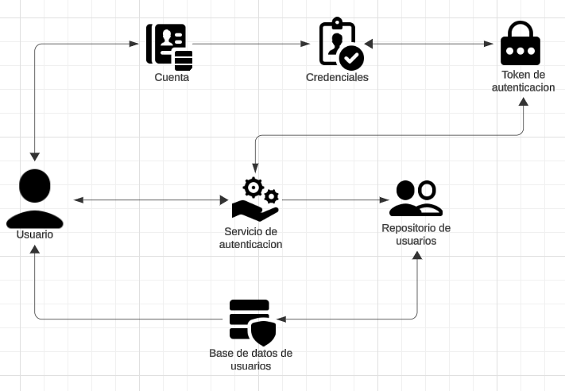
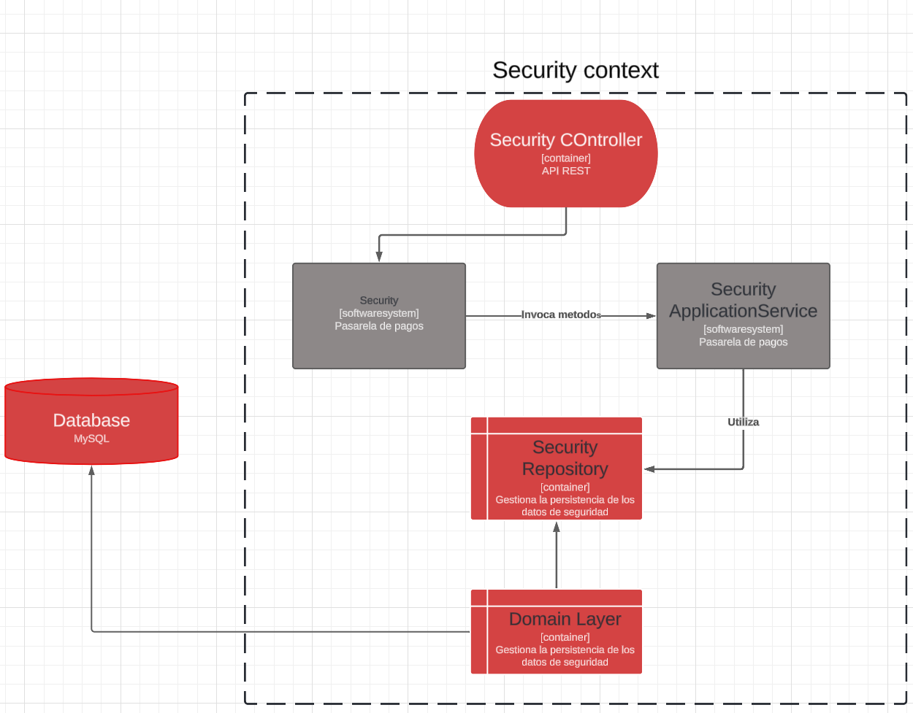
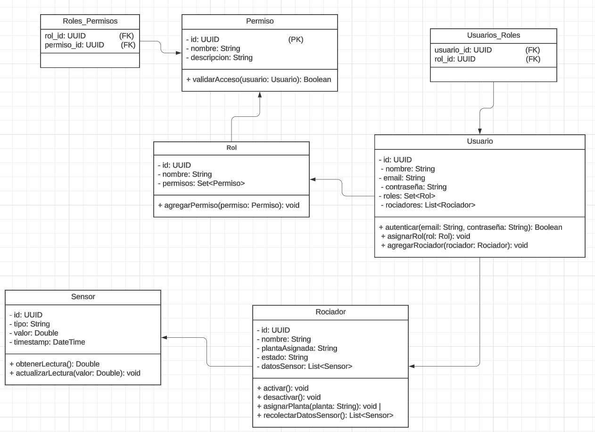
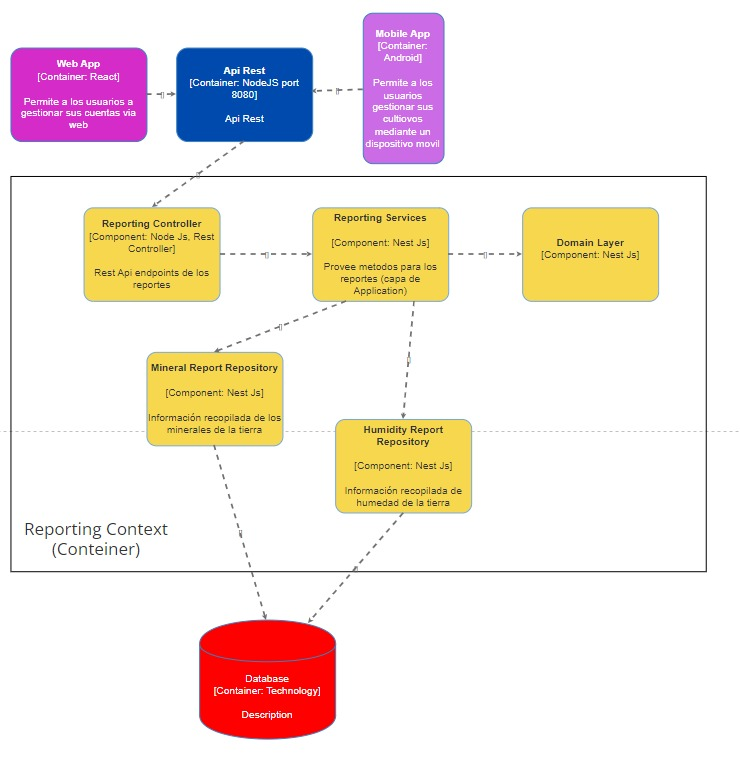

<h3 align="center"> Universidad Peruana de Ciencias Aplicadas </h3>

<h3 align="center"> Ingeniería de Software </h3>
<h3 align="center"> Ciclo 2024 - 2 </h3>

 

  

 

<h1 align="center"> TB1 Report </h1>

<h3 align="center"> Desarrollo de Soluciones IoT - SW53 </h3>

<h3 align="center"> Docente:  </h3>

<h3> Startup: HidroBots </h3>

<h3> Product: </h3>

<h3> Team Members: </h3>

| Member                              |    Code    |
| :---------------------------------- | :--------: |
| Ampudia Flores, José Carlos Isaac   | u202112936 |
| Defilippi Santillán, Diego          | U202120448 |
| Horna Silva, Fabio Ernesto          | u202020229 |
| Lopez Huarcaya, Leonardo Paul       | u202124304 |
| Paucar De La Cruz, Tatiana Medalith | u20211f955 |

<h3 align="center">Septiembre, 2024</h3>

  

# Registro de Versiones del Informe

  

# Project Report Collaboration Insights

  

# Contenido

## Tabla de Contenidos

### [Registro de versiones del informe](#registro-de-versiones-del-informe)

### [Project Report Collaboration Insights](#project-report-collaboration-insights)

### [Contenido](#contenido)

### [Student Outcome](#student-outcome-1)

### [Capítulo I: Introducción](#capítulo-i-introducción-1)

- [1.1. Startup Profile](#11-startup-profile)
  - [1.1.1. Descripción de la Startup](#111-descripción-de-la-startup)
  - [1.1.2. Perfiles de integrantes del equipo](#112-perfiles-de-integrantes-del-equipo)
- [1.2. Solution Profile](#12-solution-profile)
  - [1.2.1 Antecedentes y problemática](#121-antecedentes-y-problemática)
  - [1.2.2 Lean UX Process](#122-lean-ux-process)
    - [1.2.2.1. Lean UX Problem Statements](#1221-lean-ux-problem-statements)
    - [1.2.2.2. Lean UX Assumptions](#1222-lean-ux-assumptions)
    - [1.2.2.3. Lean UX Hypothesis Statements](#1223-lean-ux-hyphotesis-statements)
    - [1.2.2.4. Lean UX Canvas](#1224-lean-ux-canvas)
- [1.3. Segmentos objetivo](#13-segmentos-objetivo)

### [Capítulo II: Requirements Elicitation & Analysis](#capítulo-ii-requirements-elicitation--analysis-1)

- [2.1. Competidores](#21-competidores)
  - [2.1.1. Análisis competitivo](#211-análisis-competitivo)
  - [2.1.2. Estrategias y tácticas frente a competidores](#212-estrategias-y-tácticas-frente-a-competidores)
- [2.2. Entrevistas](#22-entrevistas)
  - [2.2.1. Diseño de entrevistas](#221-diseño-de-entrevistas)
  - [2.2.2. Registro de entrevistas](#222-registro-de-entrevistas)
  - [2.2.3. Análisis de entrevistas](#223-análisis-de-entrevistas)
- [2.3. Needfinding](#23-needfinding)
  - [2.3.1. User Personas](#231-user-personas)
  - [2.3.2. User Task Matrix](#232-user-task-matrix)
  - [2.3.3. User Journey Mapping](#233-user-journey-mapping)
  - [2.3.4. Empathy Mapping](#234-empathy-mapping)
  - [2.3.5. As-is Scenario Mapping](#235-as-is-scenario-mapping)
- [2.4. Ubiquitous Language](#24-ubiquitous-language)

### [Capítulo III: Requirements Specification](#capítulo-iii-requirements-specification-1)

- [3.1. To-Be Scenario Mapping](#31-to-be-scenario-mapping)
- [3.2. User Stories](#32-user-stories)
- [3.3. Impact mapping](#33-impact-mapping)
- [3.4. Product Backlog](#34-product-backlog)

### [Capítulo IV: Solutions Software Design](#capítulo-iv-solution-software-design)

- [4.1. Strategic-Level Domain-Driven Design](#41-strategic-level-domain-driven-design)
  - [4.1.1. Event Storming](#411-event-storming)
    - [4.1.1.1. Candidate Context Discovery](#4111-candidate-context-discovery)
    - [4.1.1.2. Domain Message Flows Modeling](#4112-domain-message-flows-modeling)
    - [4.1.1.3. Bounded COntext Canvases](#4113-bounded-context-canvases)
  - [4.1.2. Context Mapping](#412-context-mapping)
  - [4.1.3. Software Architecture](#413-software-architecture)
    - [4.1.3.1. Software Architecture System Landscape Diagram](#4131-software-architecture-system-landscape-diagram)
    - [4.1.3.2. Software Architecture Context Level Diagrams](#4132-software-architecture-context-level-diagrams)
    - [4.1.3.3. Software Architecture Container Level Diagrams](#4133-software-architecture-container-level-diagrams)
    - [4.1.3.4. Software Architecture Deployment Diagrams](#4134-software-architecture-deployment-diagrams)
- [4.2. Tactical-Level Domain-Driven Design](#42-tactical-level-domain-driven-design)
  - [4.2.X. Bounded Context: <Bounded Context name>](#42x-bounded-context)
    - [4.2.X.1. Domain Layer](#42x1-domain-layer)
    - [4.2.X.2. Interface Layer](#42x2-interface-context)
    - [4.2.X.3. Application Layer](#42x3-application-context)
    - [4.2.X.4. Infrastructure Layer](#42x4-infrastructure-context)
    - [4.2.X.5. Bounded Context Software Architecture Component Level Diagrams](#42x5-bounded-context-software-architecture-component-level-diagrams)
    - [4.2.X.6. Bounded Context Software Architecture Code Level Diagrams](#42x6-bounded-context-software-architecture-code-level-diagrams)
      - [4.2.X.6.1. Bounded Context Domain Layer Class Diagrams](#42x61-bounded-context-domain-layer-class-diagrams)
      - [4.2.X.6.2. Bounded Context Database Design Diagram](#42x62-bounded-context-database-design-diagram)

### [Capítulo V: Solution UI/UX Design](#capítulo-v-solutions-uiux-design)

- [5.1. Style Guidelines](#51-style-guidelines)
  - [5.1.1. General Style Guidelines](#511-general-style-guidelines)
  - [5.1.2. Web Style Guidelines](#512-web-style-guidelines)
- [5.2. Information Architecture](#52-information-architecture)
  - [5.2.1. Organization Systems](#521-organization-systems)
  - [5.2.2. Labeling Systems](#522-labeling-systems)
  - [5.2.3. SEO Tags and Meta Tags](#523-seo-tags-and-meta-tags)
  - [5.2.4. Searching Systems](#524-searching-systems)
  - [5.2.5. Navigation Systems](#525-navigation-systems)
- [5.3. Landing Page UI Design](#53-landing-page-ui-design)
  - [5.3.1. Landing Page Wireframe](#531-landing-page-wireframe)
  - [5.3.2. Landing Page Mock-up](#532-landing-page-mock-up)
- [5.4. Applications UX/UI Design](#54-web-applications-uxui-design)
  - [5.4.1. Applications Wireframes](#541-web-applications-wireframes)
  - [5.4.2. Applications Wireflow Diagrams](#542-web-applications-wireflow-diagrams)
  - [5.4.3. Applications Mock-ups](#543-web-applications-mock-ups)
  - [5.4.4. Applications User Flow Diagrams](#544-web-applications-user-flow-diagrams)
- [5.5. Aplications Prototyping](#55-applications-prototyping)

### [Capítulo VI: Product Implementation, Validation \& Deployment](#capítulo-vi-product-implementation-validation--deployment)

- [6.1. Software Configuration Management](#61-software-configuration-management)
  - [6.1.1. Software Development Environment Configuration](#611-software-development-environment-configuration)
  - [6.1.2. Source Code Management](#612-source-code-management)
  - [6.1.3. Source Code Style Guide \& Conventions](#613-source-code-style-guide--conventions)
  - [6.1.4. Software Deployment Configuration](#614-software-deployment-configuration)
- [6.2. Landing Page, Services \& Applications Implementation](#62-landing-page-services--applications-implementation)
  - [6.2.X. Sprint X](#62x-sprint-n)
    - [6.2.X.1. Sprint Planning 1](#62x1-sprint-planning-n)
    - [6.2.X.2. Sprint Backlog 1](#62x2-sprint-backlog-n)
    - [6.2.X.3. Development Evidence for Sprint Review](#62x3-development-evidence-for-sprint-review)
    - [6.2.X.4. Testing Suite Evidence for Sprint Review](#62x4-testing-suite-evidence-for-sprint-review)
    - [6.2.X.5. Execution Evidence for Sprint Review](#62x5-execution-evidence-for-sprint-review)
    - [6.2.X.6. Services Documentation Evidence for Sprint Review](#62x6-services-documentation-evidence-for-sprint-review)
    - [6.2.X.7. Software Deployment Evidence for Sprint Review](#62x7-software-deployment-evidence-for-sprint-review)
    - [6.2.X.8. Team Collaboration Insights during Sprint](#62x8-team-collaboration-insights-during-sprint)
- [6.3. Validation Interviews](#63-validation-interviews)
  - [6.3.1. Diseño de Entrevistas](#631-diseño-de-entrevistas)
  - [6.3.2. Registro de Entrevistas](#632-registro-de-entrevistas)
  - [6.3.3. Evaluaciones según heurísticas](#633-evaluaciones-según-heurísticas)
- [6.4. Video About-the-Product](#64-video-about-the-product)

### [Conclusiones](#conclusiones-1)

- [Conclusiones y recomendaciones](#conclusiones-y-recomendaciones)
- [Video About-the-Team](#video-about-the-team)

### [Bibliografía](#bibliografía-1)

### [Anexos](#anexos-1)

  

# Student Outcome

<b>ABET – EAC - Student Outcome 5:</b> La capacidad de funcionar efectivamente en un equipo cuyos miembros juntos proporcionan liderazgo, crean un entorno de colaboración e inclusivo, establecen objetivos, planifican tareas y cumplen objetivos.

  

# Capítulo I: Introducción

## 1.1. StartUp Profile

### 1.1.1. Descripción de la StartUp

### 1.1.2. Perfiles de integrantes del equipo

## 1.2. Solution Profile

### 1.2.1. Antecedentes y problemática

### 1.2.2. Lean UX Process

#### 1.2.2.1. Lean UX Problem Statements

#### 1.2.2.2. Lean UX Assumptions

#### 1.2.2.3. Lean UX Hyphotesis Statements

#### 1.2.2.4. Lean UX Canvas

## 1.3. Segmentos objetivo

# Capítulo II: Requirements Elicitation & Analysis

## 2.1. Competidores

### 2.1.1. Análisis competitivo

### 2.1.2. Estrategias y tácticas frente a competidores

## 2.2. Entrevistas

### 2.2.1. Diseño de entrevistas

### 2.2.2. Registro de entrevistas

### 2.2.3. Análisis de entrevistas

## 2.3. Needfinding

### 2.3.1. User Personas

### 2.3.2. User Task Matrix

### 2.3.3. User Journey Mapping

### 2.3.4. Empathy Mapping

### 2.3.5. As-Is Scenario Mapping

## 2.4. Ubiquitous Language

# Capítulo III: Requirements Specification

## 3.1. To-Be Scenario Mapping

## 3.2. User Stories

## 3.3. Impact mapping

## 3.4. Product Backlog

# Capítulo IV: Solution Software Design

## 4.1. Strategic-Level Domain-Driven Design

En nuestro equipo, abordamos las decisiones estratégicas utilizando Domain-Driven Design (DDD) para asegurarnos de que comprendemos a fondo el dominio y sus complejidades. Aplicamos Event Storming como primera herramienta, lo que nos permitió identificar juntos los eventos clave dentro del sistema y visualizar cómo fluye la información y las interacciones en el negocio.

Después, utilizamos el Bounded Context Canvas para definir claramente los límites de cada contexto dentro del dominio. Esto nos ayudó a organizar las responsabilidades y asegurar que cada parte del sistema estuviera alineada tanto con la visión de negocio como con las capacidades técnicas. Gracias a estas herramientas, pudimos tomar decisiones estratégicas más informadas y coherentes, asegurando que el desarrollo estuviera bien fundamentado en las necesidades reales del negocio.

### 4.1.1. Event Storming

Event Storming es una herramienta que nos permite descubrir el comportamiento de un negocio, recopilando eventos importantes del negocio, los actores principales, servicios de terceros y otros. Para la implementación de esta sección se realizaron entrevistas correspondientes a los segmentos objetivos, de esta manera pudimos identificar los eventos principales y desarrollar un entendimiento común.

Aquí mostramos los pasos respectivos para la elaboración correcta del Event Storming realizada en la herramienta de Miro.

##### **Step 1: Unstructured Exploration**

En esta sección se realizó una lluvia de ideas de los eventos del dominio
relacionados con el dominio empresarial que se está explorando. Nos permitió identificar los eventos clave y las interacciones entre ellos.

##### **Step 2: Timelines**

En esta sección, los eventos identificados previamente, son agrupados en subgrupos lo cual tiene como lider al evento principal (es quien encapsula la funcionalidad principal del grupo). Estos eventos comienzan con el flujo que describe el escenario empresarial exitoso (Happy path) y también escenarios alternativos.

##### **Step 3: Paint Points**

Durante esta fase, identificamos puntos problemáticos o (Pair Points) que son áreas donde los usuarios pueden obtener dificultades al momento de realizar una respectiva funcionalidad en la aplicación. Estos puntos son importantes para mejorar la experiencia de usuario e implementar una aplicación eficiente.

##### **Step 4: Pivotal Points**

En esta fase, nos enfocamos en identificar los puntos cruciales dentro del flujo del negocio, los cuales tienen un impacto significativo en la operatividad del sistema o el comportamiento del usuario. Estos puntos nos ayudan a priorizar qué áreas deben ser optimizadas o revisadas con mayor detalle, ya que pueden afectar el éxito de los procesos empresariales críticos.

##### **Step 5: Commands**

Los comandos representan acciones que los actores del sistema pueden ejecutar. Durante este paso, mapeamos qué acciones desencadenan los eventos clave dentro del sistema y qué actores son responsables de ejecutarlas. Esto nos ayuda a estructurar la lógica de negocio alrededor de acciones claras y específicas, facilitando la implementación de las reglas del negocio.

##### **Step 6: Policies**

En este paso, se identifican las políticas, que son reglas de negocio o condiciones que deben cumplirse para que un comando pueda ser ejecutado o un evento pueda suceder. Las políticas son esenciales para definir las restricciones del sistema y asegurar que el flujo de eventos sea coherente con las reglas del negocio.

##### **Step 7: Read Models**

Los Read Models son vistas del estado del sistema, generalmente optimizadas para la consulta por parte de los usuarios o procesos. Durante este paso, definimos qué información necesita ser accesible en ciertos momentos y cómo debería ser presentada, asegurando que los actores puedan visualizar el estado del sistema de manera eficiente.

##### **Step 8: External Systems**

En esta fase, identificamos los sistemas externos que interactúan con nuestro dominio. Aquí mapeamos las conexiones con servicios de terceros o sistemas independientes que influyen en los eventos del negocio. Es crucial entender cómo estos sistemas externos afectan los flujos y asegurar que las integraciones sean correctas.

##### **Step 9: Aggregates**

En este último paso, agrupamos los eventos y comandos que pertenecen a un agregado específico para garantizar que todas las operaciones dentro de un contexto estén alineadas y mantengan la consistencia del sistema.

#### 4.1.1.1. Candidate Context Discovery

Nuestro equipo decidió usar la técnica **start-with-value** ya que empezamos a identificar la esencia del negocio lo cual es importante para tener una mejor proyección a futuro del negocio.

- **Identificación de Valores del Negocio:**  
  Analizamos los valores clave del negocio relacionados con la **gestión automatizada del riego** y el **análisis de datos del suelo,** **creación del cultivo**. Estas áreas son fundamentales para mejorar la eficiencia operativa en la gestión de recursos (como el agua) y para garantizar que los usuarios tengan acceso a información útil y precisa sobre el estado del suelo y los cultivos.  

- **Identificación de funcionalidades:** 
  A partir de los valores identificados, nos enfocamos en las funcionalidades más críticas, esto implica la **gestion de cuenta del usuario**, **creación del cultivo**, **notificaciones** que recibirán los usuarios cuando surja una alerta sobre su respectivo cultivo, el **sistema de reporte** las cuales se encargan de recopilar la información sobre el análisis del suelo cuando el **riego** esté en funcionamiento.  

- **Priorización de contextos:**  
  Priorizar los bounded contexts, nos permite identificar situaciones primordiales que se deben lograr de manera pronta. Además, priorizar los bounded contexts, ayuda a priorizar el core del negocio los cuales son esenciales para el desarrollo de la solución.  

Identificamos 5 Bounded Contexts:
  - Security
  - Crops
  - Notifications
  - Report
  - Watering

**Bounded Context Security:**

**Bounded Context Crops:**

**Bounded Context Notifications:**

**Bounded Context Report:**

**Bounded Context Watering:**

**Visión General de los Bounded Contexts:**

#### 4.1.1.2. Domain Message Flows Modeling

En esta sección, se describe el proceso utilizado para visualizar la interacción entre los diferentes bounded contexts que conforman el sistema. El objetivo principal es entender cómo estos contextos colaboran para resolver los casos de uso del negocio y satisfacer las necesidades de los usuarios. Para lograr esto, se aplicó la técnica de Domain Storytelling, que facilita la representación gráfica de los flujos de mensajes entre actores, contextos y sistemas, permitiendo identificar claramente las responsabilidades y los puntos de comunicación entre cada componente del dominio.

**Scenario: Create Account**

En este escenario, se describe el proceso de creación de una cuenta de usuario en el sistema. El usuario interactúa con el contexto de `Security` para registrar sus credenciales y acceder a la plataforma.

**Scenario: Login**

En este escenario, se describe el proceso de inicio de sesión en el sistema. El usuario interactúa con el contexto de `Security` para autenticarse y acceder a las funcionalidades de la plataforma.

**Scenario: Create Crop**

En este escenario, se describe el proceso de creación de un cultivo en el sistema. El usuario interactúa con el contexto de `Crops` para definir las características del cultivo y recibir recomendaciones sobre su cuidado.

**Scenario: Progam Watering**

En este escenario, se describe el proceso de programación del riego automático o manual del cultivo. El usuario interactúa con el contexto de `Crop` y `Watering` para definir los horarios y la cantidad de agua necesaria para el cultivo.

**Scenario: Visualize Report**

En este escenario, se describe el proceso de visualización de los reportes de análisis del suelo y el estado del cultivo. El usuario interactúa con el contexto de `Report` para acceder a la información detallada sobre el rendimiento del cultivo y las recomendaciones para mejorar su crecimiento.

#### 4.1.1.3. Bounded Context Canvases

En esta sección, se detallan los pasos seguidos por el equipo para diseñar los bounded contexts identificados durante el proceso. El diseño de los bounded contexts fue iterativo, asegurando que cada contexto refleje de manera precisa los criterios de diseño y el conocimiento del dominio. Para cada bounded context, se siguieron los siguientes pasos clave:

- **Context Overview Definition:** Se definió el propósito y los límites de cada bounded context, alineándolos con el dominio del negocio.

- **Business Rules Distillation & Ubiquitous Language Capture:** Se identificaron las reglas de negocio clave y se capturó el lenguaje ubicuo para una comunicación clara entre el equipo.

- **Capability Analysis:** Se analizaron las capacidades que cada bounded context debe ofrecer.

- **Capability Layering:** Se aplicó la separación en capas de capacidades cuando fue necesario.

- **Dependencies Capture:** Se identificaron las dependencias con otros bounded contexts y sistemas externos.

- **Design Critique:** Se revisó el diseño para asegurar un desacoplamiento adecuado y alineación con los objetivos del negocio.

Con estos pasos, el equipo logró definir y diseñar los bounded contexts de manera efectiva, asegurando que cada uno cumpla con sus responsabilidades y contribuya al éxito del sistema en su conjunto.

**Bounded Context Canvases Security:**

**Bounded Context Canvases Crops:**

**Bounded Context Canvases Notifications:**

**Bounded Context Canvases Watering:**

**Bounded Context Canvases Report:**

### 4.1.2 Context mapping

En esta sección, se analizan las relaciones entre los bounded contexts identificados y se asignan patrones de context mapping adecuados para cada uno:

##### Customer/Supplier

**Descripción:** En esta relación, un contexto actúa como Cliente (Customer) y otro como Proveedor (Supplier). El contexto Cliente necesita servicios o datos del contexto Proveedor. Esta relación establece una dependencia directa donde el proveedor suministra información o servicios que el cliente necesita para funcionar adecuadamente.

- "Crop" es Cliente de "Reading". En este caso, "Reading" proporciona datos en tiempo real o casi real a "Crop" para su procesamiento y análisis.
- "Crop" es Proveedor para "Reporting" y "Notifications". Aquí, "Crop" proporciona datos sobre el estado del cultivo, que son consumidos por "Reporting" para generar informes y por "Notifications" para enviar alertas y notificaciones.

##### Open/Host Service (OHS)
**Descripción:** En este patrón, un contexto expone un servicio bien definido que otros contextos pueden consumir sin tener que conocer o interactuar con la lógica interna de ese contexto. Este patrón es útil para integrar sistemas o contextos que necesitan acceder a servicios comunes, como autenticación, permisos o servicios externos.

- El contexto "Security" (Host) expone servicios de autenticación y autorización.

##### **Anticorruption Layer (ACL)**
**Descripción:** Este patrón se utiliza cuando un contexto necesita proteger su propio modelo de dominio de la influencia de otro contexto con el que interactúa. El contexto que usa un ACL implementa una capa de traducción que convierte las entradas o salidas del otro contexto a su propio modelo de dominio, evitando acoplarse directamente a los detalles internos del contexto con el que se comunica.

- El contexto "Notifications" utiliza un ACL para interactuar con "Crop". Esto asegura que cualquier cambio en el modelo de dominio de "Crop" no afecte directamente al modelo de "Notifications", manteniendo una separación clara entre los dos contextos.

  

  <a href="https://miro.com/welcomeonboard/c0RJcmExaEhJNHlsVkZJbktFaFFJaVhnV3d3dmdtNFFIa0R1eTh3d3NXVlVUSkRwVU5TaXZNNTZPbDF1M2RBcnwzNDU4NzY0NTUxMjMyMTk0MjkwfDI=?share_link_id=537960621738">Context Mapping Diagram</a>

### 4.1.3. Software Architecture

#### 4.1.3.1. Software Architecture System Landscape Diagram

#### 4.1.3.2. Software Architecture Context Level Diagrams

#### 4.1.3.3. Software Architecture Container Level Diagrams

#### 4.1.3.4. Software Architecture Deployment Diagrams

Los Software Architecture Deployment Diagrams son representaciones visuales que muestran cómo los componentes de un sistema de software, como aplicaciones y bases de datos, se despliegan en diferentes entornos físicos o en la nube. Estos diagramas facilitan la comprensión de la infraestructura del sistema, las conexiones de red entre componentes, y cómo interactúan para soportar la funcionalidad del software.

 
   
## 4.2. Tactical-Level Domain-Driven Design

### 4.2.X. Bounded Context:

#### 4.2.X.1. Domain Layer
El Domain Layer representa el núcleo de la lógica de negocio de la aplicación. Aquí se encuentran las entidades, objetos de valor, servicios de dominio, y otras clases que encapsulan las reglas de negocio esenciales del sistema. Este nivel garantiza que la lógica del negocio esté correctamente definida y separada de los detalles de implementación técnica.

*security*

#### 4.2.X.2. Interface Context
El Interface Context es responsable de la interacción entre el usuario y el sistema, proporcionando una capa de presentación que incluye controladores y consumidores. Su propósito es manejar las solicitudes entrantes, validar datos, y coordinar con el Application Context para ejecutar las operaciones necesarias.

*security*

#### 4.2.X.3. Application Context
El Application Context gestiona los flujos de procesos del negocio mediante clases como manejadores de comandos y eventos. Esta capa es responsable de coordinar la lógica de aplicación, orquestando los pasos necesarios para cumplir con los casos de uso de la aplicación y delegando la lógica de negocio al Domain Layer.

*security*

#### 4.2.X.4. Infrastructure Context
El Infrastructure Context se encarga de la comunicación con servicios externos, como bases de datos, sistemas de mensajería o servicios de correo electrónico. Aquí se implementan los repositorios para las interfaces definidas en el Domain Layer, proporcionando acceso a los datos y otros recursos externos necesarios.

*security*

#### 4.2.X.5. Bounded Context Software Architecture Component Level Diagrams
Esta sección incluye diagramas de componentes del nivel de arquitectura de software, mostrando cómo cada contenedor está compuesto por diferentes componentes, sus responsabilidades, y las interacciones entre ellos. Estos diagramas ayudan a entender la estructura interna de los contenedores y cómo se integran para formar el sistema completo.

#### 4.2.X.6. Bounded Context Software Architecture Code Level Diagrams
Los diagramas de nivel de código en esta sección presentan detalles más finos sobre la implementación de los componentes dentro del bounded context. Incluyen diagramas de clases y bases de datos, proporcionando una vista más granular de la arquitectura y cómo los diferentes componentes trabajan juntos a nivel de código.

#### 4.2.X.6.1. Bounded Context Domain Layer Class Diagrams
Los diagramas de clases del Domain Layer detallan las relaciones entre clases, interfaces y objetos que componen la lógica de negocio. Incluyen detalles de atributos, métodos, visibilidad y relaciones, proporcionando una representación clara del diseño de clases en el Domain Layer.

*security*

#### 4.2.X.6.2. Bounded Context Database Design Diagram
El diagrama de diseño de bases de datos muestra cómo los objetos de base de datos están estructurados para la persistencia de datos. Incluye tablas, columnas, claves primarias y foráneas, y las relaciones entre tablas, proporcionando una representación clara del modelo de datos utilizado para respaldar el bounded context.

*security*

### 4.2.5. Bounded Context: Reporting

El **Reporting Context** es responsable de recopilar y analizar los datos de los sensores IoT, como los niveles de humedad, minerales y temperatura, para generar reportes útiles para los agricultores e investigadores.

#### 4.2.5.1. Domain Layer

El **Domain Layer** encapsula la lógica de negocio y las reglas que rigen el funcionamiento del **Reporting Context**.

**Aggregate**

| **Nombre**      | **Categoría**     | **Propósito** |
|:---------------|:-----------------|:--------------|
| Report         | Entity/Aggregate  | Representa un análisis basado en los datos de los sensores, como niveles de humedad, temperatura y minerales del suelo. |

**Atributos**

| **Nombre**        | **Tipo de dato**          | **Visibilidad** | **Descripción** |
|:-----------------:|:------------------------:|:---------------:|:----------------|
| id                | Long                     | Private         | Identificador único del reporte |
| reportDate        | Date                     | Private         | Fecha de generación del reporte |
| humidityLevels    | Map<Date, Double>        | Private         | Niveles de humedad recopilados de los sensores IoT a lo largo del tiempo |
| temperatureLevels | Map<Date, Double>        | Private         | Niveles de temperatura recogidos de los sensores |
| mineralLevels     | Map<Date, Map<String, Double>> | Private  | Niveles de minerales (como nitrógeno, potasio, fósforo) por fecha y tipo |
| summary           | String                   | Private         | Resumen del estado del cultivo basado en los datos de humedad, temperatura y minerales |
| readingsList      | List<Reading>            | Private         | Lista de lecturas de sensores que incluyen datos como humedad, temperatura y minerales |

**Métodos**

| **Nombre**       | **Tipo de retorno** | **Visibilidad** | **Descripción** |
|:----------------:|:------------------:|:---------------:|:----------------|
| addReading       | Void               | Public          | Añadir una nueva lectura de sensores (humedad, temperatura, minerales) al reporte. |
| generateSummary  | String             | Public          | Genera un resumen basado en las lecturas de humedad, temperatura y minerales. |
| generateVisualization    | Object              | Public          | Genera un objeto que representa un gráfico de los datos del reporte. |

#### 4.2.5.2. Interface Context

La **Interface Layer** del **Reporting Context** proporciona una API REST que permite a los usuarios acceder y consultar los reportes generados a partir de los datos de los sensores.

**Componentes clave:**

- **Reporting Controller**: Facilita la exposición de servicios a través de endpoints REST, permitiendo interacciones con el dominio de reportes.

  **Endpoints**:
  - `GET /reports/{id}`: Recupera un reporte específico basado en su ID.
  - `POST /reports`: Crea un nuevo reporte utilizando las lecturas más recientes de los sensores.
  - `GET /reports/{id}/summary`: Devuelve un resumen del reporte solicitado.
  - `GET /reports/{id}/visualization`: Devuelve un objeto que representa una visualización gráfica de los datos del reporte.

**Métodos del Controller**:

| **Nombre**       | **Tipo de retorno** | **Descripción** |
|:-----------------|:------------------:|:----------------|
| getReportById    | ReportDTO          | Recupera los detalles de un reporte específico. |
| createReport     | ReportDTO          | Crea un nuevo reporte y lo almacena. |
| getReportSummary | String             | Devuelve un resumen textual del estado del cultivo. |
| getReportVisualization | Object        | Devuelve una visualización gráfica de los datos del reporte. |

#### 4.2.5.3. Application Context

La capa de Aplicación en el contexto de **Reporting** gestiona la lógica empresarial y la funcionalidad de generación de reportes.

**Service**

| **Nombre**          | **Categoría**     | **Propósito**                                  |
|:--------------------|:-----------------|:-----------------------------------------------|
| Reporting Services  | Service          | Provee métodos para los reportes. |

**Atributos**

| **Nombre**           | **Tipo de dato**          | **Visibilidad** | **Descripción**                                  |
|:---------------------|:-------------------------:|:---------------:|:-------------------------------------------------|
| mineralReportRepository | MineralReportRepository | Private         | Repositorio de reportes de minerales.            |
| humidityReportRepository | HumidityReportRepository | Private      | Repositorio de reportes de humedad.              |
| validator             | Validator                 | Private         | Validador de atributos del reporte.              |

**Métodos**

| **Nombre**           | **Tipo de retorno** | **Visibilidad** | **Descripción**                                  |
|:---------------------|:------------------:|:---------------:|:-------------------------------------------------|
| getAllReports        | Page/List          | Public          | Obtiene todos los reportes.                      |
| getReportById        | Report             | Public          | Obtiene un reporte según su ID.                  |
| createReport         | Report             | Public          | Crea un nuevo reporte.                           |
| updateReport         | Report             | Public          | Actualiza los datos de un reporte.               |
| deleteReport         | ResponseEntity     | Public          | Elimina un reporte.                              |
| addReadingToReport   | Report             | Public          | Agrega una lectura a un reporte existente.       |

#### 4.2.5.4. Infrastructure Context

En la capa de Infraestructura se gestiona la persistencia de datos para el contexto de **Reporting**.

**Repository**

| **Nombre**           | **Categoría**     | **Propósito**                              |
|:---------------------|:-----------------|:-------------------------------------------|
| Mineral Report Repository | Repository  | Repositorio que almacena la información de minerales. |
| Humidity Report Repository | Repository | Repositorio que almacena la información de humedad. |

**Métodos**

| **Nombre**           | **Tipo de retorno** | **Visibilidad** | **Descripción**                                 |
|:---------------------|:------------------:|:---------------:|:-----------------------------------------------|
| findById             | Report             | Public          | Devuelve un reporte según su ID.               |
| findByDateRange      | List<Report>       | Public          | Devuelve todos los reportes en un rango de fechas. |

#### 4.2.5.5. Bounded Context Software Architecture Component Level Diagrams

En esta sección, se presentan los diagramas a nivel de componentes que ilustran la arquitectura del **Reporting Context**. Estos diagramas muestran la estructura y las relaciones entre los componentes principales del sistema.

  

#### 4.2.5.6. Bounded Context Software Architecture Code Level Diagrams

##### 4.2.5.6.1. Bounded Context Domain Layer Class Diagrams

##### 4.2.5.6.2. Bounded Context Database Design Diagram

# Capítulo V: Solutions UI/UX Design

## 5.1. Style Guidelines

### 5.1.1. General Style Guidelines

### 5.1.2. Web, Mobile and IoT Style Guidelines

## 5.2. Information Architecture

### 5.2.1. Organization Systems

### 5.2.2. Labeling Systems

### 5.2.3. SEO Tags and Meta Tags

### 5.2.4. Searching Systems

### 5.2.5. Navigation Systems

## 5.3. Landing Page UI Design

### 5.3.1. Landing Page Wireframe

### 5.3.2. Landing Page Mock-up

## 5.4. Application UX/UI Design

### 5.4.1. Applications Wireframes

### 5.4.2. Applications Wireflow Diagrams

### 5.4.3. Applications Mock-ups

### 5.4.4. Applications User Flow Diagrams

## 5.5. Applications Prototyping

# Capítulo VI: Product Implementation, Validation & Deployment

## 6.1. Software Configuration Management

### 6.1.1. Software Development Environment Configuration

### 6.1.2. Source Code Management

### 6.1.3. Source Code Style Guide & Conventions

### 6.1.4. Software Deployment Configuration

## 6.2. Landing Page, Services & Applications Implementation

### 6.2.X. Sprint n

#### 6.2.X.1. Sprint Planning n.

#### 6.2.X.2. Sprint Backlog n.

#### 6.2.X.3. Development Evidence for Sprint Review

#### 6.2.X.4. Testing Suite Evidence for Sprint Review.

#### 6.2.X.5. Execution Evidence for Sprint Review.

#### 6.2.X.6. Services Documentation Evidence for Sprint Review.

#### 6.2.X.7. Software Deployment Evidence for Sprint Review.

#### 6.2.X.8. Team Collaboration Insights during Sprint.

## 6.3. Validation Interviews.

### 6.3.1. Diseño de Entrevistas.

### 6.3.2. Registro de Entrevistas.

### 6.3.3. Evaluaciones según heurísticas.

## 6.4. Video About-the-Product.

# Conclusiones

## Conclusiones y recomendaciones

## Video About-the-Team

# Bibliografía

# Anexos
